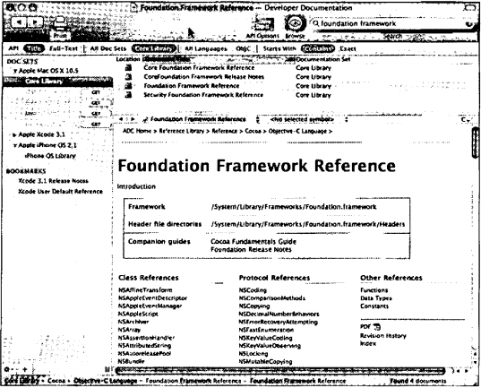
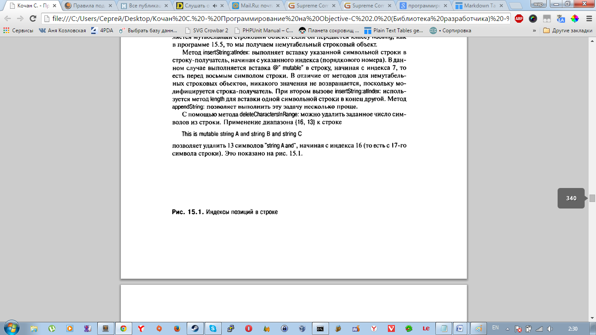

# Часть II. Foundation Framefork
# Глава 14. Введение в Foundation Framework
Фреймворк (framework) — это набор классов, методов, функций и документации, логически сгруппированных для упрощения разработки программ. В системе Mac OS X имеется более 80 фрей м ворков для разработки приложений. Они позволяют упростить работу со структурой Mac Address Book, выполнять запись на CD, воспроизведение DVD, воспроизведение фильмов с помощью QuickTime, воспроизведение музыки и т.д.

Фреймворк, который является базой для разработки программ, называется Foundation framework. Этот фреймворк, (он является темой второй части книги) позволяет работать с базовыми объектами, такими как числа и строки, а также с коллекциями объектов, такими как массивы, словари и наборы (множества). Имеются также средства для работы с датой и временем, автоматического управления памятью, работы с базовыми файловыми системами, сохранения (или архивации) объектов, а также для работы с геометрическими структурами данных, такими как точки (point) и прямоугольники (rectangle).

Фреймворк Application Kit содержит обширный набор классов и методов для разработки интерактивных графических приложений. Они позволяют легко работать с текстами, меню, панелями инструментов, таблицами, документами, компоновочными буферами (pasteboard) и окнами. В Mac OS X термин Cocoa означает совместное использование фреймворков Foundation framework и Application Kit framework. Термин Cocoa Touch означает совместное использование фреймворков Foundation framework и UIKit framework. Эта тема описывается в части III настоящей книги. Многие источники информации приводятся в приложении D.

## Документация Foundation
Для справки мы приводим местонахождение заголовочных файлов (.h) Foundation. Это папка
```
/System/Library/Frameworks/Foundation.framework/Headers
```
Перейдите в эту папку на своем компьютере и ознакомьтесь с ее содержимым. Обратитесь также к документации Foundation framework, которая хранится па вашем компьютере (в подпапках папки /Developer/Doeumentation) и доступна на веб-сайте Apple. Большинство документации доступно в форме НТМ L-файлов для просмотра браузером или pdf-файлов Acrobat. В ней содержится описание всех классов Foundation и всех реализованных методов и функций.

Если вы используете Xcode для разработки своих программ, то имеете простой доступ к этой документации через окно Documentation, которое вызывается с помощью меню Help Xcode. Из этого окна можно легко выполнять поиск и осуществлять доступ к документации, которая хранится локально на вашем компьютере или доступна в Интернет. На рис. 14.1 показаны результаты поиска строки «foundation framework» в окне документации Xcode. Из панели под заголовком «Foundation Framework Reference» (Справка по Foundation Framework) вы можете легко выполнять доступ к документации по всем классам Foundation.



Рис. 14.1. Доступа к справочной документации Foundation из Xcode


Если вы редактируете файл в Xcode и хотите получить непосредственный доступ к документации по определенному заголовочному файлу, методу или классу, достаточно выделить этот текст в окне редактора и щелкнуть на нем правой кнопкой. В появившемся меню можно выбрать Find Selected Text in Documentation (Найти выбранный текст в документации) или Find Selected Text in API Reference (Найти выбранный текст в справке API). Xcode найдет нужную библиотеку документации и выведет результат в соответствии с вашим запросом.

Класс NSString — это класс Foundation, который используется для работы со строками. (Его описание см. в следующей главе.) Предположим, что вы редак-тируете программу, в которой используется этот класс, и вам нужно получить информацию о нем и его методах. Нужно выделить слово NSString в любом месте окна редактирования и щелкнуть на нем правой кнопкой. Если выбрать в по-явившемся меню пункт Find Selected Text in API Reference, появится окно до-кумента (рис. I4.2).



Рис. 14.2. Получение документации по классу NSString

Выполняя прокрутку панели под заголовком NSString Class Reference (Справка но классу NSString), вы увидите (среди прочей информации) список всех методов, которые поддерживаются этим классом. Это позволяет легко находить информацию о методах, реализуемых определенным классом, включая описание их работы и аргументов, которые они принимают. 

К этой документации можно также выполнять доступ по адресу deveIoper.apple.com/referencelibrary с переходом к справочной документации Foundation (по ссылкам Cocoa, Frameworks, Foundation Framework Reference). На этом веб-сайте можно найти разнообразные документы по определенным вопросам программирования, таким как управление памятью, строки и управление файлами.

Если вы не подписаны на определенный набор документов вместе с Xcode, то оилайн-документация может быть более свежей, чем на вашем диске.

На этом заканчивается краткое введение в Foundation framework. Теперь мы переходим к изучению некоторых классов этого фреймворка и способам их включения в ваши приложения.