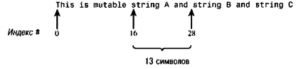

# Глава 15. Числа, строки и коллекции
В этой главе описывается работа с некоторыми базовыми объектами в Foundation framework. Это числа, строки и коллекции, позволяющие работать с группами объектов в форме массивов, словарей и наборов.

Foundation framework содержит множество классов, методов и функций. В Mac OS X доступны примерно 125 заголовочных (.h) файлов. Для доступа к ним используйте следующий оператор импорта.
```
#import <Foundation/Foundation.h>
```
Файл Foundation.h импортирует практически все другие заголовочные файлы Foundation. Xcode автоматически вставляет этот заголовочный файл в вашу программу, как во всех примерах этой книги.

Однако наличие этого оператора может существенно увеличить время ком-пиляции. Чтобы избежать излишних затрат времени, используйте заранее ском-пилированные заголовочные файлы. Это файлы, заранее обработанные компи-лятором. По умолчанию во всех проектах Xcode используются заранее скомпилированные заголовочные файлы.

В этой главе используются заголовочные файлы лля каждого объекта, чтобы показать вам, что содержится в каждом заголовочном файле.

**Примечание.** При желании можно продолжать работу, просто импортируя Foundation.h. Но если вы хотите импортировать конкретные файлы, показанные в каждом примере, то удалите файл имя лрошз РгеАх.рсЬ, который автоматически включается системой XCode при создании нового проекта Foundation Tool. При удалении этого файла из проекта обязательно выберите «Delete References» (Удалить ссылки), когда появится запрос Xcode.

## 15.1. Числовые объекты
Вес числовые типы данных, с которыми мы работали до сих пор (такие, как int, float и long) это базовые типы данных в Objective-C. Они не являются объектами, мы не можем передавать им сообщения. Однако время от времени нам нужно работать с ними как с объектами. Например, объект- класса Foundation NSArray позволяет задавать массив, в котором можно сохранять значения. Эти значения должны быть объектами. В таких массивах нельзя непосредственно сохранять базовые типы данных. Вместо этого для сохранения любого из базовых числовых типов данных (включая тип данных char) служит класс NSNumber. Он позволяет создавать объекты из этих типов данных (см. программу 15.1).
```
// Работа с числами

#import <Foundation/NSObject.h>
#import <Foundation/NSAutoreleasePool.h>
#import <Foundation/NSValue.h>

#import <Foundation/NSString.h>
int main (int arge, char *argv[])
{
    NSAutoreleasePool * pool = [[NSAutoreleasePool alloc] initj;
    NSNumber    *myNumber, *floalNumber, *inlNumber;
    NSInteger   mylnt;

    // целое значение (int)

    intNumber = [NSNumber numberWithlnteger: 100];
    mylnt - [intNumber integerValue];
    NSLog (@"%li", (long) mylnt);

    // значение удвоенной длины (long)

    myNumber = [NSNumber numberWithlong: Oxabcdef];
    NSLog (@"%lx", [myNumber longValue]);

    // значение типа char

    myNumber = [NSNumber numberWithChar: X];
    NSLog (@"%c", [myNumber charValue]);

    // значение с плавающей точкой (float)

    floatNumber = [NSNumber numberWithFloat: 100.00];
    NSLog (@"%g", [floatNumber floatValue]);

    // значение с двойной точностью (double)

    myNumber = [NSNumber numberWithDouble: 12345e+15];
    NSLog (@"%lg", [myNumber doubleValue]);

    // Здесь неверный доступ

    NSLog (@"%Г, [myNumber integerValue]);

    // Сравнение двух чисел на равенство

    if ([intNumber isEqualToNumber: floatNumber] == YES)
        NSLog (@"Numbers are equal"); (Числа равны)
    else
        NSLog (@"Numbers are not equal"); (Числа не равны)

    // Сравнение одного числа со вторым (<, == или >)

    if ([intNumber compare: myNumber] == NSOrderedAscending)
        NSLog (@"First number is less than second"); (1-e число меньше 2-ro)

    [pool drain];
    return 0;
}
```
Вывод программы 15.1
```
100
abcdef
X
100
1.2345e+19
0
Numbers are equal (Числа равны)
First number is less than second (1 -e число меньше 2-го)
```
Файл `<Foundation/NSValue.h>` требуется для работы с числами из класса NSNumber.

### Краткий обзор автоматически высвобождаемого пула (autorelease pool)
Первая строка программы 15.1 присутствовала в каждой программе этой книги. В следующей строке выполняется резервирование пространства в памяти для автоматически высвобождаемого пула (пула автоматического освобождения памяти, autorelease-пул), который назначается для переменной pool.
```
NSAutoreleasePool * pool = [ [ NSAutoreleasePoolalloc] init];
```
Autorelease-пул автоматически освобождает память, занимаемую объектами, когда объект добавляется в этот пул. Объект добавляется в пул, когда ему передается сообщение autorelease. Когда пул высвобождается, то высвобождаются и все объекты, которые были в него добавлены. Все такие объекты ликвидируются, если для них не было указано, что они существуют вне области действия autorelease-пула (это указывается счетчиками ссылок — reference count).

Обычно вам не нужно думать о высвобождении объекта, возвращаемого ка-ким-либо методом Foundation. Иногда этим объектом владеет метод, который возвращает его. Иногда объект создается заново и добавляется в autoreiease-пул самим методом. Однако, как описывается в части I, вы все же должны высво-бождать любые объекты (включая объекты Foundation), которые создаете явным образом с помощью метода alloc, когда прекращаете их использование.

**Примечание.** Вы также должны высвобождать объекты, создаваемые методом сору (см. главу 17).

В главе 17 дается полное описание счетчиков ссылок, autorelease-пула и кон-цепции автоматической сборки мусора (garbage collection).

Вернемся к программе 15.1. Класс NSNumber содержит много методов, по-зволяющих создавать объекты NSNumber с начальными значениями. Например, в строке
```
intNumber = [NSNumber numberWithlnteger: 100];
```
создается объект из целой переменной, значение которой равно 100.

Значение, которое считывается из объекта класса NSNumber, должно быть согласовано с типом значения объекта. Так, в следующем операторе программы выражение
```
[intNumber integerValue]
```
используется для считывания целого значения, хранящегося в intNumber, и оно сохраняется в переменной mylntTHnaNSInteger. Отметим, что NSInteger - не объект, а typedef-определение для базового типа данных. Это тип long для 64-битных систем или тип int для 32-битных систем. Аналогичный оператор typecef задан для NSUInteger, чтобы работать с целыми без знака (unsigned).

При вызове NSLog выполняется приведение типа NSInteger mylnt к long. Симво-лы формата %li обеспечивают корректную передачу и вывод значен ия, даже если программа компилируется для 32-битной архитектуры.

Для каждого базового значения метод class выделяет память для объекта NSNumber и присваивает ему указанное значение. Имена этих методов начи-наются с numberWith, после чего следует тип, например, numberWithLong:, numberWithFloat: и т.д. Кроме того, можно использовать методы экземпляра, что-бы присвоить объекту NSNumber (для которого была выделена память) указанное значение. Имена этих методов начинаются с initWith, например, initWithLong: и initWithFloat:.

В таблице 15.1 приводится список методов класса и экземпляра, с помощью которых можно задавать значения для объектов @@ NSNumber, и соответству-ющие методы экземпляра для считывания их значений.

Табл. 15.1. Методы создания и считывания значений объектов NSNumber

| Метод,класса для создания и инициализации | Метод экземпляра для инициализации | Метод экземпляра для считывания |
|-------------------------------------------|------------------------------------|---------------------------------|
| numberWithChar:                           | InitWithChar:                      | charValue                       |
| numberWthUnsignedChar:                    | initWthUnsignedChar:               | unsignedCharValue               |
| numberWithShort:                          | initWithShort:                     | shortValue                      |
| numberWithUnsignedShort:                  | initWithllnsignedShort:            | unsignedShortValue              |
| numberWithlnteger:                        | initWithlnteger:                   | integerValue                    |
| numberWithUnsignedlnteger:                | initWithllnsignedlnteger:          | unsignedlntegerValue            |
| numberWithlnt:                            | initWithlnt:                       | intValueunsigned                |
| numberWithllnsignedlnt:                   | initWithUnsignedlnt:               | unsignedlntValue                |
| numbefWithLong:                           | initWithLong:                      | longValue                       |
| numbetWithUnsignedLong:                   | inifWithUnsignedLong:              | unsignedLongValue               |
| numberWithLonglong:                       | initWithLongLong:                  | longlongValue                   |
| numberWithllnsignedLongLong:              | initWithUnsignedLongLong:          | unsigned LongLongValue          |
| numberWithFloat:                          | initWithFloat:                     | floatValue                      |
| numberWithDouble:                         | initWthDouble:                     | doubleValue                     |
| numberWthBool:                            | initWithBool:                      | boolValue                       |

Вернемся к программе 15.I. Методы класса служат для создания объектов NSNumber типа long, char, float и double. Рассмотрим, что происходит после созда-ния объекта типа double с помощью строки
```
myNumber = [NSNumber numberWithDouble: 12345е+15];
```
и последующей (неверной) попытки считывания и вывода его значения с помощью строки
```
NSLog (@"%i", [myNumber integerValue]};
```
Выводится результат О

Кроме того, мы не получаем от системы сообщения об ошибке. В общем случае именно вы должны обеспечить правильность считывания значения после его сохранения в объекте NSNumber.

В операторе if в выражении с сообщением
```
[intNumber isEqualToNumber: floatNumber]
```
метод isEqualToNumber: выполняет числовое сравнение двух объектов NSNumber по возвращаемому булевому значению.

Метод compare: позволяет сравнивать числовые значения. Выражение с со-общением
```
[intNumber compare: myNumber]
```
возвращает значение NSOrderedAscending, если числовое значение, хранящееся в intNumber, меньше числового значения, содержащегося в myNumber; возвращает значение NSOrderedSame, если эти два числа равны; возвращает значение NSOrderedDescending, если первое число больше второго. Эти возвращаемые значении определены в заголовочном файле NSObjecth.

Отметим, что вы не можете реинициализировать значение созданного ранее объекта NSNumber. Например, с помощью приведенного ниже оператора нельзя задать значение целого элемента, сохраненного в объекте NSNumber myNumber.
```
[myNumber initWithlnt: 1000];
```
При выполнении программы этот оператор даст ошибку. Все числовые объекты должны создаваться заново, а это означает, что нужно вызывать либо один из методов первого столбца таблицы 15.1 класса NSNumber, либо один из методов столбца 2 с результатом метода alloc.
```
myNumber = [[NSNumber alloc] initWithlnt: 1000];
```
Конечно, при таком способе создания объекта myNumber вы сами должны высвобождать занимаемую им память с помощью оператора
```
[myNumber release];
```
Мы будем использовать объекты класса NSNumber в остальных программах этой главы.

## 15.2. Строковые объекты
Мы уже работали со строковыми объектами в предыдущих главах. Заключая последовательность символов в кавычки, как в
```
@"Programming is fun" (Программировать интересно),
```
мы создаем в Objective-C объект символьной строки. Для работы с объектами символьных строк Foundation framework поддерживает класс с именем NSString. С-строки состоят из символов типа char, а объекты класса NSString состоят из символов типа unichar. Unichar-символ - это многобайтный символ, соответству-ющий стандарту Unicode. Это позволяет работать с наборами символов, содер-жащими буквально миллионы символов. Вам не нужно заботиться о внутреннем представлении этих символов в строках, поскольку класс NSString автоматически делает это для вас.  С помощью методов из этого класса легко разрабатывать приложения, доступные для локализации, то есть для работы на различных языках по всему миру.

Как вы уже знаете, для создания в Objective-C объекта константной сим-вольной строки нужно поместить символ @ перед строкой символов, заключенной в кавычки. Например, с помощью выражения
```
@"Программировать интересно"
```
создается объект константной символьной строки. Это константная символьная строка, принадлежащая классу NSConstantString. NSConstantString - это подкласс класса строковых объектов NSString. Чтобы использовать строковые объекты в программах, нужно включать в них строку
```
#import <Foundation/NSString.h>
```

### Дополнительно о функции NSLog
В программе 15.2 показано, как определить объект класса NSString и присвоить ему начальное значение и как использовать символы формата %@ для вывода объекта NSString.
```
#import <Foundation/NSObject.h>
#import <Foundation/NSString.h>
#import <Foundation/NSAutoreleasePool.h>

int main (int argc, char *argv[])
{
    NSAutoreleasePool * pool = [[NSAutoreleasePool alloc] init];
    NSString *str = @"Программировать интересно";

    NSLog (@"%@", str);

    [pool drain];
    return 0;
}
```
Вывод программы 15.2
```
Программировать интересно
```
В операторе
```
NSString *str = @"Программировать интересно";
```
Объект константной строки "Программировать интересно"" присваивается переменной str класса NSString. Затем ее значение выводится с помощью NSLog.

Символы формата %@ в NSLog позволяют выводить значения любых объек-тов. Например, если задано
```
NSNumber *intNumber = [NSNumber numberWithlnteger: 100];
```
то в результате вызова NSLog
```
NSLog(@"%@", intNumber);
```
выводится
```
100
```
Мы можем даже применять символы формата %@ для вывода всего содер-жимого массивов, словарей и наборов. С их помощью можно также выводить объекты ваших собственных классов, если вы замещаете метод rtescription, на-следуемый вашим классом. Если нет замещения этого метода, то NSLog просто выводит имя класса и адрес объекта в памяти (что я кляется реализацией по умолчан ию метода description, наследуемого из класса NSObject).

### Мутабельные (mutable) и немутабельные (immutable) объекты
С помощью выражения
```
@"Программировать интересно"
```
мы создаем объект, содержимое которог о нельзя изменить. Такой объект назы-вается немутабельным (immutable). Класс NSString используется для немутабель- ных строк, но нередко при работе со строками требуется изменять символы внутри строки, например, удалить или заменить некоторые символы. Для работы со строками этого типа предназначен класс NSMutabieString.

В программе 15.3 показаны основные способы работы с немугабельными символьными строками.
```
// Основные операции со строками

#import <Foundation/NSObject.h>
#import <Foundation/NSString.h>
#import < Foundation/N SAuto releasePool.h>

int main (int argc, char *argv(])
{
    NSAutoreleasePool *pool = [[NSAutoreleasePool alloc] init];
    NSString *str1 = @"This is string A";
    NSString *str2 = @'This is string B";
    NSString *res;
    NSComparisonResult compareResult;

    // Подсчет числа символов

    NSLog (@"Length of str 1: %lu", [strl length]);

    // Копирование одной строки в другую

    res = [NSString stringWithString: strl];
    NSLog (@"copy: %@", res);

    // Копирование одной строки в конец другой

    str2 = [strl stringByAppendingString: str2];
    NSLog (@"Concatentation: %@", str2);

    // Проверка на равенство двух строк

    if ([strl isEqualToString: res] == YES)
        NSLog (@"str1 == res");
    else
        NSLog (@"str1 != res");

    // Сравнение одной строки с другой (<, == или >)

    compareResult = [strl compare: str2];

    if (compareResult == NSOrderedAscending)
        NSLog (@"str1 < str2");
    else if (compareResult == NSOrderedSame)
        NSLog (@"str1 == str2");
    else // NSOrderedDescending
        NSLog (@"str1 > str2");

    // Преобразование символов строки в верхний регистр (в прописные буквы)
    res = [strl uppercaseString];
    NSLog (@"Uppercase conversion: %s", [res UTF8String]);

    // Преобразование символов строки в нижний регистр (в строчные буквы)

    res = [strl lowercaseString];
    NSLog (@"Lowercase conversion: %@", res);

    NSLog (@"Original string: %@", strl);

    [pool drain];
    return 0;
}
```
Вывод программы 15.3
```
Length of strl: 16 (Длина strl)
Copy: This is string А (Копирование: это строка A)
Concatentation: This is string AThis is string В (Конкатенация: это строка Аэто строка В)) strl == res strl < str2
Uppercase conversion: THIS IS STRING А (Преобразование в верхний регистр: ЭТО СТРОКА А)
Lowercase conversion: this is string а (Преобразование в нижний регистр: это строка а}
Original string: This is string А (Исходная строка: это строка А)
```
В программе 15.3 сначала объявляются три немутабельных объекта класса NSString: strl, str2 и res. Первые два инициализируются как объекты константных символьных строк. В объявлении
```
NSComparisonResult compareResult;
```
указывается, что compareResult будет содержать результат операции сравнения строк, которая будет выполнена в этой программе.

Метод length можно использовать для подсчета числа символов строки. Он возвращает целое значение без знака типа NSUInteger. Вывод подтверждает, что строка @"Thi$ is string А" действительно содержит 16 символов. Оператор
```
res = [NSString stringWithString: strl];
```
показывает, как создать новую символьную строку с содержимым другой строки. Результирующий объект класса NSString присваивается объекту res и затем выводится для подтверждения результатов. Здесь создается фактическая копия содержимого строки, а не только другая ссылка на ту же строку в памяти. Это означает, что strl и res ссылаются на два различных строковых объекта, что от-личается от простого присваивания
```
res = strl;
```
где просто создается еще одна ссылка на тот же объект в памяти.

Метод stringByAppendingString: позволяет объединять две символьные строки. Например, с помощью выражения
```
[strl stringByAppendingString: str2]
```
создается новый строковый объект, содержащий символы из strl, после которых следуют символы из str2, и этот объект возвращается как результат. Эта операция не влияет на исходные строковые объекты strl и str2, поскольку они являются немутабсльными строковыми объектами.

За тем метод isEqualToString: проверяет две строки на равенство символов. Метод compare: позволяет определить их упорядоченность, например, сортировку массива строк. Аналогично методу compare:, который мы использовали выше для сравнения двух объектов класса NSNumber, результатом сравнения является NSOrderedAscending, если первая строка лексически меньше второй строки, NSOrderedSame, если строки равны, и NSOrderedDescending, если первая строка лексически больше второй. Если вам не нужно учитывать регистр букв, исполь-зуйте метод caselnsensitiveCompare: вместо метода compare:. В этом случае два строковых объекта @"Gregory" и @ngregory" будут считаться равными.

Методы uppercaseString и lowercaseString преобразуют строки в верхний и ниж-ний регистр соответственно. Это преобразование тоже не влияет на исходные строки, что подтверждается последней строкой вывода.

В программе 15.4 показаны дополнительные методы для работы со строками. С помощью этих методов можно извлекать подстроки и п роверять одну строку на присутствие в другой строке.

В некоторых методах требуется идентифицировать подстроку, указав диа-пазон. Диапазон (range) задается с помощью начального индекса (порядкового номера) и числа символов. Порядковые номера начинаются с нуля; например, первые три символа строки указываются парой чисел {0,3}. В некоторых методах класса NSString (а также других классов Foundation) для описания диапазона используется специальный тип данных NSRange. Он определен в файле foundation/ NSRange.h> (который включен для вас из <Fourtdation/NSString.h>) и является на самом деле typedef-определением структуры, содержащей два компонента: location (позиция) и length (длина), каждый из которых определен с типом NSUinteger. Этот тип данных используется в программе 15.4,

**Примечание.** Описание структур см. в главе 13 и в следующих разделах этой главы.

```
// Основные операции со строками - Продолжение

#import <Foundation/NSObject.h>
#import <Foundation/NSString.h>
#import <Foundation/NSAutoreleasePool.h>

int main (int argc, char *argv[])
{
    NSAutoreleasePool *pool = [[NSAutoreleasePool alloc] init];
    // Извлечение первых трех символов из строки

    res = [str1 substringToIndex: 3];
    NSLog (@"First 3 chars of str1: %@", res);

    // Извлечение символов до конца строки, начиная с индекса 5

    res = [strl substringFromlndex: 5];
    NSLog (@"Chars from index 5 of strl: %@", res);

    // Извлечение символов, начиная с номера 8, до номера 13 (6 символов)

    res = [[strl substringFromlndex: 8] substringToIndex: б];
    NSLog (@"Chars from index 8 through 13: %@", res);

    // Более простой способ сделать то же самое

    res = [strl substringWithRange: NSMakeRange (8, 6)];
    NSLog (@"Chars from index 8 through 13: %@", res);

    // Проверка присутствия одной строки внутри другой

    subRange = [str1 rangeOfString: @"string A"];
    NSLog ((@"String is at index %lu, length is %lu",
        subRange.location, subRange.length);

    subRange = [str1 rangeOfString: @"string B"j;

    if (subRange.location == NSNotFound)
        NSLog (@"String not found");
    else
        NSLog (@"String is at index %lu, length is %lu",
            subRange.location, subRange.length);

    [pool drain];
    return 0;
}
```
Вывод программы 15,4
```
First 3 chars of str1: Thi (Первые 3 символа str1)
Chars from index 5 of str1: is string А (Символы str1, начиная с номера 5)
Chars from index 8 through 13: string (Символы с номерами 8-13)
Chars from index 8 through 13: string
String is at index 8, length is 8 (Строка, начиная с номера 8, длина 8)
String not found (Строка не найдена)
```
Метод substringToIndex: создаст подстроку от первого символа указанной строки до символа с указанным индексом (но не включая сам этот символ). По-скольку отсчет индексов начинается с 0, аргумент со значением 3 означает, что нужно извлечь из строки символы с номерами 0, 1 и 2 и возвратить результиру-ющий строковый объект. Для любого из строковых методов, которым в качестве одного из аргументов передается индекс, выводится сообщение об ошибке «Range or index out of bounds» (Диапазон или индекс вне допустимых границ), если указан неверный индекс для данной строки.

Метод substringFromlndex: возвращает подстроку из строки-получателя сооб-щения от символа с указанным индексом до конца строки. Выражение
```
res = [[str1 substringFromlndex: 8] substringToIndex: 6);
```
показывает, как сочетать эти методы для извлечения подстроки символов изнутри строки. Сначала используется метод substringFromlndex: для извлечения сим-волов, начиная с номера 8, вплоть до конца строки. Затем к результату приме-няется метод substringToIndex: для получения первых 6 символов. Конечным результатом является подстрока, представляющая диапазон символов {8, 6} из исходной строки.

Метод substringWittiRange: делает за один шаг то, что мы только что сделали за два. Ему передается диапазон, и он возвращает строку в указанном диапазоне. Специальная функция
```
NSMakeRange (8, 6)
```
создает диапазон из своего аргумента и возвращает результат, который передается как аргумент методу substringWittiRange:.

Чтобы найти одну строку внутри другой, можно использовать метод rangeOfString:. Если указанная строка найдена внутри строки-получателя, возвра-щаемое значение диапазона точно указывает, где найдена эта строка. Если строка не найдена, то компонент location содержит значение NSNotFound. Например, оператор
```
subRange = [strl rangeOfString: @"string A"];
```
присваивает структуру NSRange, возвращаемую этим методом, переменной subRange типа NSRange. Обратите внимание, что subRange — это не переменная- объект, а переменная-структура (объявление subRange в этой программе не со-держит звездочку). Компоненты этой структуры можно получать с помощью оператора «точка». Таким образом, выражение subRange.location дает значение компонента location (позиция) этой структуры, a subRange.length дает значение компонента length (длина). Эти значения передаются для вывода функции NSLog.

### Мутабельные строки
Для создания строковых объектов, символы которых доступны для изменения, применяется класс NSMutableString. Поскольку он является подклассом NSString, можно использовать все методы класса NSString.

Когда мы сравниваем возможности мутабельных строковых объектов с не- мутабельными, то имеем в виду изменение конкретных символов внутри строки. Как мутабельному, таки немутабельному строковому объекту во время вы-полнения программы можно присвоить совершенно другой строковый объект.
```
strl = @"This is a string";
strl = [strl substringFromlndex: 5];
```
В данном случае объекту strl сначала присваивается константный строковый объект, затем в программе ему присваивается подстрока. В данном случае strl можно объявить и как мутабельный, и как немутабельный строковый объект. В программе 15.5 показаны некоторые способы работы с мутабельными строками в программах.
```
// Основные операции со строками - м/табельные строки

#import <Foundation/NSObject.h>
#import <Foundation/NSString.h>
#import <Foundation/NSAutoreleasePool.h>

int main (int argc, char *argv[])
{
    NSAutoreleasePool * pool = [[NSAutoreleasePool alloc] init];
    NSString *strl = @'This is string A";
    NSString *search, *replace;
    NSMutableString *rnstr;
    NSRange substr;

    // Создание мутабельных строк из немутабельных

    rnstr = [NSMutableString stringWithString: strl];
    NSLog   rnstr);

    // Вставка символов
    [mstr insertString: @" mutable" atlndex: 7];
    NSLog(@"%@", rnstr);

    // Фактическая конкатенация при вставке в конец

    [mstr insertstring: @" and string В" atlndex: [mstr length]];
    NSLog (@"%@", rnstr);

    // Или непосредственное использование appendString

    [mstr appendString: @" and string C"];
    NSLog (@"%@", rnstr);

    // Удаление подстроки с указанным диапазоном

    [mstr deleteCharactersInRange: NSMakeRange (16, 13)];
    NSLog (@"%@", rnstr);

    // Сначала определение диапазона и затем его использование для удаления

    substr = [rnstr rangeOIString: @"string В and "];
    if (substr.location != NSNotFound) {
        [mstr deleteCharactersInRange: substr];
        NSLog(@"%@", mstr);
    }

    // Непосредственное задание мутабельной строки

    [mstr setString: @"This is string A"];
    NSLog (@"%@", mstr);

    // Теперь заменяем диапазон символов другой строкой
    [mstr replaceCharactersInRange: NSMakeRange(8, 8)
        withString: @"a mutable string"];
    NSLog (@"%@", mstr);

    // Поиск и замена

    search = @"This is";
    replace = @"An example of";

    substr = [mstr rangeOfString: search];

    if (substr.location != NSNotFound) {
        [mstr replaceCharactersInRange: substr
            withString: replace];
        NSLog (@"%@", mstr);
    }

    // Поиск и замена всех экземпляров

    search = @"а";
    replace = @"Х";

    substr = [mstr rangeOfString: search];

    while (substr.location != NSNotFound) {
        [mstr replaceCharactersInRange: substr withString: replace];
        substr = [mstr rangeOfString: search];
    }

    NSLog (@"%@", mstr);

    [pool drain];
    return 0;
}
```
Вывод программы 15.5
```
This is string А (Это строка A)
This is mutable string А (Это мутабельная строка A)
This is mutable string A and string В (Это мутабельные строка А и строка В)
This is mutable string A and string В and string С (Это мутабельные строка А, строка В и строка С)
This is mutable string В and string С (Это мутабельные строка В и строка С)
This is mutable string С (Это мутабельная строка С)
This is string А (Это строка А)
This is a mutable string (Это мутабельная строка)
An example of a mutable string An exXmple of X mutXble string
```
Объявление
```
NSMutableString *mstr;
```
определяет mstr как переменную со строковым объектом, содержимое которого может изменяться во время выполнения программы. В операторе
```
mstr = [NSMutableString stringWithString: strl];
```
переменной mstr присваивается строковый объект, содержимое которого является копией символов, содержащихся в strl, то есть 'This is string А". Если метод stringWithString: передается классу NSMutableString, возвращаемым результатом является мутабельный строковый объект. Если он передается классу NSString, как в программе 15.5, то мы получаем немутабельный строковый объект.

Метод insertString:atlndex: выполняет вставку указанной символьной строки в строку-получатель, начиная с указанного индекса (порядкового номера). В данном случае выполняется вставка mutable" в строку, начиная с индекса 7, то есть перед восьмым символом строки. В отличие от методов для немутабель- ных строковых объектов, никакого значения не возвращается, поскольку модифицируется строка-получатель. При втором вызове insertstring:atlndex: используется метод length для вставки одной символьной строки в конец другой. Метод appendString: позволяет выполнить эту задачу несколько проще.

С помощью метода deleteCharactersInRange: можно удалить заданное число символов из строки. Применение диапазона (16, 13) к строке
```
This is mutable string A and string В and string C
```
позволяет удалить 13 символов "string A and", начиная с индекса 16 (то есть с 17-го символа строки). Это показано на рис. 15.1.



Рис. 15.1. Индексы позиций в строке

В следующих строках программы 15.5 метод rangeOfString: позволяет сначала найти строку, а затем удалить ее. После проверки, что строка @"string В and" действительно содержит mstr, применяется метод deleteCharactersInRange: для удаления этих символов с использованием диапазона, возвращаемого методом rangeOfString:, в качестве аргумента.

Метод setString: применяется для непосредственного задания содержимого мутабельного строкового объекта. После присвоения строки <§>'This is string А" несколько символов этой строки заменяются другой строкой с помощью метода replaceCharacterstnRange:. Размеры заменяемой и заменяющей строк могут быть неодинаковыми; одну строку можно заменить строкой равного или неравного размера. Например, в операторе
```
[mstr replaceCharacterstnRange: NSMakeRange(8, 8)
    withString: @"a mutable string"];
```
8 символов "string А" заменяются на 16 символов "a mutable string".

В остальной части этой программы показано, как выполнять операции поиска и замены. В первом случае внутри строки mstr ищется строка @"This is" (сначала mstr была присвоена строка @This is a mutable string"). Эта строка находится в строке поиска и заменяется строкой @"An example of". В результате содержимое mstr заменяется строкой @"An example of a mutable string".

Далее в программе выполняется цикл, показывающий, как выполнить опе-рацию «найти и заменить все». Строке поиска присваивается значение @"а", и строке замены присваивается значение @Т*,

Если строка замены содержит также строку поиска (например, нужно заменить строку "а" на строку "аХ"), то мы получим бесконечный цикл.

Во-вторых, в случае пустой строки замены (когда она не содержит никаких символов) мы фактически удаляем все экземпляры строки поиска. Пустая кон-стантная символьная строка задается парой смежных кавычек без пробелов:
```
replace = @"";
```
Конечно, если мы хотим просто удалить экземпляр сгроки, то можно ис-пользовать метод deleteCharactersInRange:.

И, наконец, класс NSMutahleString содержит метод с именем replaceOccurrencesOfString:withString:options:range: для операции «найти и заменить все» в строке. Цикл while программы 15.5 можно было бы заменить одним оператором.
```
[mstr replaceOccurrencesOfString: search
    withString: replace
        options: nil
            range: NSMakeRange (0, [mstr length])];
```
Так можно избежать бесконечного цикла, поскольку это предусмотрено в самом методе.

### Откуда берутся все эти объекты?
В программах 15.4 и 15.5 выполняется работа со многими строковыми объектами, которые создаются и возвращаются разными методами классов NSString и NSMutableString. Вам не нужно думать об освобождении памяти, занимаемой эти-ми объектами; это предусмотрено в методах-создателях объектов. Предполага-ется, что создатели добавили все эти объекты в автоматически высвобождаемый пул (autorelease-пул), и объекты будут высвобождены, когда будет высвобожден сам пул. Однако если вы разрабатываете программу, которая создает много временных объектов, то память, используемая ими, может накапливаться. В таких случаях, возможно, придется освобождать память во время выполнения программы. Это описывается в главе 17, На данный момент просто учтите, что объекты занимают намять, которая может увеличиваться по мере выполнения программы.

Класс NSString содержит более 100 методов, которые могут работать с нему- табельными строковыми объектами. В таблице 15.2 приводятся наиболее рас-пространенные методы, а в таблице 15.3 — некоторые дополнительные методы из класса NSMutableString. Другие важные методы класса NSString (например, ра-ботающие с именами путей и читающие содержимое файла в строку) будут вво-диться далее.

В таблицах 15.2 и 15.3, url — это объект NSURL, path — это объект NSString, указывающий путь к файлу, nsstring — это объект NSString, / — это значение типа NSUInteger, представляющее допустимый номер символа в строке, епс — это объект NSStringEncoding, указывающий кодировку символов, err — это объект NSError, который описывает ошибку, если она возникла, size (размер) и орй(опции) имеют тип NSUInteger, и range — это объект NSRangc, указывающий допустимый диапазон символов в списке.

Табл. 15.2. Наиболее распространенные методы класса NSString

| Метод                                                         | Описание                                                                                                                                              |
|---------------------------------------------------------------|-------------------------------------------------------------------------------------------------------------------------------------------------------|
| +(id) stringWithContentsOfFile: path encoding; enc error: err | Создает новую строку и присваивает ей содержи­мое файла, указанного аргументом path, в коди­ровке символов enc; возвращает ошибку в err, если не nil. |
| +(id) stringWithContentsOfURL: url encoding: enc error: err   | Создает новую строку и присваивает ей содержи­мое url в кодировке символов enc, возвращает ошибку в err, если не nil.                                 |
| +(id) string                                                  | Создает новую пустую строку                                                                                                                           |
| +(id) stringWithString: nsstring                              | Создает новую строку и присваивает ей nsstring.                                                                                                       |
| -(id) initWithString: nsstring                                | Присваивает вновь выделяемой строке nsstring.                                                                                                         |
| -(id) initWithContentsOfFile: path encoding: enc error: err   | Присваивает строке содержимое файла, указан­ного аргументом path.                                                                                     |
| -(id) initWithContentsOfURL: w/encoding enc error: ей         | Присваивает строке содержимое u//(NSURL *) в ко­дировке символов enc; возвращает ошибку в err, если не nil.                                           |
| -(NSUInteger) length                                          | Возвращает число символов в строке.                                                                                                                   |
| -(unichar) characterAtlndex: i                                | Возвращает символ Unicode, находящийся в по­зиции с индексом i                                                                                        |
| -(NSString *) substringFromlndex: i                           | Возвращает подстроку от символа с индексом i до конца.                                                                                                |
| -(NSString *) siibstringWithRange: range                      | Возвращает подстроку в соответствии с указан­ным диапазоном.                                                                                          |
| -(NSString *) substringToIndex: i                             | Возвращает подстроку от начала строки вплоть до символа с индексом i.                                                                                 |
| -(NSComparator *) caselnsensitiveCompare: nsstring            | Сравнение двух строк независимо от регистра букв.                                                                                                     |
| -(NSComparator *) compare: nsstring                           | Сравнение двух строк.                                                                                                                                 |
| -(BOOL) hasRrefix: nsstring                                   | Проверка, что строка начинается с nsstring.                                                                                                           |
| -(BOOL) hasSuffix: nsstring                                   | Проверка, что строка заканчивается nsstring.                                                                                                          |
| -(BOOL) isEqualToString: nsstring                             | Проверка, что две строки равны.                                                                                                                       |
| -(NSString *) capitalizedString                               | Возвращает строку, делая прописной первую бук­ву каждого слова (и строчными все остальные бук­вы каждого слова).                                      |
| -(NSString *) lowercaseString                                 | Возвращает строку, преобразованную в нижний регистр.                                                                                                  |
| -(NSString *) uppercaseString                                 | Возвращает строку, преобразованную в верхний регистр.                                                                                                 |
| -(const char *) UTF8String                                    | Возвращает строку, преобразованную в С-строку в кодировке UTF-8.                                                                                      |
| -(double) doubleValue                                         | Возвращает строку, преобразованную в значение типа double.                                                                                            |
| -(tloat) floatValue                                           | Возвращает строку, преобразованную в значение с плавающей точкой.                                                                                     |
| -(NSInteger) integerValue                                     | Возвращает строку, преобразованную в целое значение NSInteger.                                                                                        |
| -(int) intValue                                               | Возвращает строку, преобразованную в целое значение.                                                                                                  |


Методы, которые приводятся в таблице 15.3, создают или модифицируют объекты класса NSMutableString.

Табл. 15.3. Наиболее распространенные методы класса NSMutableString

| Метод                                                                                         | Описание                                                                                                                                                                                                                                                                                                                                                                           |
|-----------------------------------------------------------------------------------------------|------------------------------------------------------------------------------------------------------------------------------------------------------------------------------------------------------------------------------------------------------------------------------------------------------------------------------------------------------------------------------------|
| +(id) stringWithCapacity: size                                                                | Создает строку, содержащую первоначально size символов.                                                                                                                                                                                                                                                                                                                            |
| -(id) initWithCapacity: size                                                                  | Инициализирует строку с начальной длиной size символов.                                                                                                                                                                                                                                                                                                                            |
| -(void) setstring: nsstring                                                                   | Присваивает строке nsstring.                                                                                                                                                                                                                                                                                                                                                       |
| -(void) appendString: nsstring                                                                | Добавляет nsstring в конец строки-получателя.                                                                                                                                                                                                                                                                                                                                      |
| -(void) deleteCharactersInFtange: range                                                       | Удаляет символы в указанном диапазоне.                                                                                                                                                                                                                                                                                                                                             |
| -(void) insertstring; nstring atlndex: i                                                      | Выполняет вставку nsstring в строку-получатель, начиная с индекса i.                                                                                                                                                                                                                                                                                                               |
| -(void) replaceCharactersInRange: range withString: nsstring                                  | Выполняет замену символов в указанном диапазоне на nsstring.                                                                                                                                                                                                                                                                                                                       |
| -(void) replaceOccurrencesOfString: nsstring withString: nsstring2 options: opts range: range | Выполняет замену всех экземпляров nsstring на nsstring2 в указанном диапазоне и в соответствии с опциями opts. Опции могут представлять побитовую OR-комбинацию NSBackwardsSearch (поиск начинается с конца диапазона), NSAnchoredSearch (совпадение nsstring должно быть только с начала диапазона), NSUteraiSearch (выполняется побайтовое сравнение) и NSCaselnsensitiveSearch. |

Объекты класса NSString широко используются в этой книге. Для разбора арок на маркеры нужно рассмотреть класс Foundation NSScanner.

## 15.3. Объекты-массивы
Массив в Foundation — это упорядоченный набор объектов. Чаще всего (но не обязательно) элементы массива имеют один определенный тип. Аналогично мутабельным и немутабсльным строкам, существуют мутабельные и немута- бельные массивы. Для работы с немутабельными (immutable) массивами исполь-зуется класс NSArray; для мутабельных (mutable) массивов используется класс NSMutableArray. Последний класс является подклассом предыдущего и наследует его методы. Для работы с объектам и-массивам и в программах нужно включить строку
```
#import <Foundalion/NSArray.h>
```
В программе 15.6 задастся массив для хранения названий месяцев, а затем выводятся названия месяцев.
```
#import <Foundation/NSObject.h>
#import <Foundation/NSArray.h>
#import <Foundation/NSString.h>
#import <Foundation/NSAutoreleasePool.h>

int main (int argc, char *argv[])
{
    int i;
    NSAutoreleasePool * pool = [[NSAutoreleasePool alloc] init];

    // Создание массива, содержащего названия месяцев

    NSArray *monthNames = [NSArray arrayWithObjects:
        @"January", @"February", @"March", @"April",
        @"May", @"June", @"July'', @"August", @"September",
        @"October", @"November", @"December", nil ];

    // Теперь вывод всех элементов этого массива

    NSLog (@"Month Name");
    NSLog (@"===== ====");

    for (i = 0; i < 12; ++i)
        NSLog (@" %2i %@", i + 1, [monthNames objectAtlndex: i]);

    [pool drain];
    return 0;
}
```
Вывод программы 15.6
```
Month   Name
1   January
2   February
3   March
4   April
5   May
6   June
7   July
8   August
9   September
10  October
11  November
12  December
```
Метод этого класса arrayWithObjects: создает массив со списком объектов в виде его элементов. Объекты перечисляются по порядку и разделяются запятыми. Это специальный синтаксис методов, которые принимают переменное число аргументов. Чтобы закончить список, нужно поставить nil в качестве последнего значения списка (nil не сохраняется внутри массива).

В программе 15.7 массиву monthNames присваиваются 12 строковых значений в виде аргументов для метода arrayWithObjects:.

Элементы массива идентифицируются своим индексом (порядковым номе-ром). Аналогично объектам класса NSString, индексирование начинается с нуля, поэтому массив, содержащий 12 элементов, имеет допустимые индексы 0-11. Метод objectAdndex: считывает элемент массива но его индексу.

В этой программе каждый элемент из массива считывается с помощью метода objectAUndex: в цикле for. Каждый считываемый элемент выводится с помощью NSLog.

В программе 15.7 создается таблица простых (prime) чисел. Поскольку про-стые числа добавляются в массив по мере их создания, здесь требуется мута- бельный массив. Память для объекта primes класса NSMutableArray выделяется с помощью метода arrayWithCapacity:. Указанный аргумент 20 задаст начальный размер массива; размер мутабельного массива автоматически увеличивается во время выполнения программы.

Хотя простые числа являются целыми, мы не можем сохранять значения типа int внутри этого массива. Данный массив может содержать только объекты, поэтому нам нужно сохранять в массиве primes целые объекты класса NSNumber.
```
#import <Foundalion/NSObject.h>
#import <Foundation/NSArray.h>
#import <Foundation/NSString.h>
#import <Foundation/NSAutoreleasePool.h>
#import <Foundation/NSValue.h>
#define MAXPRIME 50
int main (int argc, char *argv[])
{
    int i, p, prevPrime;
    BOOL isPrime;
    NSAutoreleasePool * pool = [[NSAutoreleasePool alloc] init];

    // Создание массива для хранения простых чисел

    NSMutableArray *primes =
        [NSMutableArray arrayWithCapacity: 20];

    // Сохранение в массиве первых двух простых чисел (2 и 3)

    [primes addObject: [NSNumber numberWithlnteger: 2]];
    [primes addObject: [NSNumber numberWithlnteger: 3]];

    // Вычисление остальных простых чисел
    for (р = 5; р <= MAXPRIME; р += 2) {
        // проверяется, что р - простое число

        isPrime = YES;

        i = 1;

        do {
            prevPrime = [[primes objectAtlndex: i] integerValue];

            if (p % prevPrime == 0)
                isPrime = NO;
            ++i;
        } while (isPrime == YES && p / prevPrime >= prevPrime);
        if (isPrime)
            [primes addObject: [NSNumber numberWithlnteger: p]];
    }

    // Вывод результатов

    for (i = 0; i < [primes count]; ++i)
        NSLog (@"%li", (long) [[primes objectAtlndex: i] integerValue]);

    [pool drain];
    return 0;
}
```
Вывод программы 15.7
```
2
3
5
7
11
13
17
19
23
29
31
37
41
43
47
```
kMaxPrime определяется как максимальное простое число для вычислений (в данном случае 50).

После выделения памяти для массива primes задаются два первых элемента массива с помощью следующих операторов.
```
[primes addObject: [NSNumber numberWithlnteger: 2]];
[primes addObject: [NSNumber numberWithlnteger: 3]];
```
Метод addObject: добавляет объект в коней массива. В данном случае добав-ляются объекты класса NSNumber, создаваемые соответственно из целых значе-ний 2 и 3.

Затем в программе начинается цикл for для поиска простых чисел, начиная с 5, вплоть до kMaxPrime с пропуском промежуточных четных чисел (р += 2).

Для каждого возможного числа р проверяется его делимость на предыдущие простые числа. В случае делимости р не является простым числом. Для ускорения мы проверяем делимость только на простые числа, не превышающие квадратный корень из р. Дело в том, что если число не является простым, оно должно делиться на простое число, которое не больше его квадратного корня. Поэтому выражение
```
р / prevPrime >= prevPrime
```
верно, earn prevPrime меньше, чем квадратный корень из р.

Если при выходе из цикла do-while флаг isPrime по-прежнему равен YES, зна-чит, мы нашли еще одно простое число. В этом случае р добавляется в массив primes, и выполнение программы продолжается.

Краткое замечание по эффективности. Классы Foundation очень удобны для работы с массивами, однако при работе с большими массивами чисел и сложными алгоритмами нужно научиться выполнять такие задачи с помощью низ-коуровневых конструкций языка для массивов, которые могут оказаться более эффективными сточки зрения использования памяти и скорости выполнения. См. раздел «Массивы» в главе 13.

### Создание адресной книги
Рассмотрим пример создания адресной книги.  Она будет содержать адресные карточки. Для упрощения эти адресные карточки будут содержать только имя человека и его адрес электронной почты. Можно легко расширить эти данные, добавив другую информацию, например, почтовый адрес и номер телефона, но мы оставляем это вам как упражнение в конце главы.

#### Создание адресной карточки

Мы начинаем с определения нового класса AddressCard. Нам нужны средства для создания новой адресной карточки, задания ее полей имени (паше) и электронной почты (email), чтения этих полей и вывода каргочки. В графической среде можно было бы использовать некоторые удобные процедуры, например, из фреймворка Application Kit, чтобы рисовать карточку на экране.

В программе 15.8 показан файл секции interface для нового класса AddressCard. Мы не будем пока синтезировать методы доступа (accessor methods); мы напишем их сами в качестве упражнения.
```
#import <Foundation/NSObject.h>
#import <Foundation/NSString.h>
@interface AddressCard: NSObject
{
    NSString *name;
    NSString *email;
}
-(void) setName: (NSString *) theName;
-(void) setEmail: (NSString *) IheEmail;
-(NSString *) name;
-(NSString *) email;
-(void) print;
@end
```
Это легко сделать с помощью файла секции implementation программы 15.8.
```
#import "AddressCard.h"
@implementation AddressCard
-(void) setName: (NSString *) theName
{
    name = [[NSString alloc] initWithString: theName];
}

-(void) setEmail: (NSString *) theEmail
{
    email = [[NSString alloc] initWithString: theEmail];
}

-(NSString *) name
{
    return name;
}

-(NSString *) email
{
    return email;
}

-(void) print
{
    NS Log (@"====================================");
    NSLog (@"|  Г);
    NSLog (@"|  %-31s |", Iname UIE8String]);
    NSLog (@"|  %-31s j", [email UTF8String]);
    NSLog (@"|  I");
    NSLog (@"|  Г);
    NSLog (@"|  Г);
    NSLog (@"|  О   О   Г);
    NSLog (@"====================================");
}
@end
```
Можно было бы сделать так, чтобы методы setName: и setEmail: сохраняли объекты непосредственно в своих переменных экземпляра с помощью следующих определений методов.
```
-(void) setName: (NSString *) theName
{
    name = theName;
}

-(void) setEmail: (NSString *) theEmail
{
    email = theEmail;
}
```
Но тогда объект класса AddressCard не будет владеть своими объектами-чле-нами. Мы уже говорили в главе 8 о получении объектом владения применительно к классу Rectangle, владеющему своим объектом origin.

Определение этих методов следующим способом тоже неверно, поскольку методы AddressCard тоже не будут владеть своими объектами name и email — ими будет владеть NSString.
```
-(void) setName: (NSString *) theName
{
    name = [NSString stringWithString: theName];
}

-(void) setEmail: (NSString *) theEmail
{
    email = (NSString stringWithString: theEmail];
}
```
Вернемся к программе 15.8. Метод print представляет пользователя в виде адресной карточки в формате, напоминающем карточку Rolodex (они исполь-зовались в картотеках). Символы %-31s при вызове NSLog указывают вывод в виде С-строки UTF8 при ширине поля 31 символ с выравниванием полевому краю. Так пользователь сможет брать карточку за правый край.

После создания класса AddressCard мы можем написать тестовую программу для создания адресной карточки, задания ее значений и ее вывода (см. программу 15.8).
```
#import "AddressCard.h"
#import <Foundation/NSAutoreleasePool.h>

int main (int argc, char *argv[])

{

    NSAutoreleasePool * pool = [[NSAutoreleasePool alloc] init];
    NSString *aName = @ "Julia Kochan";
    NSString *aEmail = @"jewls337(9>axlc.comn;
    AddressCard *card1 = [[AddressCard alloc] init];
    [cardl setName: aName];
    [card 1 setEmail: aEmail];

    [cardl print];

    [cardl release];
    [pool drain];
    return 0;
}
```
Вывод программы 15.8
```
========================================
|                                      |
|   Julia Kochan                       |
|   jewls337@axlc.com                  |
|                                      |
|                                      |
|                                      |
|         O            O               |
========================================
```
В этой программе строка [cardl release];
применяется для освобождения памяти, которая занята адресной карточкой. Из предыдущих глав вы должны понимать, что высвобождение объекта класса AddressCard таким способом не приводит к освобождению памяти, которую мы выделили для его членов name и email. Чтобы избежать утечки памяти для класса AddressCard, нужно заместить метод dealloc, высвобождая эти члены при освобож-дении памяти для объекта AddressCard. Ниже приводится замещающий метод dealloc для класса AddressCard.
```
-(void) dealloc
{
    [name release];
    [email release];
    [super dealloc];
}
```
Метод dealloc должен высвобождать свои собственные переменные экземп-ляра до использования super для ликвидации самого объекта. Объект становится недействительным после того, как освобождена память объекта (dealloc).

Чтобы избежать утечки памяти для класса AddressCard, нужно также внести изменения в методы setName: и setEmail: и освобождать память, которая исполь-зуется объектами, сохраненными в их переменных экземпляра. Если кто-то изменяет имя на карточке, мы должны освободи ть память, которая используется старым именем, прежде чем заменить его новым именем. Дцля адреса элек-
тронной почты мы тоже должны освободить память, которая используется для этого адреса, прежде чем заменить его новым.

Ниже приводятся новые методы setName: и setEmail: для класса, который пра-вильно управляет памятью.
```
-(void) setName: (NSString *) theName
{
    [name release];
    name = [[NSString alloc] initWithString: theName];
}

-(void) setEmail: (NSString *) theEmail
{
    [email release];
    email = [[NSString alloc] initWithString: theEmail];
}
```
Мы можем отправлять сообщение nil-объекту; поэтому выражения с сооб-щениями
```
[name release];
```
и
```
[email release];
```
допустимы, даже если name или email не были заданы ранее.

### Синтезируемые методы AddressCard
Теперь, когда описан подходящий способ написания методов доступа setName: и setEmail:, мы можем вернуться к началу и позволить самой системе сгенерировать методы доступа (accessor method). Рассмотрим второй вариант файла секции interface AddressCard.
```
#import <Foundation/NSObject.h>
#import <Foundation/NSString.h>
@interface AddressCard: NSObject
{
    NSString *name;
    NSString *email;
}

@property (copy, nonatomic) NSString *name, *email;
-(void) print;
@end
```
В строке
```
@property (copy, nonatomic) NSString *name, *email;
```
содержатся атрибуты сору и nonatomic для свойств (property). Атрибут сору указывает, что нужно создать копию переменной экземпляра в ее методе-установши- ке (setter), как мы делали в предыдущей версии. Действие по умолчанию — не создавать копию, а просто выполнить присваивание (атрибут по умолчанию assign), что является неверным подходом, как мы выяснили выше.

Атрибут nonatomic указывает, что метод-получатель (getter) не должен удер-живать (retain) или автоматически высвобождать (autorelease) переменную экземпляра, прежде чем возвратить ее значение. В главе 18 эта тема описывается более подробно.

Программа 15.9 — это новый файл секции implementation AddressCard, кото-рый указывает, что методы доступа будут синтезированы.
```
#import "AddressCard.h"
@implementation AddressCard

@synthesize name, email;
-(void) print
{
    NSLog (@"=============================");
    NSLog (@"|                           |");
    NSLog (@"|  %-31s |",  [name UTF8String]};
    NSLog (@"|  %-31s |", [email KTF8String]);
    NSLog (@"|                           |");
    NSLog (@"|                           |");
    NSLog (@"|                           |");
    NSLog (@"|   O     O                 |");
    NSLog (@"=============================");
}
@end
```
Мы оставляем вам в качестве упражнения проверку того, что это новое оп-ределение AddressCard с синтезируемыми методами доступа работает с тестовой программой, показанной в программе 15.9.

Теперь добавим еше один метод в класс AddressCard. Предположим, что мы хотим задавать поля name и email с помощью одного вызова. Чтобы сделать это, мы добавим новый метод setName:andEmail:.  Он имеет следующий вид.
```
-(void) setName: (NSString *) theName andEmail: (NSString *) theEmail
{
    self.name = theName; self.email = theEmail;
} 
```
Полагаясь на синтезируемые методы-установщики для задания соответству-ющих переменных экземпляра (вместо их непосредственного задания внутри самого метода), мы повышаем уровень абстрагирования, делая программу более независимой от внутренних структур данных. Мы также используем свойства синтезируемого метода; в данном случае это копирование (сору) вместо присваивания (assign) значения переменной экземпляра.

Этот метод тестируется в программе 15.9.
```
#import <Foundation/Foundation.h>
#import "AddressCard.h"
int main {int argc, char *argv[])
{
    NSAutoreleasePool * pool = [[NSAutoreleasePool alloc] init];

    NSString *aName = @ "Julia Kochan";
    NSString *aEmail = @"jewls337@axlc.com";
    NSString *bName = @"Tony lannino";
    NSString *bEmail = @"tony.iannino@techfilness.com";

    AddressCard *card1 = [[AddressCard alloc] init];
    AddressCard *card2 = [[AddressCard alloc] init];

    [cardl setName: aName andEmail: aEmail];
    [card2 setName: bName andEmail: bEmail];

    [cardl print];
    [card2 print];
    [cardl release];
    [card2 release];
    [pool drain];
    return 0;
}
```
Вывод программы 15.9
```
========================================
|                                      |
|   Julia Kochan                       |
|   jewls337@axlc.com                  |
|                                      |
|                                      |
|                                      |
|         O            O               |
========================================

========================================
|                                      |
|   Tony lannino                       |
|   tony.iannino@techfilness.com       |
|                                      |
|                                      |
|                                      |
|         O            O               |
========================================
```
Класс AddressCard, казалось бы, действует правильно. Но как быть, если нужно работать с большим числом адресных карточек (объектов AddressCard)? Видимо, имеет смысл собрать их вместе. Именно это мы и сделаем, определив новый класс AddressBook (Адресная книга). В классе AddressBook будет храниться имя адресной книги и набор адресных карточек в объекте-массиве. Начнем со средств создания новой адресной книги, добавления в нее новых адресных карточек, определения числа содержащихся в ней записей и вывода списка ее содержимого. Затем нам потребуются средства поиска в этой адресной книге, удаления записей, редактирования существующих записей, их сортировки и создания копии содержимого.

Начнем с простого файла секции interface (программа 15.10).
```
#import <Foundation/NSArray.h>
#import "AddressCard.h"

@interface AddressBook: NSObject
{
    NSString    *bookName;
    NSMutableArray *book;
}

-(id) initWithName: (NSString *) name;
-(void) addCard: (AddressCard*) theCard;
-(int) entries;
-(void) list;
-(void) dealloc;

@end
```
Метод initWithName: создает начальный массив для адресных карточек и со-храняет имя адресной книги. Метод addCard: добавляет отдельную адресную карточку (AddressCard) в книгу. Метод entries возвращает число адресных карточек в книге, а метод list выводит краткий список всего содержимого книги. В программе 15.10 показан файл секции implementation для класса AddressBook.
```
#import "AddressBook.h"

@Implementation AddressBook;

// задание имени адресной книги и пустой книги

-(id) initWithName: (NSString *) name
{
    self = [super init];

    if (self) {
        bookName = [[NSString alloc] initWithString: name];
        book = [[NSMutableArray alloc] init];
    }
    return self;
}

-(void) addCard: (AddressCard *) theCard
{
    [book addObject: theCard];
}

-(int) entries
{
    return [book count];
}

-(void) list
{
    NSLog (@"======== Contents of: %@ =========", bookName);
    for (AddressCard *theCard in book )
        NSLog (@"%-20s %-32s'\ [theCard.name UTF8String],
            [theCard.email UTF8String]);
    NSLog (@"=============================================");
}

-(void) dealloc
{
    [bookName release];
    [book release];
    [super dealloc];
}
@end
```
Метод initWithName: сначала вызывает метод init для суперкласса, чтобы вы-полнить его инициализацию. Затем он создает строковый объект (с использо-ванием alloc, то есть он владеет им) и присваивает ему имя адресной книги, пе-реданное как name. После этого выполняется выделение памяти и инициализация пустого мутабельного массива, который сохраняется в переменной экземпляра book.

Как мы определили, метод initWithName: возвращает обьект типа id, а не объект AddressBook. Если класс Address Book имеет подкласс, то аргумент для initWithName: не является объектом AddressBook; его тип определяется подклассом. Поэтому мы определяем тип возвращаемого объекта как обобщенный тип объекта.

Отметим также, что в initWithName: мы получаем владение переменными эк-земпляра bookName и book с помощью alloc. Например, если создать массив для book с помощью метода NSMutableArray array, как в
```
book = [NSMutableArray array];
```
вы все же не будете владельцем массива book; им будет владеть NSMutabbArray. Таким образом, вы не сможете освободить его память, когда будете освобождать память для объекта AddressBook.

Метод addCard: принимает в качестве аргумента объект AddessCard и добавляет его в адресную книгу.

Метод count выдает число элементов массива. Метод entries использует эго значение, возвращая число адресных карточек, хранящихся в адресной книге.

### Быстрое перечисление
В цикле for метода list показана новая конструкция.
```
for ( AddressCard *theCard in book)
    NSLog {@"%-20s  %-32s", [theCard.name UTFBString],
        [theCard.email UTF8String]);
```
Здесь применяется метод под названием быстрое перечисление (fast enumeration), который осуществляет перебор всех элемен шв массива book. У него простой синтаксис: определяется переменная, которая содержит по очереди каждый элемент массива (AddressCard *theCard). После ключевого слова in указывается имя массива. При выполнении цикла for указанной переменной сначала присваивается первый элемент массива, а затем выполняется тело цикла. На следующем шаге цикла этой переменной присваивается агорой элемент мас-сива и выполняется тело цикла. Цикл выполняется до тех пор, пока переменной не будут присвоены все элементы массива (каждый раз с выполнением тела цикла).

Если бы мы определили ранее theCard как объект AddressCard, то цикл for выг-лядел бы проще:
```
for (theCard in book)
```
Ниже приводится тестовая программа 15.10 для проверки нового класса AddressBook.
```
#import "AddressBook.h"
#import <Foundation/NSAutoreleasePool.h>

int main {int argc, char *argv[])
{
    NSAutoreleasePool * pool = [[NSAutoreleasePooi alloc] init];

    NSString *aName = @"Julia Kochan";
    NSString *aEmail = @"jewls337@axlc.com";
    NSString *bName = @'Tony lannino";
    NSString *bEmail = @"tony. iannino@techfitness.com'';
    NSString *cName = @''Stephen Kochan";
    NSString *cEmail = @"steve@kochan-wood.com";
    NSString *dName = @"Jamie Baker";
    NSString *dEmail = @"jbaker@kochan-wood.com";

    AddressCard *card1 = [[AddressCard alloc] init];
    AddressCard *card2 = [[AddressCard alloc] init];
    AddressCard *card3 = [[AddressCard alloc] init];
    AddressCard *card4 = [[AddressCard alloc] init];

    AddressBook *myBook = [AddressBook alloc];

    // Сначала задаем четыре адресные карточки

    [card1 setName: aName andEmail: aEmail];
    [card2 setName: bName andEmail: bEmail];
    [card3 setName: cNarne andEmail: cEmail];
    [card4 setName: dName andEmail: dEmail];

    // Теперь инициализируем адресную книгу

    myBook = [myBook initWithName: @"Linda’s Address Book"];

    NSLog (@"Entries in address book after creation: %i",
        [myBook entries]);

    // Добавляем несколько карточек в адресную книгу

    [myBook addCard: cardl];
    [myBook addCard: card2];
    [myBook addCard: card3];
    [myBook addCard: card4]; 

    NSLog(@"Entries in address book after adding cards: %i",
        [myBook entries]);

    // Теперь вывод всех записей адресной книги

    [myBook list];

    [cardl release];
    [card2 release];
    [card3 release];
    [card4 release];
    [myBook release];
    [pool drain];
    return 0;
}
```
Вывод программы 15.10
```
Entries in address book after creation: 0 (Записей в адресной книге после создания)
Entries in address book after adding cards: 4 (Записей в адресной книге после добавления карточек)
======== Contents of: Linda’s Address Book ==
Julia Kochan    jewls337@axlc.com
Tony lannino    tony.iannino@techfitness.com
Stephen Kochan steve@kochan-wood.com Jamie Baker    jbaker@kochan-wood.com
```
В программе задаются четыре адресные карточки и создается новая адресная книга с именем Linda’s Address Book. Эти четыре карточки добавляются затем в адресную книгу с помощью метода addCard:, после чего метод list выводит и проверяет содержимое адресной книги.

### Поиск в адресной книге
Если адресная книга большая, то вы не будете выводить все ее содержимое каж-дый раз, чтобы найти конкретного человека. Добавим для этого соответствующий метод. Назовем этот метод lookup: (поиск); он будет принимать в качестве аргумента имя, которое нужно найти. Этот метод будет выполнять поиск соот-ветствия в адресной книге (без учета регистра букв) и возвращать соответству-ющую запись, если она найдена. Если указанного имени нет в адресной книге, возвращается nil.

Ниже приводится метод lookup:.
```
// поиск адресной карточки по имени - требуется точное совпадение
-(AddressCard *) lookup: (NSString *) theName
{ 
    for (AddressCard *nextCard in book )
        if ([[nextCard name] caselnsensitiveCompare: theName] == NSOrderedSame ) return nextCard;
    return nil;
}

```
Поместим объявление этого метода в файл секции interface, а его определение — в файл секции implementation и напишем тестовую программу для опробования этого метода. Это программа 15.11 и ее вывод.
```
#import "AddressBook.h"
#import <Foundation/NSAutoreleasePool.h>

int main (int argc, char *argv[])
{
    NSAutoreleasePool * pool = [[NSAutoreleasePool alloc] init];

    NSString *aName = @ "Julia Kochan";
    NSString *aEmail = @"jewls337@axlc.com";
    NSString *bName = @"Tony lannino";
    NSString *bEmail = @"tony.iannino@techfitness.com";
    NSString *cName = @"Stephen Kochan";
    NSString *cEmail = @"steve@kochan-wood.com";
    NSString *dName = Jamie Baker";
    NSString *dEmail = @"jbaker@kochan-wood.com";
    AddressCard *card1 = [[AddressCard alloc] init];
    AddressCard *card2 = [[AddressCard alloc] init];
    AddressCard *card3 = [[AddressCard alloc] init];
    AddressCard *card4 = [[AddressCard alloc] init];

    AddressBook *myBook = [AddressBook alloc];
    AddressCard *myCard;

    // Сначала задаем четыре адресные карточки

    [card 1 setName: aName andEmail: aEmail];
    [card2 setName: bName andEmail: bEmail];
    [card3 setName: cName andEmail: cEmail];
    [card4 setName: dName andEmail: dEmail];

    myBook = [myBook initWithName: @"Linda’s Address Book"];

    // Добавляем несколько карточек в адресную книгу

    [myBook addCard: card 1];
    [myBook addCard: card2]; 
    [myBook addCard: card3];
    [myBook addCard: card4];

    // ПОИСК человека по имени

    NSLog (@"Lookup: Stephen Kochan");
    myCard = [myBook lookup: @"stephen kochan"];
    if (myCard != nil)
        [myCard print];
    else
        NSLog (@"Not found!");

    // Еще одна попытка поиска

    NSLog (@"Lookup: Haibo Zhang");
    myCard = [myBook lookup: @"Haibo Zhang"];

    if (myCard != nil)
        [myCard print];
    else
        NSLog (@"Not found!");

    [cardl release];
    [card2 release];
    [card3 release];
    [card4 release];
    [myBook release];

    [pool drain];
    return 0;
}
```
Вывод программы 15.11
```
Lookup: Stephen Kochan (Найти:)
===============================
|                             |
|  Stephen Kochan             |
|  steve@kochan-wood.com      |
|                             |
|                             |
|                             |
|     0    0                  |
===============================
Lookup: Haibo Zhang (Поиск:)
Not found! (He найден!)
```
Когда метод lookup: нашел в адресной книге имя Stephen Kochan (совпадение без учета регистра букв), этот метод передал результирующую адресную карточку методу AddressCard print для ее вывода. При второй попытке поиска имя Haibo Zhang не было найдено.

Этот слишком простой метод поиска, поскольку он требует точного совпаде-ния всего имени. Более подходящим был бы поиск частичного соответствия, об-рабатывающий несколько соответствий. Например, выражение с сообщением
```
[myBook lookup: @"steve"]
```
позволило бы выбрать записи “Steve Kochan", Fred Stevens" и “steven levy". Поскольку может быть обнаружено несколько соответствий, имеет смысл создать массив, содержащий все соответствия, и возвращать этот массив вызывающему методу (см. упражнение 2 в конце главы), например,
```
matches = [myBook lookup: @"steve"];
```

#### Удаление записи из адресной книги
Никакой диспетчер адресных книг, позволяющий добавлять записи, не будет полным без возможности удалять записи. Вы можете создать метод removeCard: для удаления конкретной адресной карточки (объекта AddressCard) из адресной книги, или метод remove:, который удаляет конкретного человека по его имени (см. упражнение 6 в конце главы).

Поскольку в файл секции interface внесены некоторые изменения, мы снова показываем его в программе 15.12 с новым методом removeCard:.
```
#import <Foundation/NSArray.h>
#import "AddressCard.h"
@interface AddressBook: NSObject
{
    NSString    *bookName;
    NSMutableArray *book;
}
-(AddressBook *) initWithName: (NSString *) name;
-(void) addCard: (AddressCard *) theCard;
-(void) removeCard: (AddressCard *) theCard;
-(AddressCard *) lookup: (NSString *) theName;
-(int) entries;
-(void) list;
@end
```
Ниже приводится новый метод removeCard.
```
-(void) removeCard: (AddressCard *) theCard
{
    [book removeObjectldenticalTo: theCard];
}
```
Для идентичных объектов мы применяем одно местоположение в памяти. В методе removeObjectldenticalTo: не считаются идентичными две адресные карточки, которые содержат одинаковую информацию, но находятся в разных местах памяти (что может, например, произойти, если создать копию объекта AddressCard).

Кстати, метод removeObjectldenticafTo: удаляет все объекты, идентичные его аргументу. Но это важно только в том случае, если в массиве содержится несколь-ко экземпляров одного и того же объекта.

Можно усложнить подход к равенству объектов, применяя метод removeObject: и написав метод isEqual: для проверки того, что два объекта равны. Если мы используем removeObject:, система автоматически вызывает метод isEqual: для каждого элемента массива, передавая ему два элемента для сравнения. В данном случае адресная книга содержит в качестве своих элементов объекты AddressCard, поэтому в этот класс необходимо добавить метод isEqual: (с замещением метода, который наследуется этим классом из NSObject). В самом методе нужно решить, как определяется равенство. Имеет смысл сравнивать соответствующие имена (name) и адреса электронной почты (email). Если обе пары равны, метод может возвращать значение YES; в противном случае он может возвращать значение N0. Этот метод может иметь следующий вид.
```
-(BOOL) isEqual: (AddressCard *) theCard
{
    if ([name isEqualToString: theCard.name] == YES &&
    [email isEqualToString: theCard .email] == YES)
        return YES;
    else
        return NO;
}
```
Отметим, что другие методы класса NSArray, такие как containsObject: и indexOtObject:, тоже основываются на стратегии isEqual: при проверке на равен-ство двух объектов.

Новый метод removeCard: тестируется в программе 15.12.
```
#import "AddressBook.h"
#import <Foundation/NSAutoreleasePool.h>
int main (int argc, char *argv[])
{
    NSAutoreleasePool * pool = [[NSAutoreleasePool alloc] init];

    NSString *aName = @" Julia Kochan";
    NSString *aEmail = @"jewls337@axlc.com";
    NSString *bName = @"Tony lannino";
    NSString *bEmail = @"tony.iannino@techfitness.com"; NSString *cName = @"Stephen Kochan";
    NSString *cEmail = @"steve@kochan-wood.com";
    NSString *dName = @"Jamie Baker";
    NSString *dEmail = @"jbaker@kochan-wood.com";

    AddressCard *card1 = [[AddressCard alloc] init];
    AddressCard *card2 = [[AddressCard alloc] init];
    AddressCard *card3 = [[AddressCard alloc] init];
    AddressCard *card4 = [[AddressCard alloc] init];

    AddressBook *myBook = [AddressBook alloc];
    AddressCard *myCard

    // Сначала создаем четыре адресные карточки

    [card 1 setName: aName andEmail: aEmail];
    [card2 setName: bName andEmail: bEmail];
    [card3 setName: cName andEmail: cEmail];
    [card4 setName: dName andEmail: dEmail];

    myBook = [myBook initWithName: @"Linda’s Address Book"];

    // Добавляем несколько карточек в адресную книгу

    [myBook addCard: cardl];
    [myBook addCard: card2];
    [myBook addCard: card3];
    [myBook addCard: card4];

    // Поиск человека по имени

    NSLog (@"Lookup: Stephen Kochan");
    myCard = [myBook lookup: @"Stephen Kochan"];

    if (myCard != nil)
        [myCard print];
    else
        NSLog (@"Not found!"); 

    // Теперь удаление записи из адресной книги

    [myBook removeCard: myCard];
    [туBook list]; // проверка, что ее больше нет

    [card1 release];
    [card2 release];
    [card3 release];
    [card4 release];
    [myBook release];
    [pool drain];

    return 0;
}
```
Вывод программы 15.12
```
Lookup: Stephen Kochan (Поиск:)
==============================
|                            |
|   Stephen Kochan           |
|   steve@kochan-wood.com    |
|                            |
|                            |
|                            |
|   O    O                   |
==============================

======== Contents of: Linda’s Address Book ========= (Содержимое книги)
Julia Kochan    jewls337@axlc.com
Tony lannino    tony.iannino@techfitness.com
Jamie Baker jbaker@kochan-wood.com
```
После того, как запись Stephen Kochan в адресной книге найдена, мы передаем результирующий объект AddressCard новому методу removeCard: для удаления. Вывод списка адресной книги подтверждает, что удаление было сделано.

### Сортировка массивов
Если адресная книга содержит много записей, ее удобно упорядочить в алфа-витном порядке. Добавим метод sort в класс AddressBook и применим метод sortllsingSelector: класса NSMutableArray, В этом методе в качестве аргумента служит селектор, применяемый методом sortllsingSelector: для сравнения двух элементов. Массивы могут содержать объекты любого типа, поэтому единственный способ реализации обобщенного метода сортировки — это проверка порядка элементов массива. Для этого необходимо добавить метод, выполняющий сравнение двух элементов массива.  Результат, возвращаемый этим методом, должен иметь тип NSComparisonResult. Метод должен возвращать значение NSOrderedAscending (по возрастанию), если нужно, чтобы метод помещал первый элемент перед вторым элементом в массиве; значение NSOrderedSame, если два элемента равны; значение NSOrderedDescending (по убыванию), если первый элемент должен следовать после второго элемента.

Сначала приводим новый метод сортировки из класса AddressBook.
```
-(void) sort
{
    [book sortUsingSelector: @selector(compareNames:)j;
}
```
Как известно из главы 9, выражение @selector (compareNames:)
создает селектор с типом SEL из имени указанного метода; это метод, который используется sortUsingSelector: для сравнения двух элементов массива. Когда требуется выполнить такое сравнение, он вызывает указанный метод, отправляя сообщение первому элементу массива (получателю) для сравнения с аргументом. Возвращаемое значение должно иметь тип NSComparisonResult.

Поскольку элементы нашей адресной книги - это объекты класса AddressCard, метод сравнения должен быть добаален в класс AddressCard. Мы должны вернуться к нашему классу AddressCard и добавить в него метод compareNames:.
```
// Сравнение двух имен из указанных адресных карточек -(NSComparisonResult) compareNames: (id) element {
return [name compare: [element name]];
}
```
Для строкового сравнения двух имен из адресной книги можно использовать метод NSString compare:.

Если добавить метод sort в класс AddressBook и метод compareNames; в класс AddressCard, то мы получим тестовую программу 15.13.
```
#import "AddressBook.h"
#import <Foundation/NSAutoreleasePool.h>

int main (int argc, char *argv(])
{

    NSAutoreleasePool * pool = [[NSAutoreleasePool alloc] init];

    NSString *aName = @"Julia Kochan";
    NSString *aEmail = @"jewls337@axlc.com";
    NSString *bName = @"Tony lannino";
    NSString *bErnail = @"tony.iannino@techfitness.com"; NSString *cName = @"Stephen Kochan";
    NSString *cEmail = @nsteve@kochan-wood.com";
    NSString *dName = @"Jamie Baker";
    NSString *dEmail = @"jbaker@kochan-wood.com";

    AddressCard *card1 = [[AddressCard alloc] init];
    AddressCard *card2 = [[AddressCard alloc] init];
    AddressCard *card3 = [[AddressCard alloc] init];
    AddressCard *card4 = [[AddressCard alloc] init];

    AddressBook *myBook = [AddressBook alloc];

    // Сначала задаем четыре адресные карточки

    [card1 setName: aName andEmail: aEmail];
    [card2 setName: bName andEmail: bEmail];
    [card3 setName: cName andEmail: cEmail];
    [card4 setName: dName andEmail: dEmail];

    myBook = [myBook initWithName: @"Linda’s Address Book"];

    // Добавляем несколько карточек в адресную книгу

    [myBook addCard: card1];
    [myBook addCard: card2];
    [myBook addCard: card3];
    [myBook addCard: card4];

    // Вывод неотсортированной книги

    [myBook list];

    // Ее сортировка и повторный вывод

    [myBook sort];
    [myBook list];

    [card1 release];
    [card2 release];
    [card3 release];
    [card4 release];
    [myBook release];
    [pool drain];
    return 0;
}
```
Вывод программы 15.13
```
======== Contents of: Linda’s Address Book ==
Julia Kochan jewls337@axlc.com
Tony lannino tony.iannino@techfitness.com
Stephen Kochan steve@kochan-wood.com
Jamie Baker jbaker@kochan-wood.com
====================================================
======== Contents of: Linda’s Address Book ==
Jamie Baker jbaker@kochan-wood.com
Julia Kochan jewls337@axlc.com
Stephen Kochan steve@kochan-wood.com
Tony lannino tony.iannino@techfitness.com
```

Отметим, ЧТО сортировка выполняется в порядке возрастания. Вы можете выполнить сортировку в порядке убывания, внеся изменения в метод compareNames: класса AddressCard, обратив смысл возвращаемых значений.

Для работы с объектами-массивами имеется более 50 методов. В таблицах 15.4 и 15.5 приводится список наиболее распространенных методов для работы с немутабельными и мутабельными массивами. NSMutableArray наследует методы класса NSArray, поскольку является его подклассом.

В таблицах 15.4 и 15.5 obj, objl и объявляются произвольными объектами; / — это значение типа NSUInteger, представляющее допустимый номер элемента в массиве, selector — это объект-селектор типа SEL, size имеет тип NSUInteger.

Табл. 15.4. Наиболее распространенные методы класса NSArray

| Метод                                                 | Описание                                                                                                          |
|-------------------------------------------------------|-------------------------------------------------------------------------------------------------------------------|
| +(id) arrayWithObjects: obj1, obj2,... nil            | Создает новый массив с элементами obj1, obj2, ...                                                                 |
| -(BOOL) containsObject: obj                           | Определяет, содержится ли objв массиве (используется метод isEqual:).                                             |
| -(NSUInteger) count                                   | Указывает число элементов в массиве.                                                                              |
| -(NSUInteger) indexOfObject: obj                      | Определяет номер первого элемента, содержащего obj(используется метод isEqual:).                                  |
| -(id) objectAtlndex: i                                | Указывает объект, хранящийся в элементе i.                                                                        |
| -(void) makeObjectsPerformSelector: (SEL) selector    | Передает каждому элементу массива сообщение, которое указывает selector.                                          |
| -(NSArray *) sortedArrayUsingSelector: (SEL) selector | Сортирует массив в соответствии с методом сравнения, который указывает selector.                                  |
| -(BOOL) writeToFile: path automically: (BOOL) flag    | Записывает массив в указанный с помощью path файл, создавая сначала временный файл, если flag имеет значение YES. |

Табл. 15.5. Наиболее распространенные методы класса NSMutableArray

| Метод                                           | Описание                                                                         |
|-------------------------------------------------|----------------------------------------------------------------------------------|
| +(id) array                                     | Создает пустой массив.                                                           |
| +(id) arrayWithCapacity: size                   | Создает массив с указанным начальным размером.                                   |
| -(id) initWittiCapacity: size                   | Инициализирует новый выделенный (alloc) массив с указанным начальным размером.   |
| -(void) addObject: obj                          | Добавляет obj в конец массива.                                                   |
| -(void) insertObject: obj atindex: i            | Выполняет вставку оbj в элемент i массива.                                       |
| -(void) replaceObjectAtlndex: i withObject: obj | Заменяет объект в элементе i массива на obj.                                     |
| -(void) removeObject: obj                       | Удаляет все экземпляры obj из массива.                                           |
| -(void) removeObjectAtlndex: i                  | Удаляет элемент i из массива, смещая влево все элементы, начиная с i.            |
| -(void) sortUsingSelector: (SEL)selector        | Сортирует массив в соответствии с методом сравнения, который указывает selector. |

## 15.4. Объекты-словари
Словарь (dictionary) — это коллекция данных, состоящая из пар ключ-объект. Как в обычном словаре, мы получаем из словаря Objective-C значение (объект) по его кп ючу. Ключи в словаре должны быть уникальными, и они могут быть объектом любого типа, хотя обычно это строки. Значение, соответствующее ключу, тоже может быть объектом любого типа, но не должно быть значение nil.

Словари могут быть мутабельными или немутабельными; в первом случае в них можно динамически добавлять и удалять записи. В словарях можно выполнять поиск по определенному' ключу, их содержимое можно делать перечислимым. В программе 15.14 создается словарь терминов Objective-C, и в нем заполняются первые три записи.

Для использования словарей нужно включить следующую строку.
```
#import <Foundation/NSDictionary.h>
```

```
#import <Foundation/NSObject.h>
#import <Foundation/NSString.h>
#import <Foundation/NSDictionary.h>
#import <Foundation/NSAutoreleasePool.h>
int main (int argc, char *argv[])
{
    NSAutoreleasePool * pool = [[NSAutoreleasePool alloc] init];

    NSMutableDictionary *glossary = [NSMutableDictionary dictionary];

    // Сохранение трех записей в этом словаре
    [glossary setOhject: @"A class defined so other classes can inherit from it"
        forKey: @"abstract class" ];
    [glossary setObject: @'To implement all the methods defined in a protocol"
        forKey: @"adopt"];
    [glossary setObject: @''Storing an object for later use"
        forKey: @"archiving"];

    // Их считывание и вывод
    NSLog (@"abstract class: %@", [glossary objectForKey: @"abstract class"]);
    NSLog (@"adopt: %@\ [glossary objectForKey: @"adopt"]);
    NSLog (@"archiving: %@", [glossary objectForKey: @"archiving"]);

    [pool drain];
    return 0;
}
```
Вывод программы 15.14
```
abstract class: A class defined so other classes can inherit from it (абстрактный класс: класс, определенный таким образом, чтобы другие классы могли наследовать из него)
adopt: То implement all the methods defined in a protocol (принять: для реализации всех методов, определенных в протоколе)
archiving: Storing an object for later use (архивация: сохранение объекта для дальнейшего использования)
```
С помощью выражения
```
[NSMutableDictionary dictionary]
```
создается пустой мутабельный словарь. Мы можем добавлять в этот словарь пары ключ-значение с помощью метода setObject:forKey:. После создания словаря мы можем считывать значение для заданного ключа с помощью метода objectForKey:. В программе 15.14 показано считывание и вывод этих трех записей. В более близком к практике приложении пользователь вводит слово, и программа вы-полняет поиск определения этого слова в словаре.

### Перечисление записей словаря
В программе 15.15 показано, как можно определить словарь с начальными парами «ключ-значение» с помощью метода dictionaryWithObjectsAndKeys:. Мы создадим немутабельный словарь и покажем, как применяется цикл с быстрым пе-речислением для считывания каждого элемента из словаря, по одному ключу за шаг. В отличие от объектов-массивов, объекты-словари не упорядочиваются, поэтому первая пара ключ-объект, помешенная в словарь, не обязательно будет первым ключом, извлекаемым при перечислении.

```
#import < Foundation/NSObject. h>
#import <Fnunriatinn/NSString.h>
#import <Foundation/NSDictionary.h>
#import <Foundation/NSAutoreleasePool.h>
int main (int argc, char *argv[])
{
    NSAutoreleasePool * pool = [[NSAutoreleasePool alloc] init];
    NSDictionary *glossary =
        [NSDictionary dictionaryWithObjectsAndKeys:
        @"A class defined so other classes can inherit from it",
        @"abstract class",
        @"To implement all the methods defined in a protocol",
        @"adopt",
        @"Storing an object for later use",
        @"archiving",
        nil
    ];

    // Вывод всех пар ключ-значение из словаря

    for ( NSString *key in glossary)
        NSLog (@"%@%@\ key, (glossary objectForKey: key]);

    [pool drain];
    return 0;
}
```
Вывод программы 15.15
```
abstract class: A class defined so other classes can inherit from it
adopt: To implement all the methods defined in a protocol
archiving: Storing an object for later use
```
Аргументом для метода dictionaryWithObjectsAndKeys: является список пар объектключ (именно в этом порядке), разделяемых запятой. Этот список должен заканчиваться специальным объектом nil.

После создания словаря в цикле перечисляется его содержимое. Как уже говорилось, ключи считываются из словаря по очереди, без специального порядка. Если требуется вывести содержимое словаря в алфавитном порядке, можно прочитать все ключи из словаря, отсортировать их и затем считывать по порядку все значения для отсортированных ключей. Половину этой работы выполняет для вас метод keysSortedByValueUsingSelector:, возвращая отсортированные ключи в виде массива в соответствии с критериями сортировки.

Мы только что показали некоторые базовые операции со словарями. В таб-лицах 15.6 и 15.7 приводятся наиболее распространенные методы для работы с немутабельными и мутабельными словарями. Поскольку NSMutableDictionary яв-ляется подмножеством IMSDictionary, он наследует его методы.

В таблицах 15.6 и 15.7 ключи и объекты key, keyl, кеу2, nhj, ohjl и ohj2 — про-извольные объекты, и size — целое без знака (unsigned int) типа NSUInteger.

Табл. 15.6. Наиболее распространенные методы класса NSDictionary

| Метод                                                       | Описание                                                                                                                      |
|-------------------------------------------------------------|-------------------------------------------------------------------------------------------------------------------------------|
| -(NSArray *) keysSortedByValueUsingSelector: (SEL) selector | Возвращает массив ключей из словаря, отсортированных в соответствии с методом сравнения, который указывает селектор selector. |
| -(NSEnumerator *) objectEnumerator                          | Возвращает объект класса NSEnumerator для всех значений из словаря                                                            |
| -(id) objectForKey: key                                     | Возвращает объект для указанного ключа key.                                                                                   |

Табл. 15.7. Наиболее распространенные методы класса NSMutableDictionary

| Метод                               | Описание                                                                                  |
|-------------------------------------|-------------------------------------------------------------------------------------------|
| +(id) dictionaryWitb Capacity: size | Создает мутабельный словарь с указанным начальным размером size.                          |
| -(id) initWithCapacity: size        | Инициализирует новый выделенный (alloc) словарь с указанным начальным размером size.      |
| -(void) removeAHObjects             | Удаляет все записи из словаря.                                                            |
| -(void) removeObjectForKey: key     | Удаляет из словаря запись с указанным ключом key.                                         |
| -(void) setObject: objforKey: key   | Добавляет в словарь obj для ключа key и заменяет значение, если этот ключ уже существует. |

## 15.5. Объекты-наборы
Набор, или множество (set) — это коллекция уникальных объектов. Набор может быть мутабельным или немутабельным. Для наборов можно выполнять операции поиска, добавления и удаления членов (мутабельные наборы), сравнения, поиск пересечения (intersect) и объединения (union).

Для работы с наборами в программе нужно включить следующую строку.
```
#import <Foundation/NSSet.h>
```
В программе 15.16 показаны основные операции с наборами. Предположим, что нам нужно выводить содержимое наборов во время выполнения программы. Создаем новый метод с именем print и добавляем метод print в класс NSSet, создавая новую категорию с именем Printing. NSMutableSet — это подкласс NSSet, поэтому мутабельные наборы тоже могут использовать новый метод print.
```
#import <Foundation/NSObject.h>
#import <Foundation/NSSet.h>
#import <Foundation/NSValue.h>
#import <Foundation/NSAutoreleasePool.h>
#import <Foundation/NSString.h>

// Создание объекта целого типа
#define INTOBJ(v) [NSNumber numberWithlnteger: v]

// Добавление в NSSet метода print с помощью категории Printing

@interface NSSet (Printing)
-(void) print;
@end

@implementation NSSet (Printing)
-(void) print {
    printf ("{");

    for (NSNumber *element in self)
        printf (" %li", (long) [element integerValue]);

    printf ("}\n");
}
@end

int main (int argc, char *argv[])
{
    NSAutoreleasePool * pool = [[NSAutoreleasePool alloc] init];

    NSMutableSet *set1 = [NSMutableSet setWithObjects:
        INTOBJ(I), INT0BJ(3), INTOBJ(5), INTOBJ(IO), nil];
    NSSet *set2 = [NSSet setWithObjects:
        INTOBJ(-5), INTOBJ(IOO), INTOBJ(3), INT0BJ(5), nil];
    NSSet *set3 = [NSSet setWithObjects:
        INT0BJ( 12), 1NTOBJ(200), INT0BJ(3), nil];

    NSLog (@"set1:");
    [set1 print];
    NSLog (<®"set2:");
    [set2 print];

    // Проверка на равенство
    if ([set 1 isEqualToSet: set2] == YES)
        NSLog (@"set1 equals set2n);
    else
        NSLog (@"set1 is not equal lo set2");

    // Проверка членства в наборе

    if ([set1 containsObject: INTOBJ(IO)] == YES)
        NSLog (@"set1 contains 10");
    else
        NSLog (@"setl does not contain 10");

    if ([set2 containsObject: INTOBJ(10)] == YES)
        NSLog (@"set2 contains 10");
    else
        NSLog (@"set2 does not contain 10");

    // Добавление и удаление объектов из мутабельного набора setl

    [setl addObject: INTOBJ(4)];
    [setl removeObject: INTOBJ(IO)];
    NSLog (@"set1 after adding 4 and removing 10:");
    [setl print];

    // Получение пересечения двух наборов

    [setl intersectSet: set2];
    NSLog (@"set1 intersect set2:");
    [setl print];

    // Объединение двух наборов

    [set1 unionSet:set3];
    NSLog (@"set1 union set3:");
    [set1 print];

    [pool drain];
    return 0;
}

```
Вывод программы 15.16
```
set1: (набор 1)
(3 10 1 5}
set2: (набор 2)
{ 100 3-55}
set1 is not equal to set2 (set1 не равен набору set2|
set1 contains 10 (set1 содержит 10)
set2 does not contain 10 (set2 не содержит 10)
set1 after adding 4 and removing 10: (set1 после добавления 4 и удаления 10)
{ 3 1 5 4 }
set1 intersect set2: (пересечение set1 c set2)
{ 3 5 }
set1 union set3: {объединение setl c set3)
{ 12 3 5 200}
```
В методе print используется описанный ранее метод быстрого перечисления для считывания каждого элемента из набора и определяется макрос с именем INTOBJ для создания объекта из целого значения. Это позволяет сделать про-грамму короче и исключить необязательный ввод. Конечно, наш метод print не является достаточно обобщенным, поскольку он работает только с наборами, содержащими целые элементы. Но это хороший пример, напоминающий, как добавлять методы в класс с помощью категорий.  (Отметим, что в методе print используется процедура printf библиотеки С для вывода элементов каждого на-бора в одной строке.)

Метод setWithObjects: создает новый набор из списка объектов, заканчиваю-щегося объектом nil. После создания трех наборов программа выводит первые два набора с помощью нового метода print. Затем метод isEqualToSet проверяет равенство набора setl набору set2 (они не равны).

Метод containsObject: проверяет сначала, содержится ли целый элемент 10 в наборе setl, и затем делает то же самое для набора set2. Булевы значения, воз-вращаемые этим методом, показывают, что данный элемент содержится в первом наборе и не содержится во втором.

Затем в программе используются методы addObject: и removeObject:, чтобы добавить 4 и удалить 10 из setl. Вывод содержимого этого набора показывает, что операции выполнены успешно.

Методы intersect: и union: используются, чтобы вычислять пересечение и объединение двух наборов. В обоих случаях результат операции заменяет получателя сообщения.

В Foundation framework имеется также класс NSCountedSet. Наборы могут содержать более одного экземпляра одного и того же объекта, однако вместо не-скольких представлений этого объекта в наборе поддерживается счетчик эк-земпляров. При первом добавлении объекта в набор его счетчик равен 1. При последующем добавлении этого объекта в набор происходит наращивание его счетчика, а при удалении объекта счетчик уменьшается на 1. Когда счетчик ста-новится равным 0, объект удаляется из набора. Метод countForObject: читает счет-чик для указанного объекта в наборе.

Наборы со счетчиками могут применяться, например, в приложении для подсчета количества слов. При каждом обнаружении слова в некотором тексте его можно добавить в набор со счетчиками. По окончании просмотра текста можно читать слово из набора вместе с его счетчиком, показывающим, сколько раз данное слово встречается в этом тексте.

Мы только что показали некоторые основные операции с наборами. В таб-лицах 15.8 и 15.9 приводятся наиболее распространенные методы для работы с мутабельными и немутабсльными наборами. Поскольку NSMutableSet является подклассом класса NSSet, он наследует его методы.

В таблицах 15.8 и 15.9 obj, objt и obj2являются произвольными объектами, nsset — это объект класса NSSet или NSMutableSet, size — целый элемент типа NSUInteger.


Табл. 15.8. Наиболее распространенные методы класса NSSet

| Метод                                      | Описание                                                                          |
|--------------------------------------------|-----------------------------------------------------------------------------------|
| +(id) setWithObjects: obj1, obj2, ..., nil | Создает новый набор из списка объектов.                                           |
| -(id) imtWithObjects: obj1, obj2, ..., nil | Инициализирует новый выделенный (alloc) набор со списком объектов.                |
| -(NSUInteger) count                        | Возвращает число членов данного набора.                                           |
| -(BOOL) containsObject: obj                | Определяет, содержится ли obj в данном наборе.                                    |
| -(BOOL) member: obj                        | Определяет, содержится ли оbj в данном наборе (с использованием метода isEqual:). |
| -(NSEnumerator *) objectEnumerator         | Возвращает объект класса NSEnumerator для всех объектов набора.                   |
| -(BOOL) isSubsetOfSet: nsset               | Определяет, содержится ли каждый член получателя в nsset.                         |
| -(BOOL) intersectsSet: nsset               | Определяет, содержится ли хотя бы один член получателя в nsset.                   |
| -(BOOL) isEqualToSet: nsset                | Проверяет равенство двух наборов.                                                 |

Табл. 15.9. Наиболее распространенные методы класса NSMutableSet

| Метод                        | Описание                                                                    |
|------------------------------|-----------------------------------------------------------------------------|
| -(id) setWithCapacity: size  | Создает новый набор с начальной емкостью для хранения size членов.          |
| -(id) initWithCapacity: size | Задает начальную емкость нового выделенного (alloc) набора для size членов. |
| -(void) addObject: obj       | Добавляет obj в набор.                                                      |
| -(void) removeObject: obj    | Удаляет obj из набора.                                                      |
| -(void) removeAllObjects     | Удаляет всех членов набора-получателя.                                      |
| -(void) unionSet: nsset      | Добавляет каждого члена nsset в набор-получатель.                           |
| -(void) minusSet: nsset      | Удаляет всех членов nsset из набора-получателя.                             |
| -(void) intersectSet: nsset  | Удаляет из набора-получателя всех членов, не входящих в nsset.              |

## Упражнения
1. Найдите класс NSCalendarDate в своей документации. Добавьте в NSCalendarOate новую категорию с именем BapsedDays. В этой категории добавьте метод в соответствии со следующим объявлением этого метода.
    ```
    -(unsigned long) numberOfEiapsedDays: (NSCalendarDate *} theDate;
    ```
    Этот метод должен возвращать число дней (elapsed days), прошедших между датой получателя и датой аргумента. Напишите тестовую пробам му для проверки этого метода. (Подсказка:  посмотрите метод
    ```
    years:months:days:hours:minutes:seconds:sinceDate:.)
    ```
2. Внесите изменения в метод lookup:, разработанный в этой главе для класса AddressBook, чтобы можно было проверять частичное совпадение с именем. Выражение с сообщением | my Book lookup: @»steve»] должно определять соответствие записи, содержащей строку Steve в любой части имени.
3. Внесите изменения в метод lookup:, разработанный в этой главе для класса AddressBook, чтобы можно было искать все соответствия в адресной книге. Этот метод должен возвращать массив, содержащий все соответствующие адресные, карточки, или nil, если не найдено ни одного соответствия.
4. Добавьте новые поля по вашему выбору в класс AddressCard. Например, вы можете разделить поле name на поля имени и фамилии, а также добавить адрес (с полями штата, города, почтового кода и страны) и номер телефона. Напишите метод-установщик и метод-получатель, а также проследите, чтобы методы print и list правильно выводили поля.
5. После завершения упражнения 3 внесите изменения в метод lookup: из уп-ражнения 2, чтобы выполнять поиск по всем полям адресной карточки. Как вы спроектировал и бы свои классы AddressCard и AddressBook, чтобы в AddressBook не нужно было знать все поля, хранящиеся в AddressCard?
6. Добавьте метод removeName: в класс AddressBook, чтобы удалять запись адресной книги в соответствии со следующим объявлением этого метода.
-(BOOL) removeName: (NSString *) theName;
Используйте метод lookup:, разработанный в упражнении 2. Если имя не най-дено или существует несколько записей, метод должен возвращать значение N0. Если запись успешно удалена, метод должен возвращать значение YES.
7. Используя класс Fraction, определенный в части 1, создайте массив дробей (fraction) с некоторыми произвольными значениями. Затем напишите код для вычисления суммы всех дробей, хранящихся в этом массиве.
8. Используя класс Fraction, определенный в части I, создайте мутабельный мас-сив дробей (fraction) с произвольными значениями. Затем отсортируйте этот массив с помощью метода sortUsingSelector: из класса NSMutableArray. Добавьте в класс Fraction категорию Comparison (сравнение) и реализуйте свой метод сравнения в этой категории.
9. Определите три новых класса с именами Song, PlayList и MusicCollection. Объект класса Song должен содержать информацию об определенной песне, например, ее название (title), исполнителя (artist), альбом (album) и время воспроизведения (playing time). Объект класса PlayList должен содержать имя списка воспроизведения и коллекцию песен. Объект класса MusicCollection должен содержать коллекцию списков воспроизведения, включая специальный мастер-список с именем library (библиотека), который содержит все песни этой коллекции. Определите эти три класса и напишите методы, чтобы выполнять следующее.
    * Создавать объект класса Song и задавать его информацию.
    * Создавать объект класса Playlist и добавлять или удалять песни из списка воспроизведения. Новая песня должна добавляться в мастер-список, если ее еще там нет. При удалении песни из мастер-списка она должна удаляться из всех списков воспроизведения этой музыкальной коллекции.
    * Создавать объект класса MusicCollection и добавлять в него или удалять из него объекты класса Playlist (списки воспроизведения)
    * Выполнять поиск и вывод информации о любой песне, любом списке воспроизведения или всей музыкальной коллекции.
Проследите, чтобы во всех классах не было утечки памяти!
10. Напишите программу, которая создает из массива объектов типа NSInteger гистограмму, где показано каждое целое значение вместе с числом экземп-ляров этого значения (частотой появления) в массиве. Для создания счетчиков экземпляров используйте объект NSCountedSet.
