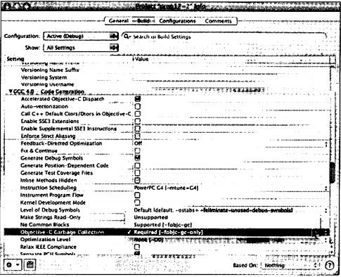

# Глава 17. Управление памятью
На протяжении этой книги мы неоднократно затрагивали тему управления па-мятью. К этому моменту вам должно быть понятно, в каких случаях вы должны сами освобождать память, занятую объектами, и в каких случаях вы не обязаны это делать. Рассматривая даже небольшие примеры, мы постоянно подчеркивали, насколько важно уделять внимание управлению памятью для освоения практики надежного программирования и разработки программ, не допускающих утечки памяти.

Продуманное использование памяти может оказаться критически важным для работы приложения. Например, при создании интерактивного приложения для рисования многих объектов необходимо следить, чтобы по мере выполнения программы количество потребляемых ресурсов памяти не увеличивалось. В таких случаях вы обязаны аккуратно управлять этими ресурсами и освобождать их, когда они становятся не нужны. Это означает, что ресурсы следует освобождать во время выполнения программы, не дожидаясь ее окончания.

В этой главе мы обсудим стратегию выделения памяти в Foundation, пул ав-томатического высвобождения (autorelease pool) и идею «удержания» (retain) объектов. Вы узнаете также о счетчике ссылок (reference count) объекта и о сборке мусора (garbage collection), которая облегчает задачу удержания и последующего высвобождения объектов. Однако, как вы увидите, сборку мусора нельзя ис-пользовать для приложений iPhone, поэтому вы должны знать способы управления памятью, которые описываются в этой книге.

## 17.1. Автоматически высвобождаемый пул
Вы уже знакомы с автоматически высвобождаемым пулом (пулом автомати-ческого освобождения памяти) из примеров во второй части книги. При работе с программами Foundation вы должны создавать этот пул для работы с объектами Foundation. Именно в этом пуле программа следит за объектами для их даль-нейшего высвобождения. Как уже говорилось, пул в приложении можно задать с помощью следующего вызова.
```
NSAutoreleasePool * pool = [ [ N SAutor el ease Poo I alloc] init];
```
После создания этого пула Foundation автоматически добавляет н него оп-ределенные массивы, строки, словари и другие объекты. Закончив использование пула, можно освободить память, которую он использует, отправив сообщение drain.
```
[pool drain];
```
Автоматически высвобождаемый пул называется так потому, что любые объекты, которые помечаются как автоматически высвобождаемые (autorelease) и поэтому добавляются в этот пул, автоматически высвобождаются, когда выс-вобождается сам пул. В программе можно иметь несколько autorelease-пулов, и они могут быть также вложенными.

Если программа создает много временных объектов (что часто происходит при выполнении кода в цикле), может потребоваться создание нескольких autorelease-пулов. Например, в следующем фрагменте кода показано, как со-здавать autorelease-пулы для высвобождения временных объектов, создаваемых на каждом шаге цикла for.
```
NSAutoreleasePool *tempPool;
for (i = 0; i < n; ++i) {
tempPool = [[NSAutoReleasePool alloc] init];
... // здесь выполняется много работы с временными объектами [tempPool drain];
}
```
Отметим, что при опустошении пула (pool drain)autorelease-nyji содержит не сами обьекты, а только ссылку на объекты. Чтобы добавить объект втекуши й autorelease- пул для последующего высвобождения, нужно отправить сообщение autorelease.
```
[myFraction autorelease];
```
Система добавит myFraction в autorelease-пул для автоматического высвобож-дения. Как будет показано ниже, метод autorelease полезен, чтобы помечать объек-ты внутри метода для их устранения.

## 17.2. Подсчет ссылок
Описывая базовый класс объектов Objective-C NSObject, мы говорили, что память выделяется с помощью метода alloc, и ее можно в дальнейшем освободить с помощью сообщения release. К сожалению, это не всегда так просто. Выполняемое приложение может ссылаться на объект, который может быть создан в нескольких местах; объект может быть также сохранен в массиве или, например, к нему может быть обращение с помощью переменной экземпляра. Мы не можем освободить память, занимаемую объектом, пока не будем уверены, что все закончили использовать этот объект.

К счастью, Foundation framework включает удобное решение для отслежи-вания числа ссылок на объект. Это довольно простой способ, который называется подсчетом ссылок (reference count). Он состоит в следующем. При создании объекта его счетчик ссылок устанавливается равным 1. Каждый раз, когда нужно учесть объект, мы увеличиваем его счетчик ссылок на 1, отправляя сообщение retain, как в следующей строке.
```
[myFraction retain];
```
Некоторые методы в Foundation framework тоже наращивают этот счетчик ссылок, например, когда объект добавляется в массив.

Когда объект уже не нужен, мы уменьшаем на I его счетчик ссылок, отправляя сообщение release, как в следующей строке.
```
[myFraction release];
```
Когда счетчик ссылок объект становится равным 0, система «понимает», что этот объект больше не нужен (поскольку на него нет больше ссылок), и поэтому она освобождает (deallocate) его память. Для этого объекту отправляется со-общение dealloc.

Успешное осуществление этой стратегии требует аккуратности от програм-миста, чтобы счетчик ссылок правильно наращивался и уменьшался во время выполнения программы. Как вы увидите ниже, система выполняет только часть этой работы.

Рассмотрим подсчет ссылок несколько подробнее. Объекту можно отправить сообщение retainCount, чтобы получить его счетчик ссылок (или удержаний, retain). Обычно вы не будете использовать этот метод, но здесь мы рассмотрим его в иллюстративных целях (см. программу 17.1). Отметим, что он возвращает целое без знака (unsigned int) типа NSUInteger.
```
// Знакомство с подсчетом ссылок
#import <Foundation/NSObject.h>
#import < Foundation/NSAutoreleasePool.h>
#import <Foundation/NSString.h>
#import <Foundation/NSArray.h>
#import <Foundation/NSValue.h>
int main (int arge, char *argv[])
{
NSAutoreleasePool   * pool = [[NSAutoreleasePool alloc] init];
NSNumber    *mylnt = [NSNumber numberWithlnteger: 100];
NSNumber    *mylnt2;
NSMutableArray  *myArr = [NSMutableArray array];
NSLog (@"mylnt retain count = %lx",
(unsigned long) [mylnt retainCount]);
[myArr addObject: mylnt];
NSLog (@"after adding to array = %lx",
(unsigned long) [mylnt retainCount]);
mylnt2 = mylnt;
NSLog {@"after asssignment to mylnt2 = %lx’\
(unsigned long) [mylnt retainCount]);
[mylnt retain];
NSLog (@"mylnt after retain = %lx",
(unsigned long) [mylnt retainCount]);
NSLog (@"mylnt2 after retain = %lx",
(unsigned long) [mylnt2 retainCount]);
[mylnt release];
NSLog (@“after release = %lx")
(unsigned long) [mylnt retainCount]);
[myArr removeObjectAtlndex: 0];
NSLog (@nafter removal from array = %lx",
(unsigned long) [mylnt retainCount]};
[pool drain];
return 0;
}
```
Вывод программы 17.1
```
mylnt retain count = 1 (счетчик удержаний mylnt)
after adding to array = 2 (после добавления в массив)
after asssignment to mylnt2 = 2 (после присваивания mylnt2)
mylnt after retain = 3 (mylnt после удержания)
mylnt2 after retain = 3 (mylnt2 после удержания)
after release = 2 (после release)
after removal from array = 1 (после удаления из массива)
```
Объекту NSNumber mylnt присваивается целое значение 100, и вывод показы-вает, что начальное число его удержаний равно 1. Затем этот объект добавляется в массив myArr с помощью метода addObject:. Обратите внимание, что после этого его счетчик ссылок равен 2. Метод addObject: делает это автоматически; в документации по addObject: описан этот факт. Добавление объекта в любой тип коллекции увеличивает его счетчик ссылок. Это означает, что когда мы высво-бождаем (release) добавленный ранее объект, на него можно будет по-прежнему ссылаться из массива, и он не будет высвобожден.

Затем мы присваиваем mylnt переменной mylnt2. Отметим, что это не приво-дит к наращиванию счетчика ссылок, что может вызвать в дальнейшем потен-циальные проблемы. Например, если счетчик ссылок для mylnt уменьшится до 0 и его память будет освобождена, mylnt2 будет содержать неверную ссылку на объект (напомним, что присваивание mylnt переменной mylnt2 не приводит к копированию самою объекта, а только к созданию указателя на место в памяти, где находится сам объект).

Поскольку mylnt теперь имеет еще одну ссылку (через mylnt2), мы наращиваем его счетчик ссылок, отправляя ему сообщение retain. Это происходит в следующей сгроке программы 17.1. Как мы видим, после отправки сообщения retain счетчик ссылок становится равным 3. Первая ссылка — это сам объект, вторая ссылка делается из массива и третья — во время присваивания. Сохранение элемента в массиве вызывает автоматическое наращивание счетчика ссылок, а присваивание другому элементу — нет, поэтому мы должны сделать это сами. Отметим, что при выводе счетчик ссылок mylnt и на mylnrt2 дает одинаковое значение 3; дело в том, что в обоих случаях это ссылка на один и тот же объект в памяти.

Предположим, что мы прекратили использовать объект mylnt в программе. Это можно сообщить системе, отправив объекту сообщение release. Как мы можем видеть, его счетчик ссылок в результате уменьшается с 3 до 2. Счетчик нс равен 0; это означает, что продолжают действовать другие ссылки (из массива и через mylnt2). Система не освобождает память, используемую этим объектом, поскольку счетчик ссылок не равен нулю.

После удаления первого элемента из массива myArr с помощью метода removeObjectAtlndex: мы видим, что счетчик ссылок автоматически уменьшился до
В общем случае удаление объекта из любой коллекции сопровождается уменьшением на 1 его счетчика ссылок. Поэтому следующая последовательность кода может вызвать проблемы.
```
mylnt = [myArr ObjectAtlndex: 0];
[myArr removeObjectAtlndex: 0]
```
Дело в том, что в данном случае объект, на который ссылается mylnt, может стать недействительным после вызова метода removeObjectAtlndex:, если его счет-чик ссылок уменьшился до 0. Конечно, для решения этой проблемы нужно удер-жать (retain) mylnt после считывания из массива, чтобы на его ссылку не повлияло то, что происходит в других местах.

### Подсчет ссылок и строки
В программе 17.2 показано, как действует подсчет ссылок для строковых объектов.
```
// Подсчет ссылок в случае строковых объектов.
#import <Foundatton/NSObject.h>
#import <Foundation/NSAutoreleasePool.h>
Simport <Foundation/NSString.h>
#import <Foundation/N$Array.h>
int main (int argc, char *argv[])
{
NSAutoreleasePool * pool = [[NSAutoreleasePool alloc] init];
NSString    *myStr1 = @"Constant string";
NSString    *myStr2 = [NSString stringWithString: @"string 2"];
NSMutableString *myStr3 = [NSMutableString stringWithString: @"string 3"]; NSMutableArray *myArr = [NSMutableArray array];
NSLog (@"Retain count: myStrl: %lx, myStr2: %lx, myStr3: %lx",
(unsigned long) [myStrl retainCount],
(unsigned long) [myStr2 retainCount],
(unsigned long) [myStr3 retainCount]);
[myArr addObject: myStrl];
[myArr addObject: myStr2];
[myArr addObject: myStr3];
NSLog (@"Retain count: myStrl: %lx, myStr2: %lx, myStr3: %lx",
(unsigned long) [myStrl retainCount],
(unsigned long) [myStr2retainCount],
(unsigned long) [myStr3 retainCount]);
[myArr addObject: myStrl];
[myArr addObject: myStr2];
[myArr addObject: myStr3];
NSLog (@"Retain count: myStrl: %lx, myStr2: %lx, myStr3: %lx",
(unsigned long) [myStrl retainCount],
(unsigned long) [myStr2retainCount],
(unsigned long) [myStr3 retainCount]);
[myStrl retain];
[myStr2 retain];
[myStr3 retain];
NSLog (@"Retain count: myStrl: %lx, myStr2: %lx, myStr3: %lx",
(unsigned long) [myStrl retainCount],
(unsigned long) [myStr2 retainCount],
(unsigned long) [myStr3 retainCount]);
// Уменьшение счетчика ссыпок myStr3 снова до 2 [myStr3 release];
[pool drain]; return 0;
}
```
Вывод программы 17.2
```
Retain count: myStrl: ffffffff, myStr2: ffffffff, myStr3: 1 (Счетчик ссылок:)
Retain count: myStrl: ffffffff, myStr2: ffffffff, myStr3: 2 Retain count: myStrl: ffffffff, myStr2: ffffffff, myStr3: 3
```
Объекту NSString myStrl присваивается строка NSConstantString @'Constant string" (Константная строка). Вьшеление места в памяти для константных строк отличается от других объектов. Константные строки не имеют механизма подсчета ссылок, поскольку их нельзя высвободить. Именно поэтому при отправке сообщения retainCount переменной myStrl счетчик возвращает значение Oxffffffff. (Это на самом деле максимально возможное целое значение без знака, то есть UINT_MAX в стандартном header-файле `<limits.h>`.)

**Примечание.** Очевидно, что в некоторых системах счетчик ссылок, возвращаемый для константных строк в программе 17.2, дает значение Qx7fffffif (а не Gxffffffff), что является максимально возможным целым значением со знаком, то есть INT_MAX.

Отметим, что то же самое относится к немутабельному строковому объекту, который инициализируется с константной строкой: он тоже не имеет счетчика ссылок, что подтверждается счетчиком ссылок, выведенным для myStr2.

**Примечание.** В данном случае система уже достаточно «сообразительна», по-этому она определила, что немутабельный строковый объект инициализируется с помощью константного строкового объекта. До выпуска Leopard такая оп-тимизация не выполнялась, и поэтому для mystr2 действовал счетчикудержаний.

В операторе
```
NSMutableString *myStr3 = [NSMutableString stringWithString: @"string 3"];
```
переменной myStr3 присваивается строка, полученная из копии константной символьной строки @"string 3". Мы создали копию этой строки, поскольку классу NSMutableString было передано сообщение stringWithString:, указывающее, что содержимое строки может быть изменено в ходе выполнения программы. А по-скольку содержимое константных символьных строк нельзя изменить, система не может сделать так, чтобы переменная myStr3 только указывала на константную строку @"string 3", как это было сделано в случае myStr2.

Поэтому строковый объект myStr3 действительно имеет счетчик ссылок, что подтверждается результатами вывода. Счетчик ссылок можно изменить путем добавления этой строки к массиву или передачи ему сообщения retain, что под-тверждается результатами вывода с помощью последних двух вызовов NSLog. Метод Foundation stringWithString: добавил этот объект в autorelease-пул при его создании. Метод Foundation array также добавил массив myArr в этот пул.

Прежде чем высвободить сам autorelease-пул, высвобождается myStr3. В ре-зультате его счетчик ссылок уменьшается до 2. Высвобождение autorelease-пула уменьшает счетчик ссылок этого объекта до 0, что приводит к освобождению занятой им памяти. Как это происходит? При высвобождении autorelease-пула каждый из объектов этого пула получает сообщение release, и это сообщение передается объекту столько раз, сколько было передано сообщений airtorelease. Поскольку строковый объект myStr3 был добавлен в autorelease-пул при создании этого объекта с помощью метода stringWithString:, ему передается сообщение release. Это уменьшает его счетчик ссылок до 1. При высвобождении массива в autorelease-пуле также происходит высвобождение каждого из его элементов. Поэтому при высвобождении массива туАл из пула каждому из его элементов (включая myStr3) передается сообщение release. "Эго уменьшает его счетчик ссы-лок до 0, в результате чего его память должна быть освобождена.

Следите, чтобы не было лишних высвобождений объекта. Если в программе 17.2 сделать счетчик ссылок mystr3 меньше 2 до высвобождения самого пула, то пул будет содержать ссылку на неверный объект. Затем при высвобождении самого пула ссылка на неверный объект вызовет, скорее всего, аварийное за-вершение программы с ошибкой неверной сегментации (segmentation fault).

### Подсчет ссылок и переменные экземпляра
Счетчикам ссылок необходимо уделять внимание при работе с переменными экземпляра. Вспомним метод setName: из класса AddressCard.
```
-(void) setName: (NSString *) theName
{
[name release];
name = [[NSString alloc] initWithString: theName];
}
```
Предположим, что вместо этого мы определили setName: следующим образом и он не получил владения своим объектом name.
```
-(void) setName: (NSString *) theName
(
name = theName;
}
```
Эта версия метода получает строку, представляющую имя человека, и со-храняет ее в переменной экземпляра name. Казалось бы, здесь все очевидно, но рассмотрим следующий вызов метода.
```
NSString *newName;
[myCard setName: newName];
```
Предположим, что newName — это пространство временного хранения для имени человека, которого добавили в адресную карточку, и что в дальнейшем эго пространство нужно освободить. Как вы думаете, что произойдет с переменной экземпляра name в myCard? Ее поле name будет недействительным, поскольку будет ссылаться на объект, который был ликвидирован. Именно поэтому нужно, чтобы наши классы имели свои собственные объекты-члены: эти объекты могут быть неожиданно высвобождены или модифицированы.

В следующих примерах этот вопрос обсуждается более подробно. Начнем с определения нового класса ClassA, содержащего одну переменную экземпляра: строковый объект с именем str. Напишем метод-установщик и метод-получатель (setter и getter) для этой переменной. Мы не будем синтезировать эти методы, а напишем их сами, чтобы было ясно, что происходит.
```
// Знакомство с подсчетом ссылок
#import <Foundation/NSObject.h>
#import <Foundation/NSAutoreleasePool.h>
#import <Foundation/NSString.h>
@interface ClassA: NSObject
{
NSString *str;
}
-(void) setStr: (NSString *) s;
-(NSString *) sir;
@end
@implementation ClassA -(void) setStr: (NSString *) s {
str = s;
}
-{NSString *) str
{
return str;
}
@end
int main (int argc, char *argv[])
{
NSAutoreleasePool * pool = [[NSAutoreleasePool alloc] init];
NSMutableString *myStr = [NSMutableString stringWithString: @"A string"];
ClassA *myA = [[ClassA alloc] init];
NSLog (@nmyStr retain count: %x", [myStr retainCount]);
[myA setStr: myStr];
NSLog (@"myStr retain count: %x", [myStr retainCount]);
[myA release];
[pool drain];
return 0;
}
```
Вывод программы 17.3
```
myStr retain count: 1 (счетчик ссылок myStr) myStr retain count: 1
```
Программа просто выделяет память (alloc) для объекта класса ClassA с именем myA и затем вызывает метод-установщик (setStr), чтобы присвоить ему объект NSString, указанный myStr. Счетчик ссылок для myStr равен 1 как до, так и после вызова метода setStr (как и следовало ожидать), поскольку этот метод просто сохраняет значение своего аргумента а своей переменной str. И здесь снова, если программа высвободит myStr после вызова метода setStr, значение, сохраненное внутри переменной экземпляра str, будет неверным, поскольку ее счетчик ссылок будет уменьшен до 0 и пространство памяти, занятое объектом, на который она ссылается, будет освобождено.

Это происходит в программе 17.3 при высвобождении autorelease-пула. Мы не добавляли строковый объект myStr в этот пул явным образом, но он был добавлен в autorelease-пул при его создании с помощью метода stringWitliString:. При высвобождении пула произошло также высвобождение myStr. Поэтому любая попытка доступа к этому объекту после высвобождения пула будет неверной.

В программе 17.4 внесены изменения в метод setStr:, чтобы удержать (retain) значение str. Это защитит от возможности случайно высвободить ссылки на объект str.
```
// Удержание объектов
#import <Foundation/NSObject.h>
#import <Foundation/NSAutoreleasePool.h>
#import <Foundation/NSString.h>
#import <Foundation/NSArray.h>
@interface ClassA: NSObject
{
NSString *str;
}
-{void} setStr: (NSString *) s;
-(NSString *) str;
@end
@implementation ClassA -(void) setStr: (NSString *) s {
str = s;
[str retain];
}
-(NSString *) str
{
return str;
}
@end
int main (int arge, char *argv[])
{
NSAutoreleasePool * pool = [[NSAutoreleasePool alloc] init];
NSString * myStr = [NSMutableString stringWitliString: @"A string"];
ClassA *myA = [[ClassA alloc] init];
NSLog (@''myStr retain count: %x", [myStr retainCount]);
[myA setStr: myStr];
NSLog (@nmyStr retain count: %x", [myStr retainCount]);
[myStr release];
NSLog (@"myStr retain count: %x", [myStr retainCount]);
[myA release];
[pool drain]; return 0;
}
```
Вывод программы 17.4
```
myStr retain count: 1 myStr retain count: 2 myStr retain count: 1
```
Мы видим, что после вызова метода setStr: счетчик ссылок для myStr увели-чился до 2, что позволило решить эту проблему. Последующее высвобождение myStr в этой программе оставляет допустимой ссылку на нее через переменную экземпляра, поскольку ее счетчик ссылок пока равен 1.

Поскольку мы выделили память для myA с помощью alloc, мы по-прежнему обязаны высвободить ее сами. Но вместо этого мы могли бы добавить ее в autorelease-пул, отправив ей сообщение autorelease.
```
[myA autorelease];
```
Это можно сделать сразу после выделения памяти для объекта. Напомним, что добавление объекта в autorelease-пул не высвобождает его и не делает его недействительным; он просто помечается для дальнейшего высвобождения. Мы можем продолжать использовать этот объект, пока не будет освобождена зани-маемая им память, что происходит при высвобождении пула, если счетчик ссылок этого объекта на этот момент стал равным 0.

У нас все еще остаются некоторые потенциальные проблемы, которые вы, возможно, видите. Метод setStr: выполняет необходимую работу по удержанию (retain) строкового объекта, который он получает в качестве своего аргумента, но когда высвобождается этот строковый объект? И что происходит со старым значением переменной экземпляра str, которое мы перезаписываем? Нужно ли высвобождать это значение, чтобы освободить занимаемую им память? В прог-рамме 17.5 содержится решение этой проблемы.
```
// Знакомство с подсчетом ссылок
#import <Foundation/NSObject.h>
#import <Foundation/NSAutoreleasePool.h>
#import <Foundation/NSString.h>
#import <Foundation/NSArray.h>
@interface ClassA: NSObject
{
NSString *str;
}
-(void) setStr: (NSString *) s;
-(NSString *) str;
-(void) dealloc;
@end
@implementation ClassA -(void) setStr: (NSString *) s {
// высвобождение старого объекта, поскольку мы закончили работать с ним [str autorelease];
// удержание (retain) аргумента на тот случай, если кто-то высвободит его str = [s retain];
-(NSString *) str
{
return str;
)
-(void) dealloc {
NSLog (@"ClassA dealloc");
[str release];
[super dealloc];
}
@end
int main (int argc, char *argv[])
{
NSAutoreleasePool * pool = [[NSAutoreleasePool alloc] init]; NSString *myStr = [NSMutableString stringWithString: @"A string"]; ClassA *myA = [[ClassA alloc] init];
NSLog (@"myStr retain count: %x", [myStr retainCount]);
[myA autorelease];
[myA setStr: myStr];
NSLog {@"myStr retain count: %x’\ [myStr retainCount]);
[pool drain]; return 0;
}
```
Вывод программы 17.5
```
myStr retain count: 1
myStr retain count: 2
ClassA dealloc
```
Метод setStr: берет то, что сохранено на данный момент в переменной эк-земпляра str, и применяет к нему autorelease, то есть делает его доступным для дальнейшего высвобождения. Это важно, если метод вызывается много раз, чтобы присваивать одному и тому же полю различные значения. Каждый раз перед сохранением нового значения старое значение должно быть помечено для высвобождения. После высвобождения старого значения новое значение удерживается (retain) и сохраняется в поле str. В выражении с сообщением
```
str - [s retain];
```
используется тот факт, что метод retain возвращает своего получателя.

**Примечание.** Если переменная str имеет значение nil, это не представляет про-блемы. Среда выполнения Objective-C инициализирует все переменные экзем-пляра, присваивая им nil, и вполне допустимо передать сообщение nil.

Метод dealloc уже встречался в главе 15 при работе с классами AddressBook и AddressCard. Замещающий метод dealloc — это удобный способ избавиться от последнего объекта, на который ссылается наша переменная экземпляра str при освобождении ее памяти (то есть когда ее счетчик ссылок стал равным 0). В таком случае система вызывает метод dealloc, который наследуется из NSObject и его обычно не требуется замещать. Если внутри методов происходит удержание (retain) объектов, выделение для них памяти (с помощью alloc) или их копирование (с помощью методов копирования, описанных в следующей главе), может потребоваться замещение dealloc, чтобы иметь возможность их высвобождения. Операторы
```
[str release];
[super dealloc];
```
сначала высвобождают переменную экземпляра str и затем вызывают родитель-ский метод dealloc, чтобы закончить работу.

Вызов NSLog был помещен внутри метода dealloc, чтобы выводить сообще-ние, когда вызывается этот метод. Мы сделали это, чтобы подтвердить, что объект ClassA правильно высвобожден после высвобождения autorelease-пула.

Возможно, вы увидели один последний недочет в методе-установщике setStr. Рассмотрим еще раз программу 17.5. Предположим, что myStr является мута- бельной строкой (а не немутабельной) и один или несколько символов в myStr были изменены после вызова setStr. Изменения в строке, на которую ссылается myStr, повлияют также на строку, на которую ссылается переменная экземпляра, поскольку они ссылаются на один и тот же объект. Перечитайте последнее предложение, чтобы убедиться, что вы понимаете его. Вы должны также понять, что присваивание myStr совершенно нового строкового объект не вызовет этой проблемы. Проблема возникает только в том случае, если будут изменены каким-либо способом один или несколько символов строки.

Решением этой проблемы является создание новой копии строки внутри метода-установщика, если вы хотите защитить ее и сделать совершенно неза-висимой от аргумента этого метода. Именно поэтому здесь выбрано создание копии компонентов name и email в методах setName: и setEmail: класса AddressCard (см. главу 15).

## 17.3. Пример автоматического высвобождения
Рассмотрим последний пример из этой главы, чтобы убедиться, что вы действи-тельно понимаете, как действует подсчет ссылок, удержание (retain) и высво- бождение/автоматическое высвобождение (release/autorelease) объектов. Рас-смотрим программу 17.6, которая определяет фиктивный класс с именем Foo с одной переменной экземпляра и только наследуемыми методами.
```
#import <Foundation/NSObject.h>
#import <Foundation/NSAutoreleasePool.h>
@interface Foo: NSObject
{
int x;
}
@end
@implementation Foo @end
int main (int arge, char *argv[])
{
NSAutoreleasePool * pool = [[NSAutoreleasePool alloc] init];
Foo *myFoo = [[Foo alloc] init];
NSLog (@"myFoo retain count = %x", [myFoo retainCount]);
[pool drain];
NSLog (@"after pool drain = %x", [myFoo retainCount]);
pool = [[NSAutoreleasePool alloc] init];
[myFoo autorelease];
NSLog (@"after autorelease = %x", [myFoo retainCount]);
[myFoo retain];
NSLog (@"after retain = %x", [myFoo retainCount]);
[pool drain];
NSLog (@"after second pool drain = %x", [myFoo retainCount]);
[myFoo release]; return 0;
}
```
Вывод программы 17.6
```
myFoo retain count = 1 (счетчик ссылок myFoo)
after pool drain = 1 (после pool drain)
after autorelease = 1 (после autorelease)
after retain = 2 (после retain)
after second pool drain = 1 (после второго pool drain)
```
Программа выделяет память для нового объекта Foo и присваивает его пере-менной myFoo. Как вы уже видите, начальное значение ее счетчика удержаний (ссылок) равно 1. Этот объект еще не является частью autorelease-пула, поэтому высвобождение этого пула не делает объект недействительным. Затем выделяется новый пул, и myFoo добавляется в этот пул путем отправки сообщения autorelease. Снова отметим, что счетчик ссылок этой переменной не изменяется, так как добавление объекта в autorelease-пул не влияет на его счетчик ссылок, а только помечает его для дальнейшего высвобождения.

Затем мы передаем myFoo сообщение retain. Это изменяет ее счетчик ссылок на 2. При последующем высвобождении пула во второй раз счетчик ссылок для myFoo уменьшается на 1, так как ранее ей было передано сообщение autorelease и, следовательно, ей передается сообщение release, когда происходит высвобождение пула.

Поскольку для myFoo было выполнено удержание (retain) до высвобождения пула, ее счетчик ссылок после уменьшения будет все еще больше 0. Поэтому myFoo остается после pool drain и все еще является действительным объектом. Конечно, вы должны теперь высвободить и ее, что мы и делаем в программе 17.6 для очистки и ликвидации утечек памяти.

Если вам понятна программа 17.6, значит, вы хорошо понимаете, что такое autorelease-пул и как он действует.

## 17.4. Сводка правил по управлению памятью
Подытожим сведения по управлению памятью, которые изложены в этой главе.
* Высвобождение объекта может освобождать его память, что может требовать определенных усилий, если вы создаете много объектов во время выполнения программы. Основным правилом является высвобождение созданных или удержанных объектов, когда вы прекращаете работать с ними. Передача сообщения release не обязательно означает ликвидацию объекта. Если счетчик ссылок объекта уменьшается до 0, то объект ликвидируется. Система осуществляет это, передавая объекту сообщение dealloc для освобождения его памяти.
* Автоматически высвобождаемый пул (autorelease-пул) предусматривает ав-томатическое высвобождение объектов, когда высвобождается сам пул. Си-стема делает это, передавая сообщение release каждому объекту столько же раз, сколько было передано сообщений autorelease. Каждому объекту в autorelease-пулс, счетчик ссылок которого уменьшился до 0, передается со-общение dealloc для ликвидации самого объекта.
* Если вам больше не нужен объект в методе, но нужно вернуть его, передайте ему сообщение autorelease, чтобы пометить его для дальнейшего высвобож-дения. Сообщение autorelease не влияет на счетчик ссылок объекта. Это по-зволяет отправителю сообщения использовать объект, но при этом объект будет высвобожден позже, когда будет высвобожден сам autorelease-пул.
* Когда завершается работа приложения, освобождается вся память, занимаемая объектами, независимо от их включения в autorelease-пул.
* Если вы разрабатываете более сложные приложения (например, приложения Cocoa), autorelease-пулы можно создавать и ликвидировать во время выполнения профаммы (для приложений Cocoa это происходит каждый раз при возникновении события). В таких случаях можно сделать так, чтобы объект остался действительным после автоматического высвобождения (когда высвобождается сам autorelease-пул); для этого нужно явно удержать его (retain). Все объекты, счетчик ссылок которых больше числа переданных им сообщений autorelease, продолжают действовать после высвобождения пула.
* В случае непосредственного создания объекта с помощью метода alloc или сору (либо метода allocWithZone:, copyWithZone: или mutableCopy) вы обязаны сами высвободить его. Каждый раз при удержании объекта (с помощью retain) вы должны применить release или autorelease к этому объекту.
* Вам не нужно заботиться о высвобождении об'ьектов, возвращаемых методами, которые не упомянуты в предыдущем правиле. Такие методы будут сами обеспечивать автоматическое высвобождение объектов. Именно поэтому вам нужно в первую очередь создавать autorelease-пул в своих программах. Такие методы, как stringWithString:, автоматически добавляют в этот пул новые создаваемые строковые объекты, передавая им сообщения autorelease. Если не создать пул, то вы получите сообщение, что пытаетесь автоматически высвободить (autorelease) объект при отсутствии пула.

## 17.5. Сборка мусора
До настоящего момента мы создавали программы для выполнения в среде runtime с управлением памятью (memory-managed environment). Правила управления памятью, изложенные в предыдущих разделах, применимы к такой среде, где используются autorelease-пулы и возникают вопросы высвобождения и удержания объектов, а также владения объектами.

В Objective-C 2.0 стала доступна альтернативная форма управления памятью, которая называется сборкой мусора (garbage collection). Используя сборку мусора, можно не думать об удержании и высвобождении объектов, autorelease- пулах или счетчиках удержаний (ссылок). Система автоматически следит, какие объекты владеют другими объектами, автоматически высвобождает (то есть включает в сборку мусора) объекты, к которым больше нет обращений, по мере того, как возникает потребность в памяти при выполнении программы. 

Если все так просто, то почему мы не использовали сборку мусора на протя-жении всей этой книги, опустив все вопросы управления памятью? Здесь есть три причины. Во-первых, даже в среде, которая поддерживает сборку мусора, будет лучше, если мы знаем владельцев наших объектов, чтобы определять момент, когда они больше не требуются. Это заставит вас быть более аккуратными при написании кода, поскольку вы будете понимать связи объектов друг с другом и знать продолжительность их действия в программе.

Во-вторых, как уже говорилось выше, среда runtime для iPhone не поддер-живает сборку мусора, поэтому у вас нет выбора при разработке программ для этой платформы.

И третья причина относится к вам, если вы планируете писать библиотечные процедуры, встраиваемые модули (plug-in) или код для совместного доступа. Этот код может быть загружен в процесс как со сборкой мусора, так и без сборки мусора, поэтому его следует писать для работы в обеих средах. Это означает, что вы должны использовать методы управления памятью, описанные в этой книге. Это также означает, что вы должны тестировать свой код с отключением и включением сборки мусора.

Если вы решили использовать сборку мусора, то должны включить ее при создании программ с помощью Xcode. Это можно делать через меню Project (Проект), Edit Project Settings (Изменение настроек проекта). В настройках «GCC 4.0-Code Generation» вы увидите пункт Objective-C Garbage Collection (Сборка мусора Objective-C). Измените ее со значения по умолчанию Unsupported (Не поддерживается) на Required (Требуется), чтобы ваша программа создавалась с включением автоматической сборки мусора (см. рис. 17.1).



Рис. 17.1. Включение сборки мусора

С включенной сборкой мусора в программе могут по-прежнему использо-ваться вызовы методов retain, autorelease, release и dealloc. Однако все они будут игнорироваться. Это позволит вам разработать программу, которую можно будет выполнять в обеих средах — с управлением памятью или со сборкой мусора. Однако при выполнении в обеих средах вы не сможете работать с собственным методом dealloc: как уже говорилось, вызовы dealloc игнорируются, если включена сборка мусора.

Примечание. Способы управления памятью, описанные в этой главе, достаточны для большинства приложений. Однако в более сложных случаях, например, при написании многопотоковых приложений, могут потребоваться дополнительные сведения. О вопросах, относящихся к сборке мусора, см. приложение D.

## Упражнения
1. Напишите программу, чтобы проверить, как влияет добавление и удаление зап исей в словарь на счетчик ссылок объектов, которые вы добавляете и удаляете.
2. Как, по вашему мнению, будет влиять метод NSArray replaceObjectAtlndex:withObject: на счетчик ссылок объекта, который заменяется в массиве? Напишите соответствующую программу для проверки. Затем ознакомьтесь с документацией по этому методу, чтобы проверить результаты.
3. Вернемся к классу Fraction, с которым мы работали на протяжении части I этой книги. Для вашего удобства он приводится в приложении D. Внесите изменения в этот класс, чтобы работать в Foundation framework. Затем добавьте нужные сообщения в различные методы категории MathOps, чтобы добавлять в autorelease-пул дроби (fraction), получаемые в результате каждой операции. Сможете ли вы использовать после этого следующий оператор без утечки памяти?
    ```
    [[fractionA add: fractionB] print];
    ```
    Объясните ответ.
4. Вернемся к примерам AddressBook и AddressCard из главы 15. Внесите измене-ния в каждый метод dealloc, чтобы выводить сообщение при вызове метода. Затем выполните некоторые примеры программ, где используются эти классы, чтобы убедиться, что сообщение dealloc передается каждому объекту AddressBook и AddressCard, прежде чем будет достигнут конец main.
5. Выберите любые две программы из этой книги и выполните их в Xcode с включенной сборкой мусора. Убедитесь, что в этом случае игнорируются вызовы таких методов, как retain, autorelease и release.
