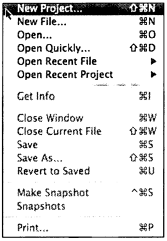
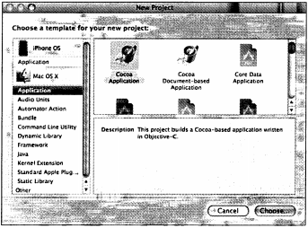
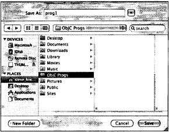
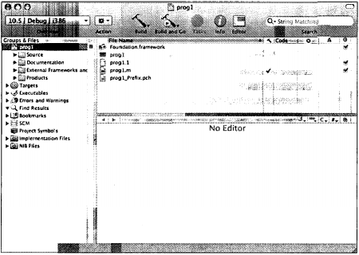
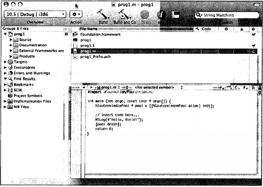
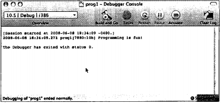
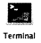
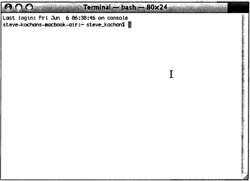

# Часть I. Язык Objective-C 2.0
# Глава 2. Программирование на Objective-C

В этой главе мы сразу приступим к делу и напишем первую программу на Objective-C. Пока мы не будем работать с объектами — это тема следующей гла-вы. Сначала необходимо понять, что такое ввод программы, ее компиляция и выполнение. Это важно при программировании и в Windows, и на компьютерах Macintosh.

Для начала рассмотрим простую программу, которая выводит на экране фразу «Programming is fun!» (Программировать весело!). Эту задачу выполняет программа «Программа 2.1», приведенная ниже.

```
// First program example (Первый пример программы)
#import <Foundation/Foundation.h>

int main (int argc, const char * argv[])
{
    NSAutoreleasePool * pool = [[NSAutoreleasePool alloc] init];
    NSLog ((@"Programming is fun!");
    [pool drain]; return 0;
}
```

## 2.1. Компиляция и выполнение программ
Прежде чем приступить к подробному описанию программы, рассмотрим ее компиляцию и выполнение. Для компиляции и выполнения этой программы можно использовать Xcode или компилятор GNU Objective-C в окне Terminal. Мы рассмотрим оба метода, чтобы вы могли решить, каким из них будете работать с программами в остальной части книги.

Примечание. Соответствующие средства уже предустановлены на всех Маках, которые поставляются с системами OS X. Если вы устанавливаете OS X отдель-но, установите также Developer Tools.

### Xcode
Xcode — это мощное приложение, позволяющее вводить, компилировать, от-лаживать и выполнять программы. Если вы намерены разрабатывать приложения на Маке, вам необходимо освоить это мощное инструментальное средство. Здесь вы только ознакомитесь с ним, в дальнейшем мы разработаем с его помо-щью одно графическое приложение.
Xcode находится в папке Developer внутри подпапки Applications. На рис. 2.1 показан значок Xcode.
Запустите Xcode. В меню File (Файл) выберите New Project (Новый проект), см. рис. 2.2.


Рис. 2.1. Значок Xcode

Появится окно, показанное на рис. 2.3.



Рис. 2.2. Запуск нового проекта



Рис. 2.3. Запуск нового проекта: выбор типа приложения

Выполните прокрутку в левой панели, пока не появится Command Line Utility (Утилита командной строки). В правой панели выделите Foundation Tool. Теперь появится окно, показанное на рис. 2.4.


Рис. 2.4. Запуск нового проекта: создание инструмента Foundation

Щелкните на Choose (Выбрать). Появится новое окно (рис. 2.5).



Рис. 2.5. Окно списка файлов Xcode

Мы назовем эту программу progl. Введите это имя в поле Save As (Сохранить как). Возможно, для проектов этой книги следует создать отдельную папку. Я держу проекты для этой книги в папке ObjC Progs.

Щелкните на кнопке Save (Сохранить), чтобы создать новый проект. По-явится окно проекта (рис. 2.6).

Ваше окно может выглядеть по-другому, если вы уже работали с Xcode или изменяли какие-то параметры Xcode.

Теперь пора ввести первую программу. Выберите файл progl.m в правой вер-хней панели. Окно Xcode показано на рис. 2.7.

В таблице 2.1 приводится список распространенных расширений имен файлов. Расширение имени для исходных файлов Objective-C — .m.

Табл. 2.1. Распространенные расширения имен файлов

| Расширение | Описание                         |
|------------|----------------------------------|
| .c         | Исходный файл на языке С         |
| .cc, .cpp  | Исходный файл на языке C++       |
| .h         | Файл заголовка (Header)          |
| .m         | Исходный файл Objective-C        |
| .mm        | Исходный файл Objective-C++      |
| .pl        | Исходный файл Perl               |
| .o         | Объектный (компилированный) файл |



Рис. 2.6. ОКНО проекта Xcode prog1



Рик. 2.7. Файл progl.m и окно редактирования (edit)

В окне проекта Xcode (внизу справа) показан файл с именем progl.m, содержащий следующие строки:
```
#import <Foundation/Foundation.h>

int main (int argc, const char * argv[]) {
    NSAutoreleasePool * pool = [[NSAutoreleasePool alloc] init];

    // insert code here... (введите здесь код)
    NSLog (@"Hello World!");
    [pool drain]; return 0;
}
```
Примечание. Если у вас не отображается содержимое этого файла, попробуйте щелкнуть и вытянуть нижнюю правую панель, чтобы снова появилось окно ре-дактирования. Это может произойти, если вы уже работали с Xcode.

В этом окне Xcode предоставляет файл шаблона, который вы можете редак-тировать. Внесите изменения, соответствующие тексту программы 2.1. Строка в начале файла progl .m, которая начинается с двух слэшей (//), называется ком-ментарием; ниже мы поговорим о них более подробно.

Ваша программа в окне редактирования должна выглядеть следующим об-разом.
```
// First program example

#import <Foundation/Foundation.h>

int main (int argc, const char * argv[])
{
    NSAutoreleasePool * pool = [[NSAutoreleasePool alloc] init];
    NSLog (@"Programming is fun!");
    [pool drain]; return 0;
}
```
Обратите внимание на цвета текста. Xcode выделяет разными цветами зна-чения, зарезервированные слова и т.д.

Теперь можно скомпилировать и выполнить программу. В терминологии Xcode эти этапы называются build and run (Сборка и выполнение). Сначала следует сохранить программу, выбрав пункт Save в меню File. Если попытаться ском-пилировать и выполнить программу без сохранения файла, Xcode спросит, хотите ли вы сохранить его.

В меню Build (Сборка) можно выбрать Build или Build and Run. Выберите второй вариант, поскольку программа, скомпилированная без ошибок, будет выполнена автоматически.

Можно также щелкнуть на значке Build and Go, который показан в панели инструментов.

Примечание. Build and Go означает «Выполнить сборку и затем запустить пос-леднюю операцию, которую я просил выполнить». Это может быть Run, Debug, Run with Shark or Instruments и т.д. При первом использовании для проекта Build and Go означает «собрать и выполнить программу» (Build and Run). Однако в дальнейшем «Build and Go» и «Build and Run» не всегда означают одно и то же.

Если в программе имеются ошибки, то на этом этапе вы увидите сообщение об ошибках. Вернитесь назад, исправьте ошибки и повторите процесс. После устранения всех ошибок появится окно progl - Debugger Console (Консоль отладчика). Это окно содержит выходные результаты программы (рис. 2.8). Если это окно не появляется автоматически, перейдите в линейку главного меню и выберите Console в меню Run. Содержимое окна Console будет описано ниже.



Рис. 2.8. Окно Xcode Debugger Console

Вы закончили процедурную часть компиляции и выполнения программы с помощью Xcode. Ниже приводится последовательность шагов для создания новой программы с помощью Xcode.
1. Запустите приложение Xcode.
2. Если это новый проект, выберите File, New Project.
3. Для типа приложения выберите Command Line Utility, Foundation Tool и щел-кните на кнопке Choose. 
4. Выберите имя проекта и папку для сохранения в ней файлов проекта. Щел-кните на кнопке Save.
5. В верхней правой панели вы увидите файл progl.m (или то имя, которое вы назначили своему проекту, с расширением имени .т). Выделите этот файл.
    Введите текст программы в окне редактирования (edit), которое появится непосредственно под этой панелью.
6. Сохраните изменения, выбрав File, Save.
7. Запустите сборку и выполнение приложения, выбрав Build, Build and Run или щелкнув на кнопке Build and Go.
8. В случае ошибок при компиляции внесите в программу изменения и повторите шаги 6 и 7.

### Приложение Terminal
Если вы привыкли использовать оболочку UNIX и средства командной строки, то можете редактировать, компилировать и выполнять программы, используя приложение Terminal. Ниже описывается, как это делать.

Первый шаг — это запуск приложения Terminal на вашем Маке. Приложение Terminal находится в папке Applications внутри Utilities. На рис. 2.9 показан его значок.

Запустите приложение Terminal. Появится окно, аналогичное рис. 2.10.



Рис. 2.9. Значок программы Terminal

Команды вводятся в каждой строке после символа $ (или % — в зависимости от настройки вашего приложения Terminal). Это вполне понятно, если вы знакомы с использованием UNIX,

Сначала нужно ввести в файл строки из программы 2.1. Можно начать с со-здания папки, в которой будут сохраняться примеры ваших программ. Затем для ввода вашей программы нужно запустить текстовый редактор, например, vi или emacs.

```
sh-2.05a$ mkdir Progs # Создание папки для сохранения программ
sh-2.05a$ cd Progs  # Переход в новую папку
sh-2.05a$ vi progl.m # Запуск текстового редактора для ввода программы
```



Рис. 2.10. Окно Terminal

Примечание. В показанном примере и в остальной части книги команды, которые вводятся пользователем, выделены полужирным начертанием.

Для файлов Objective-C можно выбрать любое имя, но в конце имени должны стоять символы .т, которые указывают компилятору, что используется Objective-C.

Для файла с текстом программы можно выполнять компиляцию и сборку с помощью компилятора GNU Objective-C, который называется дсс. Команда дсс имеет следующий формат:
```
gcc -framework Foundation файлы -о имя_программы
```
Опция -framework Foundation указывает, что используется информация о Foundation framework.

Эта опция должна быть указана в командной строке. Файлы — это список файлов для компиляции. В нашем примере такой файл только один (с именем progl.m). Имя_программы — это имя исполняемого файла, который будет создан, если файл скомпилируется без ошибок.

Эта программа называется prog 1. Ниже приводится командная строка для компиляции этой программы:
```
$ gcc -framework Foundation progl .m -о progl # Компилировать progl.m и назвать ее prog 1
$
```
Возврат символа командной строки без каких-либо сообщений означает, что в программе не обнаружено ошибок. Вы можете выполнить такую программу, введя имя progl в командной строке:
```
$ progl Выполнение progl
sh: prog 1: command not found (команда не найдена)
$
```
Вы можете получить этот результат, если раньше не использовали Terminal. Оболочка UNIX (то есть приложение, выполняющее вашу программу), «не зна-ет», где находится progl (мы не будем подробно объяснять это здесь). Есть два варианта решения этой проблемы. Первый — поставить перед именем программы символы ./, чтобы оболочка искала программу в текущей папке. Второй— добавить папку, в которой хранится ваша программа (или просто текущей папки), к переменной оболочки PATH. Мы используем первый способ:
```
$ ./progl   Выполнение progl
2008-06-08 18:48:44.210 progl [7985:10b] Programming is fun!
$
```
Написание и отладка программ Objective-C из среды Terminal — вполне до-пустимый, но стратегически ошибочный подход. Приложения Mac OS X или iPhone — это не просто исполняемый файл, который должен быть «упакован» в пакет приложения. Создать такие приложения из приложения Terminal очень нелегко, в отличие от специализированной среды Xcode. Поэтому далее мы зай-мемся изучением Xcode как среды для разработки ваших программ.

## 2.2. Объяснение вашей первой программы
Познакомившись с компиляцией и выполнением программы Objective-C, рас-смотрим эту программу более подробно. Еще раз приведем ее текст.
```
// First program example (Первый пример программы)

#import <Foundation/Foundation.h>

int main (int arge, const char * argv[])
{
    NSAutoreleasePool * pool = [[NSAutoreleasePool alloc] init];
    NSLog (@"Programming is fun!");
    [pool drain]; return 0;
}
```
В Objective-C прописные и строчные буквы различаются. Кроме того, для Objective-C не имеет значения, с какого места строки вы начинаете ввод: вводить символы можно с любой позиции строки. Это позволяет сделать программы более удобными для чтения.

В первой строке программы мы встречаем понятие комментария:
```
// First program example
```
Комментарий используется для документирования программы и удобства ее чтения. Из комментариев читатель программы (программист или человек, поддерживающий программу) видит назначение и логику определенной про-граммы или последовательности операторов.

Комментарии можно вставлять в программу Objective-C двумя способами. Один из них - это использование двух последовательных слэшей (//). Компилятор игнорирует все символы после слэшей, вплоть до конца строки.

Комментарий можно также инициировать с помощью символов / и *. Ком-ментарий начинается с символов /* и завершается символами */ с любым числом предшествующих пробелов. Все символы между открывающими /* и зак-рывающими */ считаются частью комментария и игнорируются компилятором Objective-C. Эта форма комментария часто используется, если комментарий занимает несколько строк:
```
/*
    Этот файл реализует класс с именем Fraction, который представляет дробные числа. Используются методы, которые позволяют работать с дробями, например, addition (сложение), subtraction (вычитание) и т.д.
    Более подробную информацию см. в документе:
    /usr/docs/classes/fractions.pdf
*/
```
Вы сами выбираете стиль комментариев. Вложенность комментариев в стиле /* не допускается.

Имеются три причины для того, чтобы вставлять комментарии в программу. Во-первых, намного проще документировать программу, когда вы еще держите в уме ее логику, чем восстанавливать ее логику после того, как программа завершена. Во-вторых, при вставке комментариев на ранних стадиях вы облег-чаете себе этап отладки, когда происходит выявление и отладка ошибок. Ком-ментарий не только помогает вам (и другим) в чтении программы, но и помогает выяснять путь к источнику логической ошибки. И последнее — я не встречал ни одного программиста, которому нравилось бы документирование программы, так что после окончания отладки программы вы вряд ли займетесь вставкой комментариев. Менее скучно — вставлять их при разработке программы.

В следующей строке программы 2.1 вы указываете компилятору, что нужно найти и обработать файл с именем Foundation.h:
```
#import <Foundation/Foundation.h>
```
Это системный файл. #import указывает, что нужно импортировать или включить в программу информацию из этого файла так, как если бы ввели ее в этом месте вручную. Импорт файла Foundation.h выполняется потому, что он содержит классы и функции, используемые в этой программе.

Следующая строка указывает, что программа имеет имя main:
```
int main (int argc, const char *argv[])
```
Это специальное имя, которое указывает, где должно начаться выполнение программы. Зарезервированное слово int, которое поставлено перед main, ука-зывает тип значения, которое возвращает main — целое (более подробно об этом см. ниже). Между открывающей и закрывающей круглыми скобками находятся аргументы командной строки, которые мы будем рассматривать в главе 13.

Теперь, после идентификации main для системы, вы можете задать, какие действия выполняет программа. Для этого все программные операторы должны быть заключены в фигурные скобки. В самом простом случае оператор (statement) — это просто выражение, которое заканчивается символом «точка с запятой». Система интерпретирует все программные операторы между фигурными скобками как часть процедуры main. Программа 2.1 содержит четыре оператора. Первый оператор в программе 2.1 имеет следующий вид:
```
NSAutoreleasePool * pool = [[NSAutoreleasePool alloc] init];
```
Он резервирует пространство в памяти для автоматически высвобождаемого пула (autorelease pool). Мы опишем этот оператор в главе 17. Xcode помещает эту строку в вашу программу автоматически как часть соответствующего шаблона, поэтому не обращайте пока на это внимание.

Следующий оператор указывает, что должна быть вызвана (call) процедура NSLog. Параметр, или аргумент (argument), должен быть передан процедуре NSLog в виде следующей строки символов:
```
@"Programming is fun!"
```
Здесь символ @ стоит непосредственно перед строкой символов, заключен-ной в кавычки. Все вместе это называется объектом-константой типа NSString.

**Примечание.** Если вы программировали на С, то вам может быть непонятен смысл символа-префикса @. Без этого символа вы получаете строку-константу
в стиле С; с ним вы получаете объект-строку типа NSString.

Процедура NSLog — это функция библиотеки Objective-C, которая просто выводит на экран свой аргумент (или аргументы). Но прежде чем сделать это, она выводит дату и время выполнения процедуры, имя программы и некоторые другие числовые данные. В следующих главах мы не будем показывать текст, который вставляется функцией NSLog перед выходными результатами.

Вы должны заканчивать все операторы программы в Objective-C символом «точка с запятой» (;). Точка с запятой ставится непосредственно после закры-вающей круглой скобки при вызове NSLog. Прежде чем выполнить выход из про-граммы, вы должны освободить выделенный пул памяти (и связанные с ним объекты). Для этого вводится следующая строка:
```
[pool drain];
```
В данном случае Xcode тоже автоматически вставляет в программу эту строку. Ее подробное описание будет приведено позже. Последний оператор программы в процедуре main имеет следующий вид:
```
return 0;
```
С его помощью завершается выполнение main и возвращается (return) значе-ние состояния, равное 0, которое указывает на нормальное завершение про-граммы. Любое ненулевое значение обычно означает, что возникла проблема, например, программа не смогла найти нужный файл.

На рис. 2.8. в окне Debug Console после строки результатов NSLog было выве-дено следующее сообщение:
```
The Debugger has exited with status 0. (Выход из отладчика со значением состояния 0)
```
Теперь вы понимаете, что означает это сообщение.

Теперь внесем в программу изменения. Пусть она выводит также фразу «And programming in Objective-C is even more fun!» (А программировать Objective-C еще интереснее!). Это можно сделать, добавив еще один вызов процедуры NSLog, как показано ниже в программе 2.2. Напомним, что каждый оператор программы на Objective-C должен заканчиваться символом «точка с запятой».
```
#import <Foundation/Foundation.h>
int main (int argc, const char *argv[])
{
    NSAutoreleasePool * pool = [[NSAutoreleasePool alloc] init];

    NSLog (@"Programming is fun!");
    NSLog (@"Programming in Objective-C is even more fun!");

    [pool drain];
    return 0;

}
```
Если ввести программу 2.2 с последующей компиляцией и выполнением, то получится следующий вывод (мы опустили текст, который обычно выводится процедурой NSLog перед результатами программы):
```
Programming is fun!
Programming in Objective-C is even more fun!
```
Как можно видеть из следующего примера, вы не обязаны вызывать проце-дуру NSLog для каждой строки вывода.

Рассмотрим специальный набор из двух символов. Обратный слэш в соче-тании с буквой п используются как признак новой строки. Этот символ указывает системе, что нужно перейти на новую строку. Все символы, которые выводятся после символа новой строки, появятся в следующей строке вывода. Символ новой строки аналогичен клавише возврата каретки на пишущей машинке. Изучите листинг программы 2.3 и попытайтесь предсказать результаты, прежде чем посмотреть вывод этой программы.
```
#import <Foundation/Foundation.h>
int main (int argc, const char *argv[])
{
    NSAutoreleasePool * pool = [[NSAutoreleasePool alloc] init];
    NSLog (@"Testing...\n..1\n...2\n....3H);
    [pool drain]; return 0;
}
```
Вывод программы 2.3
```
Testing...
..1
...2
....3
```

## 2.3. Вывод значений переменных
С помощью NSLog можно выводить не только простые фразы, но и значения переменных или результаты вычислений. В программе 2.4 для вывода результатов сложения двух чисел, 50 и 25, используется процедура NSLog.
```
#import <Foundation/Foundation.h>
int main (int argc, const char *argv[])
{
    NSAutoreleasePool * pool = [[NSAutoreleasePool alloc] init]; int sum;

    int sum;

    sum = 50 + 25;
    NSLog (@"The sum of 50 and 25 is %i", sum);
    [pool drain];

    return 0;
}
```
Вывод программы 2.4
```
The sum of 50 and 25 is 75 (Сумма 50 и 25 равна 75)
```
Первый оператор программы внутри main после autorelease pool определяет переменную sum типа integer. Вы должны определить все переменные программы перед использованием. Определение переменной указывает компилятору Objective-C, как переменная должна использоваться программой. Эта инфор-мация требуется компилятору, чтобы он сформировал соответствующие инст-рукции для сохранения и считывания значений в этой переменной. Переменную, которая определена с типом int, можно использовать для хранения только целых значений, то есть значений без цифр после десятичной точки. Примеры целых значений: 3, 5, -20 и 0. Числа с цифрами после десятичной точки, например, 2.14, 2.455 и 27.0, называются числами с плавающей запятой (floating-point% или вещественными числами.

В целой переменной sum сохраняется результат сложения двух целых чисел, 50 и 25. Мы преднамеренно оставили пустую строку после определения этой переменной, чтобы визуально отделить объявление переменной от операторов программы. Иногда добавление одной пустой строки в программе может сделать программу более удобной для чтения.

Соответствующий оператор программы выглядит так же, как в большинстве языков программирования:
```
sum = 50 + 25;
```
Число 50 добавляется (что указано знаком «плюс») к числу 25, и результат сохраняется (что указано оператором присваивания, то есть знаком «равно») в переменной sum.

Вызов процедуры NSLog в программе 2.4 теперь содержит два аргумента, заключенных в круглые скобки. Эти аргументы разделены запятой. Первый аргу-мент при обращении к процедуре NSLog — это всегда символьная строка, которая должна быть выведена на экран. Но вместе с символьной строкой часто требуется выводить значения определенных переменных. В данном случае нужно вывести значение переменной sum после вывода следующей строки символов:
```
The sum of 50 and 25 is
```
Символ процента внутри первого аргумента — это специальный символ, рас-познаваемый функцией NSLog. Символ, который следует непосредственно за символом процента, указывает тип отображаемого значения. В приведенной программе процедура NSLog интерпретирует букву i как указание на вывод це-лого значения.

Если процедура NSLog обнаруживает символы %i внутри строки символов, она автоматически выводит значение следующего переданного ей аргумента. Поскольку следующим аргументом для NSLog является переменная sum, ее значение автоматически выводится после текста «The sum of 50 and 25 is».

Теперь попытайтесь предсказать, что выведет программа 2.5.
```
#import <Foundation/Foundation.h>
int main (int argc, const char *argv[])
{
    NSAutoreleasePool * pool = [[NSAutoreleasePool alloc] init];
    int value 1, value2, sum;

    valuel = 50;
    value2 = 25;
    sum = valuel + value2;

    NSLog (@"The sum of %i and %i is %i", valuel, value2, sum);
    [pool drain]; return 0;
}
```
Вывод программы 2.5
```
The sum of 50 and 25 is 75
```
Второй оператор программы внутри main определяет три переменные с именами valuel, value2 и sum, и все они имеют тип int. Этот оператор эквивалентен трем операторам:
```
int valuel;
int value2;
int sum;
```
После определения этих переменных программа присваивает значение 50 переменной valuel и значение 25 переменной value2. Затем вычисляется сумма этих переменных, и результат присваивается переменной sum.

Вызов процедуры NSLog теперь содержит четыре аргумента. Здесь тоже первый аргумент, который обычно называют строкой формата (format string), указывает системе, как выводить остальные аргументы. Значение value 1 должно быть выведено непосредственно после фразы «The sum of». Аналогичным образом, значения value2 и sum должны быть выведены в местах, указанных следующими двумя экземплярами символов %i в строке формата.

## Упражнения
1. Введите и выполните пять программ, описанных в этой главе. Сравните выходные результаты каждой программы с выводом, показанным после каждой программы.
2. Напишите программу, которая выводит следующий текст:
    ```
    In Objective-C, lowercase letters are significant, main is where program execution begins.
    Open and closed braces enclose program statements in a routine.
    All program statements must be terminated by a semicolon.
    (B Objective-C строчные буквы отличаются от прописных.
    ```
    Выполнение программы происходит в main.

    Операторы программы находятся между открывающей и закрывающей фигурными скобками.

    Все операторы программы должны заканчиваться символом «точка с запя-той».
3. Какие результаты выведет следующая программа?
    ```
    #import <Foundation/Foundation.h>
    int main (int argc, const char *argv[])
    {
        NSAutoreleasePool * pool = [[NSAutoreleasePool alloc] init;
        int i;

        i= 1;
        NSLog ((^"Testing...");
        NSLog (@"....%Г, i);
        NSLog ((§>"...%i", i + 1);
        NSLog (@"..%Г\ i + 2);
        [pool drain];
        return 0;
    }
    ```
4. Напишите программу, которая вычитает значение 15 из 87 и выводит результат вместе с сообщением.
5. Укажите синтаксические ошибки в программе, затем введите и выполните исправленную программу, чтобы убедиться, что выявлены все ошибки.
    ```
    #import <Foundation/Foundation.h>
    int main (int argc, const char *argv[]);
    {
        NSAutoreleasePool * pool = [[NSAutoreleasePool alloc] init];
        INT sum;

        /* COMPUTE RESULT //
        sum = 25 + 37- 19
        / DISPLAY RESULTS /
        NSLog (@'The answer is %i', sum);

        [pool drain];
        return 0;
    }
    ```
6. Какие результаты выведет следующая программа?
    ```
    #import <Foundation/Foundation.h>

    int main (int argc, const char *argv[])
    {
        NSAutoreleasePool * pool = [[NSAutoreleasePool alloc] init];

        int answer, result;

        answer = 100;
        result = answer - 10;

        NSLog (@"The result is %i\n", result + 5);
        [pool drain];
        return 0;
    }
    ```