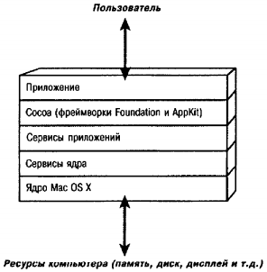

# Часть III. Cocoa и SDK iPhone
# Глава 20. Введение в Cocoa

На протяжении этой книги мы разрабатывали программы, которые имеют до-вольно простой пользовательский интерфейс. Для вывода сообщений на кон-соль мы использовали процедуру @@ NSLog. Это действительно полезная про-цедура, но ее возможности ограничены. Другие программы, которые мы используем на своих Маках, имеют намного более удобный интерфейс. Репу-тация компьютеров Macintosh во многом основывается на дружественных пользовательских окнах и простоте использования. В своих приложениях мы можем использовать XCode вместе с приложением Interface Builder. Это сочета-ние образует мощную среду для разработки программ со средствами редакти-рования и отладки и удобным доступом к online-документации и позволяет легко разрабатывать сложные графические пользовательские интерфейсы (GUI).

Фреймворки для поддержки приложений, обеспечивающие удобный пользо-вательский интерфейс, называются Cocoa. Это два фреймворка: Foundation framework, с которым вы уже знакомы, и фреймворк Application Kit (или AppKit). Второй фреймворк содержит классы, связанные с окнами, кнопками, списками и т.д.

## 20.1. Уровни фреймворков
Чтобы показать уровни, которые отделяют приложение от оборудования, час-то используют схемы. Одна из таких схем показана на рис. 20.1.

Ядро системы обеспечивает низкоуровневую связь с оборудованием в форме драйверов устройств. Оно управляет ресурсами системы, такими как программы-планировщики, управление памятью и электропитанием и выполнение базовых операций ввода-вывода.

Сервисы ядра (Core Services) обеспечивают поддержку на нижнем уровне (уровне ядра), в отличие от находящихся выше уровней. Здесь обеспечивается поддержка коллекций, сетевого обмена, управления файлами, папок, управле-ния памятью, отладки, потоков, времени и электропитания.

Уровень Сервисов приложений (Application Services) включает поддержку печати и воспроизведения графики, включая Quartz, OpenGL и Quicktime.
Пользователь

Рис. 20.1. Иерархия уровней для приложения

Непосредственно под приложением находится уровень Cocoa. Как говорилось выше, Cocoa содержитфреймворки Foundation и AppKit. Foundation содержит классы для работы с коллекциями, строками, для управления памятью, файловой системой, архивацией и т.д. AppKit содержит классы для управления представлениями (view), окнами, документами, а также для обширного пользовательского интерфейса, который гак хорошо известен пользователям Mac OS X.

Из этого описания возникает ощущение дублирования функций некоторых уровней. Например, коллекции существуют на уровнях Cocoa и сервисов ядра. Однако первый уровень основывается на поддержке со стороны второго уровня. Кроме того, в некоторых случаях определенный уровень можно пропускать. Например, некоторые классы Foundation для работы с файловой системой целиком основываются на функциях уровня сервисов ядра в обход уровня сервисов приложений. Во многих случаях фреймворк Foundation определяет объектно-ориентированное отображение структур данных, определенных на уровне сервисов ядра (написанных преимущественно на процедурном языке С).

## 20.2. Cocoa Touch
Телефон iPhone содержит компьютер, который работает под управлением уп-рощенной версии Mac OS X. Некоторые возможности оборудования iPhone, например, акселерометр, уникальны для этого телефона и отсутствуют на дру-гих компьютерах под управлением Mac OS X, таких как МасВоок или iMac.

**Примечание.** На самом деле ноутбуки Мак содержат акселерометр для выпол-нения парковки жесткого диска в случае падения компьютера, но вы не имеете непосредственного доступа к этому акселерометру.

В отличие от фреймворков Cocoa, используемых при разработке приложе-ний для настольных компьютеров и ноутбуков с Mac OS X, фреймворки Cocoa Touch используются для приложений, которые будут работать на iPhone и iTouch.

Cocoa и Cocoa Touch содержат один общий фреймворк — Foundation. Одна-ко в Cocoa Touch вместо фреймворка AppKit используется фреймворк UI Kit, поддерживающий много таких же типов объектов (окна, представления, кнопки, текстовые поля и т.д.). Кроме того, Cocoa Touch содержит классы для работы с акселерометром, триангуляции местоположения с помощью GPS и сигналов WiFi, а также сенсорный интерфейс. Из нею исключены ненужные классы, например, поддержка клавиатуры.

На этом заканчивается краткий обзор Cocoa. В следующей главе описыва-ется, как писать приложение для iPhone с использованием имитатора, который является частью комплекта разработки профамм (SDK) iPhone.