# Глава 21. Написание приложений iPhone

В этой главе мы будем разрабатывать два простых приложения iPhone. В пер-вом из них вы познакомитесь с понятиями делегат (delegate), outlet-переменные и действия (action) и с некоторыми концепциям и использования Interface Builder и создания соединений. Во втором приложении мы создадим калькуля-тор для дробей, объединив то, что вы узнали при разработке первого приложения, со всем материалом этой книги.

## 21.1. Комплект разработки программ (SDK) для iPhone
Чтобы писать приложения для iPhone, необходимо установить Xcode и комп-лект iPhone SDK. Этот SDK можно получить бесплатно с веб-сайта Apple. Для загрузки SDK нужно зарегистрироваться в качестве разработчика Apple (Apple Developer). Этот процесс тоже выполняется бесплатно. Чтобы получить соот-ветствующие ссылки, начните с адреса developer.apple.com и перейдите к нуж-ному пункту. Обязательно ознакомьтесь с этим сайтом. В приложении D содер-жится несколько прямых ссылок на определенные места этого сайта, которые могут заинтересовать вас.

Материал этой главы основывается на Xcode 3.1.1 и iPhone SDK для iPhone OS 2.1. Следующие версии этих продуктов совместимы с изложенным здесь материалом.

## 21.2. Ваше первое приложение iPhone
В этом приложении показано, как поместить черно-белое окно на экран iPhone, разрешить пользователю нажать на кнопку и вывести текст в ответ на нажатие этой кнопки.

**Примечание.** Второе приложение еще интересней! В нем используется опыт первого приложения для создания простого калькулятора, позволяющего вы-полнять операции с дробями. Мы можем использовать класс Fraction, с которым работали в предыдущих главах, а также модифицированный класс Calculator. На этот раз калькулятор сможет работать с дробями.

Приступим к первой программе. Мы опишем самые необходимые шаги, чтобы на их основе вы могли разрабатывать собственные программы Cocoa или iPhone.

На рис. 21.1 показано наше первое приложение для iPhone, которое будет выполняться па имитаторе iPhone (об этом чуть ниже).

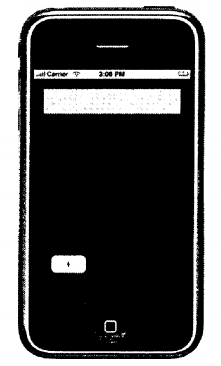

Рис. 21.1. Первое приложение для iPhone

В этом приложении при нажатии кнопки «1» на дисплее будет появляться соответствующая цифра (см. рис. 21.2). Оно больше ничего не делает! Это про-стое приложение является основой дня второю приложения, которое представ-ляет калькулятор дш работы с дробями.

Мы создадим приложение с помощью Xcode и пользовательский интерфейс с помощью Interface Builder. Если вы работали с Xcode в предыдущих главах, то можете использовать его для ввода и тестирования своих программ. Как гово-рилось выше, Interface Builder позволяет разрабатывать пользовательский ин-терфейс, размещая элементы пользовательского интерфейса (U1) — таблицы, метки и кнопки — в окне, которое похоже на элемент iPhone. Работа с Interface Builder, как с любым серьезным средством разработки, требует определенного опыта.

Apple распространяет имитатор (simulator) iPhone в составе SDK iPhone. Этот имитатор повторяет многие элементы среды iPhone, включая домашнюю страницу, веб-браузер Safari, приложение Contacts (Контакты) и т.д. Этот имитатор намного упрощает отладку приложений; вам не нужно каждый раз загружать разрабатываемое приложение на реальное устройство iPhone и затем выполнять отладку на этом устройстве.

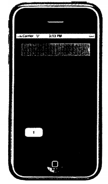

Рис. 21.2. Первое приложение iPhone

Чтобы запускать приложения на устройстве iPhone, вам нужно зарегистри-роваться как разработчику программ iPhone и заплатить компании Apple 99 долларов (по состоянию на момент написания этой книги). В ответ вы получите код активации, который позволит вам получить сертификат разработки для iPhone (iPhone Development Certificate), чтобы вы могли тестировать и устанавливать приложения на своем iPhone. К сожалению, вы не можете разрабатывать приложения даже для вашего собственного iPhone без прохождения этого процесса. Приложение, которое мы разрабатываем в этой главе, будет загружаться и тестироваться на имитаторе iPhone, а не на устройстве iPhone.

### Создание нового проекта приложения iPhone
Вернемся к разработке нашего первого приложения. После установки SDK iPhone запустите приложение Xcode. В меню File (Файл) выберите New Project (Новый проект). Под iPhone OS (если этого пункта нет в левой панели, значит, вы не установили SDK iPhone) щелкните на Application (Приложение). Появится окно, показанное на рис. 21.3.

Здесь мы видим шаблоны, которые можно использовать как отправную точку для различных типов приложений, в соответствии с таблицей 21.1.

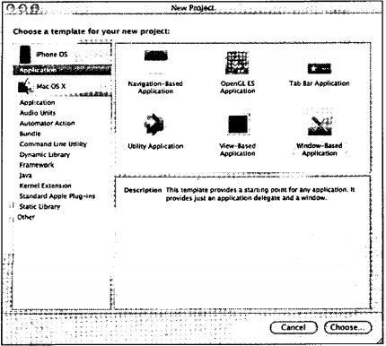

Рис. 21.3. Запуск нового проекта для iPhone

Табл. 21.1. Шаблоны приложений iPhone

| Tип приложения   | Описание                                                                                                                            |
|------------------|-------------------------------------------------------------------------------------------------------------------------------------|
| Navigation-Based | Для приложения, в котором используется контроллер на­вигации. Contacts — это пример приложения данного типа.                        |
| OpenGL ES        | Для графических приложений OpenGL, например, игр.                                                                                   |
| Tab Bar          | Для приложений, в которых используется полоса вкладок. Примером может служить приложение iPod.                                      |
| Utility          | Для приложения, где используется представление flipside (обратная сторона). Примером может служить приложение Stock Quote.          |
| View-Based       | Для приложения, в котором используется одно представле­ние (view). Вы переходите к этому представлению и затем выводите его в окне. |
| Window-Based     | Для приложения, которое запускается из главного окна iPhone. Его можно использовать как отправную точку для любого приложения       |

Вернувшись к окну New Project, выберите в верхней правой панели Window- Based Application и затем щелкните на кнопке Choose (Выбрать). При последующем запросе ввода имени проекта (в поле Save As —Сохранить как) введите текст iPhone_l и щелкните на кнопке Save (Сохранить). Это имя станет именем вашего приложения по умолчанию. Как вы уже знаете из предыдущих проектов, созданных с помощью Xcode, будет создан новый проект, содержащий шаблоны для необходимых файлов (рис. 21.4).

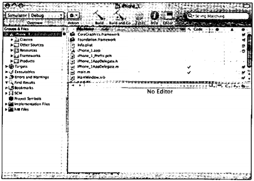

Рис. 21.4. Создание нового проекта iPhone

В зависимости от ваших настроек и предыдущего использования Xcode ваше окно может несколько отличаться от показанного на рисунке. Вы можете продолжить работу с текущего вида или постараться изменить его так, чтобы он походил на этот рисунок.

В верхнем левом углу окна Xcode мы видим раскрывающийся список, помеченный текущим выбором для SDK и активной конфигурации (Configuration). Поскольку мы не разрабатываем приложение для непосредственного выполнения на iPhone, нужно настроить SDK для работы с имитатором iPhone (Simulator) и для конфигурации задать вариант Debug (Отладка). Если этот рас-крывающийся список не помечен как Simulator | Debug, выберите соответствующие опции, как показано на рис. 21.5.


Рис. 21.5. Проект iPhoneJ с заданными опциями секций SDK и Configuration

### Ввод кода
Теперь мы можем внести изменения в некоторые файлы проекта. Обратите внимание, что для вас созданы классы «jWtfnpoeK/naAppDelegate.h и илщл/гаек/иаАрр Delegate.m (в данном примере имя_проекта — это iPhonc_l). Вся работа но управлению кнопками и метками в типе приложения Window- based, которое мы создаем, делегируется классу, который называется ш1я_«росл:/лаАррDelegate (в данном случае — iPhone_ 1 AppDelegate). В этом классе мы определим методы, чтобы реагировать на действия, возникающие в окне iPhone, такие как нажатие кнопки или перемещение ползунка. Как вы увидите, конкретная связь между этими управляющими элементами и соответствую-щими методами задается в приложении Interface Builder.

Этот класс будет также содержать переменные конфшурации, значения которых соответствуют некоторому управляющему элементу в окне iPhone, например, имя на метке или текст, отображаемый в поле изменяемого текста. Эти переменные называют outlet-переменными, и, аналогично процедурам действий, мы связываем в Interface Builder переменные экземпляра с конкретным управляющим элементом окна iPhone.

Для нашего первого приложения нужен метод, реагирующий на действие, которое состоит из нажатия кнопки с меткой I. Нам нужна также outlet-пере-менная, содержащая (среди прочей информации) текст, который должен отображаться на метке, создаваемой вверху окна iPhone.

Внесем изменения в файл iPhone_1AppDelegate.h, чтобы добавить переменную типа UlLabel с именем display и объявить метод для действия с именем clickl:, чтобы реагировать на нажатие кнопки. Наш файл секции interface показан в программе 21.1. (Здесь нет строк комментария, которые автоматически вставляются в начале файла.)

Программа 21.1. iPhoneJAppDelegate.h
```
#import <UIKit/UIKit.h>
@interface iPhoneJAppDelegate : NSObject <UIApplicationDelegate> { 
UlWindow *window;
UlLabel *display;
}
@property (nonalomic, retain) IBOutlet UlWindow *window;
@property (nonatomic, retain) IBOutlet UlLabel *display;
-(IBAction) clickl: (id) sender;
@end
```
Отметим, что приложения iPhone импортируют header-файл <UIKit/UiKit.h>. Этот файл импортирует, в свою очередь, другие header-файлы UIKit, что аналогично импорту в файле Foundation.h других нужных header-файлов, например, NSString.h и NSObject.h. Чтобы посмотреть содержимое этого файла, нужно пройти достаточно длинный путь. На момент написания этой книги он содержался в папке
```
/Devetoper/Platforms/iPhoneSimulator.platform/Developer/SDKs/iPhoneSimulatог2.1.sdk/System/Library/Franriewor ks/UIKit.framework/Headers/.
```
Теперь класс iPhoneJAppDelegate содержит две переменные экземпляра. Первая — это объект UlWindow с именем window. Эта переменная экземпляра создается автоматически, когда мы создаем проект, и является ссылкой на главное окно iPhone. Мы добавили еще одну переменную экземпляра с именем display, которая принадлежит классу UlLabel. Это outlet-псрсмснная, которая будет связана с меткой. Когда мы задаем текстовое поле для этой переменной, происходит изменение текста для метки в окне. Другие методы, определенные для класса UlLabel, позволяют задавать и считывать такие атрибуты метки, как цвет, число строк и размер шрифта.

Для создания интерфейсов вам потребуются и другие классы, но мы не будем описывать их здесь. Имена некоторых классов объясняют их назначение: UlTextField (Текстовое поле), UIFont (Шрифт), UlView (Представление), UITableView(Табличное представление), UllmageView (Представление изображения), Ullmage (Изображение) и UIButton (Кнопка).

Обе переменные — window и display — являются outlet-переменными. В объявлениях свойств для этих переменных используется идентификатор IBOutlet. IBOutlet определяется как nothing (ничто) в header-файле UINibDeclarations.h для UIKit. (То есть он фактически не заменяется ничем в исходном файле при обработке препроцессором.) Однако он необходим, поскольку Interface Builder ищет IBOutlet, когда читает header-файл, чтобы определить, какие переменные можно использовать как outlet-переменные.

В этом interface-файле отметим объявление метода с именем clickl: ему передается один аргумент с именем sender. При вызове метода clickl: в этом аргументе ему будет передаваться информация, связанная сданным событием. Например, если у нас имеется action-процедура для обработки нажатий различных кнопок, то этот аргумент можно запрашивать для определения нажатой кнопки.

Метод clickl: определен для возврата значения типа IBAction. (Оно определяется как void в файле UINibDectarations.h.) Аналогично IBOutlet, этот идентификатор используется приложением Interface Builder, когда оно просматривает header-файл, чтобы определить, какие методы можно рассматривать как действия (action).

Теперь можно внести изменения в implemcntation-файл iPhoneJAppDelegate.m для нашего класса. Здесь мы синтезируем методы досгупа (accessor method) для переменной display (методы доступа для window уже сип тезированы для вас) и добавляем определение для метода clickl

Внесите изменения в implementation-файл, чтобы он был похож на файл, показанный в программе 21.1.

Программа 21.1. iPhoneJAppDelegate.m
```
#import ""iPhoneJAppDelegate.h""
@implementation iPhoneJAppDelegate
@synthesize window, display;
-(void) applicationDidFinishlaunching:(U!Application *(application {
// Место переопределения для настройки после запуска приложения [window makeKeyAndVisi ble];
}
-(IBAction) clickl: (id) sender
{
(display setText: @T];
}
-(void) dealloc {
[window release];
[super dealloc];
@end
```
Метод applicationDidFinishLaunching: автоматически вызывается системой runtime iPhone один раз; как следует из его имени, оно означает, что запуск приложения завершен. Здесь можно инициализировать переменные экземпляра, нарисовать что-то на экране и сделать окно видимым для отображения его содержимого. Последнее действие осуществляется при передаче сообщения makeKeyAndVisible окну (window) в конце этого метода.

Метод clickl: задает отображение этой outlet-переменной в строке 1 с помощью метода UlLabel setText:. Когда мы свяжем нажатие кнопки с вызовом данного метода, он сможет выполнить нужное действие: поместить 1 на дисплей в окне iPhone. Чтобы задать эту связь, вы должны узнать, как используется Interface Builder. Прежде чем сделать это, нужно собрать программу, чтобы удалить предупреждения компилятора или сообшения об ошибках.

### Проектирование интерфейса
На рис. 21.4 и в вашем главном окне Xcode обратите внимание на файл MainWindow.xib. Файл с расширением »Ь содержит всю информацию о пользовательском интерфейсе для программы, включая информацию о его окнах, кнопках метках, полосах вкладок (tab bar), текстовых полях и т.д. Конечно, у нас еше нет пользовательского интерфейса! Это следующий шаг.

Дважды щелкните на файле MainWindow.xib. Будет запушено еше одно приложение, Interface Builder. Доступ к этому XIВ-файлу можно также выполнить из папки Resources вашего проекта.

При запуске Interface Builder на экране появится последовательность окон (рис. 2I.6, 21.7, 21.8). Окна, которые открываются у вас, могут отличаться от изображенных на рисунках.

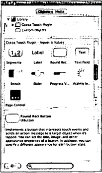

Рис. 21.6. Окно Library приложения Interface Builder

Окно Library (Библиотека) содержит набор управляющих элементов интерфейса. Это окно представлено на рис. 21.6я.

Окно MainWindow.xib (рис. 21.7) является управляющим окном для задания связей между кодом приложения и интерфейсом. 

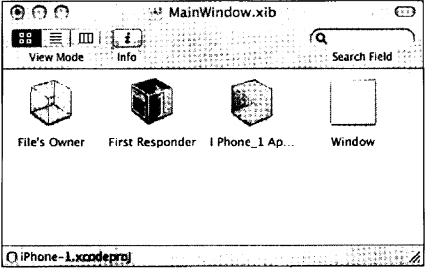

Рис. 21.7. Окно Interlace Builder MainWindow.xib

В окне под заголовком Window показан макет главного окна iPhone. Поскольку мы еше ничего не создали для окна iPhone, оно является пустым (рис. 21.8).

Сначала зададим черный цвет для окна iPhone. Для этого щелкните внутри окна под заголовком Window и выберите пункт Inspector в меню Tools (Сервис). Появится окно Inspector (рис. 21.9).

Убедитесь, что окно Inspector называется Window Attributes (Атрибуты окна), как на рисунке 21.9. Если это не так, щелкните на левой вкладке в полосе вкладок, чтобы отобразить нужное окно.

В секции View (Вид) этот окна имеется атрибуте именем Background (Фон). Дважды щелкните внутри белого прямоугольника рядом с меткой Background. Появится указатель цветов. Выберите черный цвет из этого указателя. Цвет прямоугольника рядом с атрибутом Background изменится на черный (рис. 21.10).

Окно Window, представляющее окно отображения iPhone, тоже будет иметь черный цвет (рис. 21.11).

Теперь можно закрыть окно цветов Colors.

Для создания нового объекта в окне интерфейса iPhone нужно щелкнуть на объекте в окне Library и перетянуть его в ваше окно iPhone. Щелкните и перетяните элемент Label (Метка). Отпустите кнопку мыши, когда метка окажется наверху примерно посередине окна (рис. 21.12).

Во время перемещения метки в окне будут показаны синие направляющие линии. Иногда они нужны для выравнивания объектов относительно других объектов, размещенных ранее в этом окне. Иногда они требуются, чтобы объекты находились на достаточном расстоянии друг от друга и от краев окна в соответствии с рекомендациями Apple.

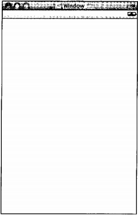

Рис. 21.8. Окно iPhone в Interface Builder

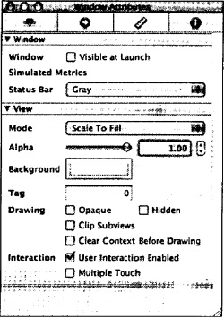

Рис. 21.9. Окно Inspector в Interface Builder

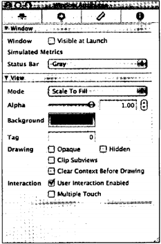

Рис. 21.10. Изменение цвета фона окна

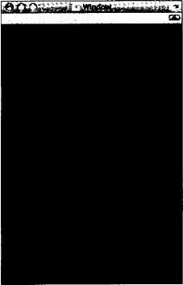

Рис. 21.11. Изменение цвета окна интерфейса на черный цвет

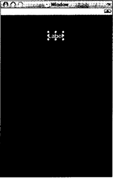

Рис. 21.12. Добавление метки

Вы можете в любой момент перетянуть метку в другое место внутри окна.

Теперь зададим некоторые атрибуты для этой метки. Щелкните на метке, которую вы только что создали, чтобы выделить ее (если она еще не выделена). Отметим, что окно Inspector автоматически изменяется, чтобы вы получали информацию о текущем выбранном объекте в вашем окне. Нам не нужно, чтобы текст по умолчанию появился в этой метке, поэтому измените значение Text на пустую строку, то есть удалите текст Label из текстового поля, показанного в окне Inspector.

Для атрибута Layout (Компоновка) выберите Right-justified (Выравнивание справа) среди вариантов выравнивания (Alignment). И, наконец, измените цвет фона (background) для метки на синий так же, как изменили цвет фона окна на черный. Ваше окно Inspector должно быть похоже на рис. 2I.I3.

Теперь изменим размер метки. Вернемся к окну Window и изменим размер метки, растянув ее углы и стороны. Измените размер и местоположение метки, чтобы она выглядела, как на рисунке 21.14.

Теперь добавим в этот интерфейс кнопку. Из окна Library перетяните объект Round Rect Button в ваше окно интерфейса, поместив его в нижний левый угол окна (рис. 21.15). Метку на этой кнопке можно изменить одним из двух способов: дважды щелкнуть на кнопке и затем ввести нужный текст или ввести текст в поле Title (Заголовок) в окне Inspector. При любом способе сделайте так, чтобы ваше окно было похоже на показанное на рисунке 21.15.

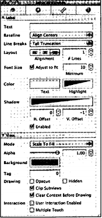

Рис. 21.13. Изменение атрибутов метки

Теперь у нас есть метка, которую нужно связать с переменной экземпляра display, чтобы при задании этой переменной в программе текст метки был изменен.

У нас также есть кнопка с меткой 1, для которой нужно задать вызов метода clickl: при каждом нажатии этой кнопки. Этот метод задаст значение 1 для текстового поля на дисплее. А поскольку эта переменная будет связана с данной меткой, метка будет изменяться. Приведем ниже последовательность, которую нужно задать.
1. Пользователь нажимает кнопку с меткой 1.
2. По этому событию вызывается метод dickl:.
3. Метод clickl: изменяет текст переменной экземпляра display на строку 1.
4. Поскольку объект DILabel display связан с меткой в окне iPhone, текст этой метки изменяется на соответствующее текстовое значение, равное 1.

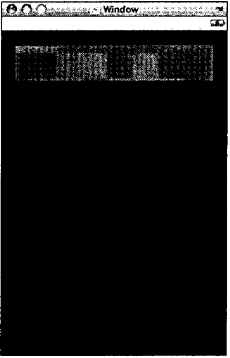

Рис. 21.14. Изменение размера и местоположения метки

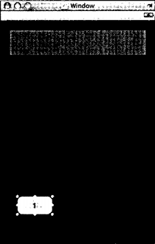

Рис. 21.15. Добавление кнопки в интерфейс

Для выполнения этой последовательности нам требуются только две привязки.

Сначала свяжем кнопку с методом IBAction clickl:. Для этого удерживайте нажатой клавишу Control во время щелчка на этой кнопке и затем протяните синюю линию, которая появится на экране, к кубику делегата приложения (AppDelegate) в окне MainWindow.xib, как показано рис. 21.16.

Когда вы отпустите кнопку мыши над кубиком делегата приложения, появится раскрывающееся меню, где можно выбрать метод IBAction для привязки к кнопке. В данном случае имеется только один такой метод (с именем clickl:), и он появится в этом раскрывающемся меню. Выберите этот метод, чтобы создать привязку (рис. 21.17).

Теперь выполним привязку переменной display к метке. Нажатие кнопки вызывает выполнение метода в приложении (то есть управление передается от интерфейса к делегата приложения), задание значения переменной экземпляра в приложении вызывает изменение текста метки в окне iPhone. (Управление передается от делегата приложения к интерфейсу.) Поэтому, удерживая нажатой клавишу Control, щелкните на значке делегата приложения и протяните к метке синюю линию, которая появится в окне Window (рис. 21.18).

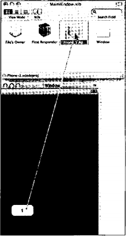

Рис. 21.16. Добавление действия для кнопки

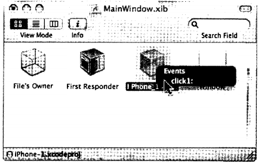

Рис. 21.17. Привязка события к методу

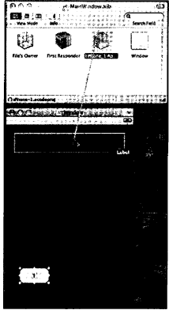

Рис. 21.18. Привязка outlet-переменной

Отпустив кнопку мыши, мы получим список outlet-переменных соответствующего класса как элемент управления (UlLabel), среди которых можно сделать выбор. В нашей программе такая переменная одна — с именем display. Выберите ее и выполните привязку (рис. 21.19).

Выберите File->Save в линейке меню Interface Builder и затем Build and Go в Xcode. (Это можно также инициировать из Interface Builder.)

Если все проходит нормально, программа будет успешно собрана и начнет выполняться. При этом она будет сначала загружена в имитатор iPhone, который появится на экране вашего компьютера (см. рис. 21.1). Чтобы имитировать нажатие кнопки в имитаторе, нужно просто щелкнуть на ней. Последовательность шагов и привязок, которая описана выше, будет реализована в виде отображения текстовой строки 1 в метке вверху дисплея, как показано на рис. 21.2.

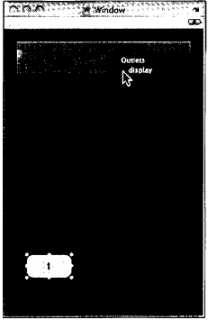

Рис. 21.19. Завершение привязки

## 21.3. Калькулятор дробей для iPhone
Следующий пример несколько сложнее, но к нему применяются все концеп-ции предыдущего примера. Мы не будем описывать шаги по созданию этого примера полностью, а только приведем сводку этих шагов и дадим обзор методологии разработки. И, конечно, покажем весь код.

Сначала рассмотрим, как работает приложение. Приложение на имитаторе непосредственно после запуска показано на рис. 21,20.

Этот калькулятор позволяет вводить дроби. Сначала вводится числитель (numerator), затем нужно нажать клавишу с меткой Over и ввести знаменатель (denominator). Таким образом, чтобы ввести дробь 2/5, нужно нажать 2, затем Over и 5. В отличие от других калькуляторов, это приложение показывает простую дробь на дисплее, то есть 2/5 отображается как 2/5.

После ввода дроби нужно выбрать операцию: сложение, вычитание, умножение или деление — и нажать клавишу +, -, х или ?.

После ввода второй дроби нужно завершить операцию, нажав клавишу =, как в стандартном калькуляторе.

**Примечание.** Этот калькулятор может выполнять только одну операцию над дробями. В упражнении в конце главы от вас потребуется снять это ограниче-ние.

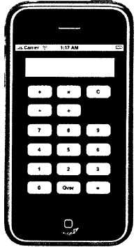

Рис. 21.20. Калькулятор дробей после запуска

По мере нажатия клавиш дисплей непрерывно обновляется. На рис. 21.21 показан дисплей после ввода дроби 4/6 и нажатия клавиши умножения.

На рис. 21.22 показан результат умножения дробей 4/6 и 2/8. Результат 1/6 показывает, что выполняется сокращение результирующей дроби.

### Запуск нового проекта Fraction_Calculator
Первая программа iPhone в этой главе начиналась с шаблона проекта типа Window-Based. Наша небольшая работа, связанная с пользовательским интерфейсом (Ш), была выполнена непосредственно в контроллере приложения (с помошью класса AppDelegate). Такой подход не рекомендуется для разработки приложений с насыщенным пользовательским интерфейсом. Класс AppDelegate обычно используется только для обработки изменений, относящихся к состоянию самого приложения, например, к окончанию запуска приложения или к его завершению.

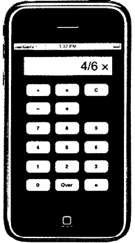

Рис. 21.21 Ввод операции

Контроллер представлений (view controller), реализованный с помощью класса UlViewController, подходит именно для действий, относящихся к Ш, таких как отображение текста, реагирование на нажатие кнопки или вывод другого представления на экране iPhone.

Разработку второго примера программы мы начнем с создания нового проекта. На этот раз в окне New Project мы выберем тип View-Based Application и назовем новый проект Fraction_Calculator.

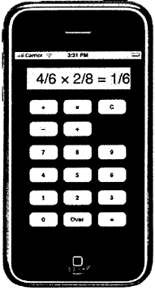

Рис. 21.22. Результат умножения двух дробей

При создании проекта вы увидите, что на этот раз используются два шаблона классов. Fraction_CalculatorAppDelegate.il и Fraction_CalсuIatorАрpDelegate.m определяют для нашего проекта класс контроллера приложения, a Fraction_ CalculatorViewController.h и Fraction CalculatorViewController.m определяют класс контроллера представлений. Как говорилось выше, вся наша работа будет выполнена именно во втором классе.

Начнем с класса контроллера приложения. Он содержит две переменные экземпляра: одну для ссылки на окно iPhone и вторую — для контроллера представлений. Обе переменные заданы вХсобе. Вам не потребуется вносить никакие изменения в .h-файл и .m-файл контроллера приложения.

Файл секции interface Fraction_CalculatorApp Delegate показан в программе 21.2.

Программа 21.2. Interface-файл Fraction_CalculatorAppDelegate.h
```
#import <UIKit/UIKit.h>
@class Fraction_CalculatorViewController;
@interface FractionCalculatorAppDelegate : NSObject <UIApplicationDelegate> {
IBOutlet UlWindow *window;
IBOutlet Fraction CalculatorViewController *viewController;
}
@property (nonatomic, retain) UlWindow *window;
@property (nonatomic, retain) Fraction_CalculatorViewController *viewController;
@end
```
Переменная экземпляра UlWindow window предназначена для той же цели, что и в первой программе: она представляет окно iPhone. Переменная экземпляра Fraction_CalculatorViewController используется для контроллера представлений, который будет управлять всем взаимодействием с пользователем и выводом на дисплей. В файле секции implementation для этого класса мы реализуем всю работу, связанную с этими задачами.

В программе 21.2 показан implementation-файл для класса контроллера приложения. Как говорилось выше, мы не будем делать никакой работы в этом файле (в отличие от программы 21.1); вся работа передается контроллеру представлений. Таким образом, этот файл показан так, как он генерируется Xcode при создании нового проекта.

Программа 21.2. Implementation-файл Fraction_CalculatorAppDelegate.m
```
#import "FractionCalculatorAppDelegate.h"
#import "Fraction CalculatorViewController.h"
@implementation Fraction_CalculatorAppDelegate
@synthesize window;
@synthesize viewController;
-(void)applicationDidFinishLaunching:(UIApplication *(application (
// Место переопределения для настройки после запуска приложения [window addSubview:viewController.view];
[window makeKeyAndVisible];
-(void)dealloc {
[viewController release]; [super deallocj;
@end
```

### Определение контроллера представлений
Теперь мы напишем код для класса контроллера представлений
Fraction CalculatorViewController. Начнем с файла секции interface. Он показан в про­
грамме 21.2.

Программа 21.2. Interface-файл Fraction_CalculatorViewController.h
```
#import <UIKit/UIKit.h>
#import "Calculator.h"
@interface Fraction_CalculatorViewController : UlViewController {
UlLabel *display;
char op;
int currentNumber;
NSMutableString *displaystring;
BOOL firstOperand, isNumerator;
Calculator *myCalculator;
}

@property {nonatomic, retain) IBOutlet UlLabel *display;
@property (nonatomic, retain) NSMutableString *displaystring;
-(void) processDigit: (int) digit;
-(void) processOp: (char) op;
-(void) storeFracPart;
// Числовые клавиши
-(IBAction) clickDigit; (id) sender;
// Клавиши арифметических операций
-(IBAction) clickPlus: (id) sender;
-(IBAction) clickMinus: (id) sender;
-(IBAction) clickMultiply: (id) sender;
-(IBAction) clickDivide: (id) sender;
// Другие клавиши
-(IBAction) clickOver: (id) sender;
-(IBAction) clickEquals: (id) sender;
-(IBAction) clickClear: (id) sender;
@end
```

У нас имеются служебные переменные для создания дробей (currentNumber, firstOperand и isNumerator) и для создания выводимой строки (displayString). Объект типа Calculator (myCalculator) выполняет конкретные вычисления между двумя дробями. Мы выполним привязку метода с именем clickDigit: для обработки нажатий цифровых клавиш 0-9. И, наконец, мы определяем методы для хранения операции, которая должна быть выполнена (clickPlus:, clickMinus:, clickMultiply:, clickDivide:), выполняя сами вычисления при нажатии клавиши = (clickEquals:), сброс текущей операции (clickClear:) и отделение числителя от знаменателя при нажатии клавиши Over (clickOver:). Несколько методов (processDigit:, processOp: и StoreFracPart) определяются для этих задач как вспомогательные средства.

В программе 21.2 показан файл секции implementation для этого класса контроллера. 

Программа 21.2. Implementation-файл Fraction_CalculatorViewController.m
```
#import «Fraction_CalculatorViewController.h»
@implementation FractionCalculatorViewController
@synthesize display, displayString;
-(void) viewDidLoad {
// Место переопределения для настройки после запуска приложения
firstOperand = YES; isNumerator = YES;
self.displayString = [NSMutableString stringWithCapacify: 40]; myCalculator = [[Calculator alloc] init];
-(void) processDigit: (int) digit
{
currentNumber = currentNumber * 10 + digit;
[displayString appendString: [NSString stringWithFormat: <a>"%i\ digit]]; [display setText: displayString];
-(IBAction) clickDigit:(id)sender {
int digit = [sender tag];
[self processDigit: dig it];
}
-{void) processOp: (char) theOp
{
NSString *opStr;
op = theOp;
switch (theOp) { case
opStr = + ";
break; case
opStr = -";
break; case ■*':
opStr = <@" ? "; break;
case opStr = break;
}
[self storeFracPart]; firstOperand = NO; isNumerator = YES;
[displaystring appendString: opStr); [display setText: displaystring];
-(void) storeFracPart
{
if (firstOperand) { if (isNumerator) {
myCalculator.operandl.numerator = currentNumber; myCalculator.operandl .denominator = 1; // e g. 3*4/5 =
)
else
myCalculator.operandl.denominator = currentNumber;
}
else if (isNumerator) {
myCalculator.operand2.numerator = currentNumber; myCalculator.operand2.denominator = 1; // e.g. 3/2*4 =
}
else {
myCalculator.operand2.denominator = currentNumber; firstOperand = YES;
}
currentNumber = 0;
}
-(IBAction) clickOver: (id) sender
{
[self storeFracPart]; isNumerator = NO;
[displaystring appendString: @"/"];
[display setText: displaystring];
}
// Клавиши арифметических операций
-(IBAction) clickPlus: (id) sender
{
[self processOp:
}
-(IBAction) clickMinus: (id) sender
{
[self processOp:
}
-(IBAction) clickMultiply: (id) sender
{
[self processOp:
}
-(IBAction) clickDivide: (id) sender
{
[self processOp: У];
)
// Другие клавиши
-(IBAction) clickEquals: (id) sender
{
[self storeFracPart];
[myCalculator performOperation: op];
[displaystring appendString:    = "];
[displaystring appendString: [myCalculator.accumulator convertToString]]; [display setText: displayString];
currentNumber = 0; isNumerator = YES; firstOperand = YES;
[displayString setString: (§>""];
}
-(IBAction) clickClear: (id) sender
{
isNumerator = YES; firstOperand = YES; currentNumber = 0;
[myCalculator clear];
[displayString setString: @'"];
[display setText: displayString];
-(void)dealloc {
[myCalculator dealloc];
[super dealloc];
}
@end
```
Окно калькулятора пока содержит только одну метку, как в предыдущем приложении, и мы по-прежнему называем се display. По мерс того, как пользователь вводит число пифра за цифрой, мы должны формировать это число. Переменная currentNumber содержит накапливаемое число, а BOOL-переменные firstOperand и isNumerator следят за тем, какой операнд введен (первый или второй), и что представляет этот операнд — числитель или знаменатель.

При нажатии числовой клавиши идентифицирующая информация будет передаваться методу clickDigit:, чтобы указать, какая числовая клавиша была нажата. Для этого атрибуту клавиши с именем tag (с помощью средства Inspector в Interface Builder) присваивается соответствующее значение каждой числовой клавиши. В данном случае нам нужно присвоить tag соответствующую цифру. Например, для клавиши с меткой 0 tag будет присвоено значение 0, для клавиши с меткой 1 — значение 1, и т.д. При последующей отправке сообщения tag параметру sender, который передается методу clickDigit:, мы считываем значение тега клавиши. Это происходит в методе clickDigit:, как показано ниже.
```
-(IBAction) clickDigit:(id)sender
{
int digit = [sender tag];
[self processDigitrdigit];
}
```
В программе 21.2 намного больше клавиш, чем в первом приложении. Наиболее сложной частью в implementation-файле контроллера представлений является формирование и отображение дробей. Как говорилось выше, при нажатии числовой клавиши от 0 до 9 выполняется action-метод clickDigit:. Этот метод вызывает метод processDigit:, который помещает цифру в конец числа, формируемого в переменной currentNumber. Этот метод также добавляет цифру в текущую строку отображения, которая поддерживается в переменной displaystring, и обновляет отображение.
```
-(void) processDigit: (int) digit
(
currentNumber = currentNumber * 10 + digit;
[displaystring appendString: [NSString stringWithFormat: @"%i", digit]];
[display setText: displaystring];}
```
При нажатии клавиши со знаком равенства (=) для выполнения операции вызывается метод clickEquals:. Калькулятор выполняет операцию между двумя дробями, сохраняя результат в накопителе (accumulator). Этот накопи гель считывается внутри метода clickEquals:, и результат выводится па дисплей.

### Класс Fraction
Класс Fraction мало отличается от предыдущих примеров этой книги. В нем имеется новый метод convertToString, который добавлен для преобразования дроби в эквивалентное строковое представление. В программе 21.2 показан файл секции interface для класса Fraction, после которого следует соответствующий файл секции implementation.

Программа 21.2. Interlace-файл Fraction.h
```
#import <UIKit/UIKit.h>
@interface Fraction : NSObject {
    int numerator;
    int denominator;
}

@property int numerator, denominator;
-(void) print;
-(void) setTo:
-(Fraction *) add: (Fraction *) f;
-(Fraction *) subtract: (Fraction *) f;
-(Fraction *) multiply: (Fraction *) f;
-(Fraction *) divide: (Fraction *) f;
-(void) reduce;
-(double) convertToNum;
-(NSString *) convertToString;
(int) n over: (int) d;
@end
```
Программа 21.2. Implementation-файл Fraction.m
```
#import "Fraction.h"
@implementation Fraction
@synthesize numerator, denominator;
(void) setTo: (int) n over: (int) d
{
    numerator = n;
    denominator = d;
}

-(void) print
{
    NSLog (@"%i/%i", numerator, denominator);
}

-(double) convertToNum
{
    if (denominator != 0)
        return (double) numerator / denominator;
    else
        return 1.0;
}

-(NSString *) convertToString;
{
    if (numerator == denominator)
        if (numerator == 0)
            return @»0";
        else
            return @»1";
    else if (denominator == 1)
        return [NSString stringWithFormat: @"%i", numerator];
    else
        return [NSString stringWithFormat: @"%i/%i",
            numerator, denominator];
}

// Сложение дроби (Fraction) с получателем
-(Fraction *) add: (Fraction *) f
{
    // Сложение двух дробей
    // a/b + c/d = ((a*d) + (b*c)) / (b * d)

    // в result будет сохраняться результат сложения
    Fraction * result = [[Fraction alloc] init];
    int resultNum, resultDenom;

    resultNum = numerator * f.denominator + denominator * f.numerator;
    resultDenom = denominator * f.denominator;

    [result setTo: resultNum over: resultDenom];
    [result reduce];

    return [result autorelease];
}

-(Fraction *) subtract: (Fraction *) f
{
    // Вычитание двух дробей
    // a/b - c/d = ((a’ d) - (b*c)) / (b * d)
    Fraction *result = [[Fraction alloc] init];
    int resultNum, resultDenom;

    resultNum = numerator * f.denominator - denominator * Enumerator;
    resultDenom = denominator * f.denominator;

    [result setTo: resultNum over: resultDenom];
    [result reduce];
    return [result autorelease];
}

[Fraction *) multiply: (Fraction *) f
{
    Fraction *result = [[Fraction alloc] init];

    [result setTo: numerator * f.numerator over: denominator
    * f.denominator];
    [result reduce];

    return [result autorelease];
}

-(Fraction *) divide: (Fraction *) f
{
    Fraction *result = [[Fraction alloc] init];

    [result setTo: numerator * f.denominator over: denominator * f.numerator];
    [result reduce];

    return [result autoreiease];
}

-(void) reduce
{
    int u = numerator;
    int v = denominator;
    int temp;

    if (u == 0)
        return;
    else if (u <0)
        u = -u;

    while (v != 0) {
        temp = u % v;
        u =v;
        v = temp;
    }
    numerator /= u;
    denominator /= u;
}
@end
```
Метод convertToString: проверяет числитель и знаменатель дроби, чтобы создать вид числа для внешнего отображения. Если числитель и знаменатель равны (но не равны нулю), возвращается @"Г. Если числитель равен нулю, то возвращается строка @"0". Если знаменатель равен 1, результатом является целое число, то есть показывать знаменатель не нужно.

Метод stringWithFormat:, который используется внутри convertToString:, возвращает строку в соответствии со строкой формата (аналогично NSLog) и список аргументов с разделителями-запятыми. Мы передаем аргументы методу, который принимает переменное число параметров, разделяя их запятыми, как при передаче аргументов функции NSLog.

### Класс Calculator, который работает с дробями
Теперь рассмотрим класс Calculator. Он аналогичен одноименному классу, с которым мы работали раньше, но теперь наш калькулятор должен «знать», как работать с дробями. Ниже приводятся файлы секций interface и implementation для класса Calculator.

Программа 21.2. Interface-файл Calculator.h
```
#import <UIKit/UIKit.h>
#import"Fraction.h"
@interface Calculator: NSObject (
Fraction *operand1;
Fraction *operand2;
Fraction *accumulator;
}
@property (retain, nonatomic) Fraction *operand 1, *operand2, *accumulator;
-(Fraction *) performOperation: (char) op;
-(void) clear;
@end
```
Программа 21.2. Implementation-файл Calculator.m «import "Calculator.h"
```
@implementation Calculator
@synthesize operand 1, operand2, accumulator;
-(id) init
{
self = [super init];
operand 1 = [[Fraction alloc] init]; operand2 = [[Fraction alloc] init]; accumulator = [[Fraction alloc] init];
return self;
}
-(void) clear
{
if (accumulator) {
accumulator.numerator = 0; accumulator.denominator = 0;
}
-(Fraction *) performOperation: (char) op
{
Fraction *result;
switch (op) {
case
result = [operandl add: operand2]; break; case
result = [operandl subtract: operand2]; break; case '*':
result = [operandl multiply: operand2]; break; case
result= [operandl divide: operand2]; break;
accumulator.numerator = result.numerator; accumulator.denominator = result.denominator;
return accumulator;
}
-(void) dealloc
{
[operand 1 release];
[operand2 release];
[accumulator release];
[super dealloc];
}
@end
```

### Разработка пользовательского интерфейса (Ul)
В папке Resources этого проекта содержатся два xib-файла: MainWindow.xib и Fraction CalculatorViewController.xib. Вам не требуется работать с первым файлом. Откроем второй файл, дважды щелкнув на его имени. При запуске Interface Builder вы увидите значокс именем “View" в окне с именем Fraction CalculatorViewController.xib (рис. 21.23).

Если окно View еще не открыто, дважды щелкните на этом значке и откройте его. Внутри окна View мы будем разрабатывать пользовательский интерфейс нашего калькулятора. Мы будем связывать каждую числовую клавишу с методом ctickDigit:. Для это нужно при нажатой клавише Control протянуть мышь к значку File’s Owner по очереди от каждой клавиши в окне Fraction_CalculatorViewController.xib и выбрать clickDigit: в раскрывающемся меню Events (События). Кроме того, для каждой числовой клавиши нужно задать в окне Inspector значение Tag, соответствующее названию клавиши. Дтя числовой клавиши с меткой 0 нужно задать значение Tag, равное 0, для клавиши с меткой 1 — значение 1, и т.д.

Протяните мышь от остальных клавиш в окне View и создайте соответствующие привязки. Не забудьте вставить метку для отображения (display) калькулятора и протяните мышь при нажатой клавише Control от File’s Owner к этой метке. Выберите display из появившегося списка Outlets.

Все! Структура интерфейса создана, и приложение с калькулятором дробей готово к работе.

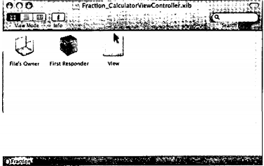

Рис. 21.23. Окно Fraction_CalculatorViewController.xib

## 21.4. Сводка шагов
На рис. 21.24 показано окно проекта Xcode со всеми файлами, относящимися к проекту.

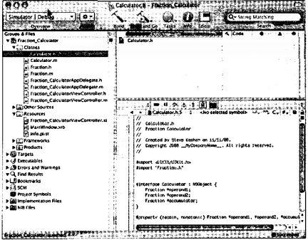

Рис. 21.24. Файлы проекта калькулятора дробей

Ниже приводится сводка шагов посозданию калькулятора дробей для iPhone.
1. Создание нового приложения типа View-based.
2. Ввод UI-кода в файлы Fraction_CalculatorViewControlleг с расширениями .h и .m.
3. Добавление в проект классов Fraction и Calculator.
4. Открытие окна Fraction CalculatorViewController.xib в Interface Builder для создания UI. "
5. Создание черного фона окна View.
6. Создание метки и клавиш (кнопок), их позиционирование внутри окна View.
7. При нажатой клавише Control протягивание мыши из File’s Owner к метке, созданной в окне View, и выбор для нес варианта “display".
8. При нажатой клавише Control протягивание мыши от каждой клавиши в окне View к File’s Owner и привязка к соответствующему action-методу. Для каждой числовой клавиши выбирается метод clickDigit:. Кроме того, для каждой числовой клавиши нужно присвоить атрибуту клавиши tag соответствующую цифру от 0 до 9, чтобы метод clickDigit: мог определить, какая клавиша была нажата. 

Изучение контроллера представлений было бы полезным упражнением, но это потребовало бы куда больше усилий, чем вся разработка проекта в контроллере приложения. Однако, если вам нужно осуществлять в приложении более сложные задачи, например, выполнить анимацию, реагировать на поворот экрана, использовать контроллер навигации или создать интерфейс с вкладками, то контроллер представлений вам просто необходим.

Мы надеемся, что это краткое введение в разработку приложений iPhone поможет вам в разработке ваших собственных приложений iPhone. Как говорилось выше, UIKit предоставляет разработчику множество возможностей.

В описанном выше приложении для калькулятора дробей имеется несколько ограничений. Многие из них вы снимете, выполнив упражнения, которые приводятся ниже.

## Упражнения
1. Добавьте клавишу Convert (Преобразование) в приложение для кал ькулято- ра дробей. При нажатии этой клавиши используйте метод convertToNum класса Fraction, чтобы создать десятичное представление для результата, полученного в виде дроби. Преобразуйте это число в строку и выведите его на дисплее калькулятора.
2. Внесите изменения в приложение для калькулятора дробей, чтобы можно было вводить отрицательную дробь (перед вводом числителя нажимается клавиша «-»).
3. Если для знаменателя введено значение «О», нужно вывести строку Error на дисплее калькулятора дробей.
4. Внесите изменения в приложение для калькулятора дробей, чтобы можно было выполнять цепочку вычислений. Например, нужно разрешить выполнение следующей операции:
    ```
    1/5 + 2/7 - 3/8 =
    ```
5. Вы можете добавить значок приложения, который будет отображаться на экране iPhone. Для этого можно в папке Resources вашего приложения добавить изображение, которое будет использоваться в качестве значка (.png- файл), и задать этот файл изображения для клавиши «Icon file» в списке информационных свойств (файл Info.plist в вашей папке Resources), как показано на рис. 21.25.
    Найдите в Интернете подходящее изображение калькулятора и задайте для калькулятора дробей использование этого изображения как значка приложения.

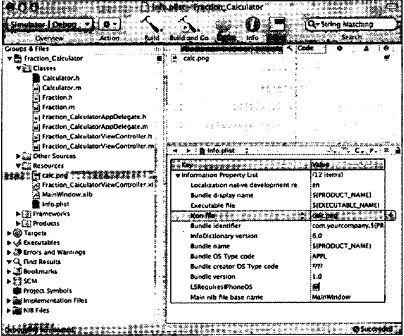

Рис. 21.25. Добавление значка приложения