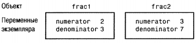

# Глава 3. Классы, объекты и методы

В этой главе вы узнаете о ключевых концепциях в объектно-ориентированном программировании, начнете работать с классами в Objective-C и познакомитесь с основной терминологией. Мы опишем только базовые терминов, чтобы не перегружать вас излишней информацией. Подробное и точное определение терминов см. в «Словаре» (приложение А).

## 3.1. Понятие объекта
Объект (object) — это определенная «вещь». В объектно-ориентированном про-граммировании объект — это и вещь, и действия, которые с ней можно делать. Этим объектно-ориентированные языки программирования отличаются, на-пример, от языка С, который является процедурным языком. В С сначала думают о том, что хотят сделать, и только затем заботятся об объектах, что почти противоположно объектно-ориентированному подходу.

Рассмотрим пример из повседневной жизни. Предположим, у вас есть авто-мобиль. Это объект, которым вы владеете. Это не какой-либо произвольный автомобиль; это определенный автомобиль, который собран на заводе в Детройте или в Японии, или где-то еще. У него есть идентификационный номер (vehicle identification number, VIN), который уникально идентифицирует этот автомобиль.

В объектно-ориентированной терминологии ваш автомобиль является эк-земпляром (instance) автомобиля. Развивая эту терминологию, автомобиль (саг) — имя класса, из которого этот экземпляр был создан. При выпуске каждого нового автомобиля создается новый экземпляр данного класса автомобилей, и каждый экземпляр автомобиля называется объектом.

Ваш автомобиль может иметь серебристую окраску, может быть с откидным или жестким верхом, и т.д. Вы выполняете определенные действия со своим автомобилем — водите его, заправляете бензином, моете, выполняете техническое обслуживание и т.д.

Действия, приведенные в таблице 3.1, можно выполнять с вашим автомобилем и с любыми другими автомобилями. Например, ваша сестра водит свой автомобиль, моет его, заправляет его бензином и т.д.

| Объект         | Что вы делаете с ним                 |
|----------------|--------------------------------------|
| Ваш автомобиль | Водите.                              |
|                | Заправляете бензином.                |
|                | Моете.                               |
|                | Выполняете техническое обслуживание. |

## 3.2. Экземпляры и методы
Уникальная реализация класса - это экземпляр. Действия, которые выполняются над экземпляром, называются методами (method). В некоторых случаях метод может применяться к экземпляру класса или к самому классу. Например, мытье автомобиля применяется к экземпляру (все методы, перечисленные в таблице 3.1, являются методами для экземпляра). Определение количества типов автомобилей, выпускаемых изготовителем, применяется к классу, то есть это метод для класса.

Предположим, что у нас имеются два автомобиля, которые сошли со сбо-рочного конвейера и, казалось бы, идентичны: они имеют одинаковый салон, одинаковую окраску и т.д. Они могут одинаково запускаться, но поскольку каж-дый автомобиль используется его собственным владельцем, он приобретает свои уникальные характеристики — на одном автомобиле появится царапина, а другой проедет больше километров. Каждый экземпляр, или объект, содержит не только информацию о своих собственных характеристиках, полученных на заводе, но и свои текущие характеристики. Эти характеристики могут изменяться динамически. Когда вы ведете автомобиль, бензина в баке становится меньше, автомобиль загрязняется, шины изнашиваются.

Применение метода к объекту может влиять на состояние (state) этого объекта. Если метод определяется как «заправить мой автомобиль бензином», то после выполнения этого метода будет заполнен бензобак вашего автомобиля. Таким образом, метод повлияет на состояние бака автомобиля.

Объекты являются уникальными представителями класса, и каждый объект содержит некоторую информацию (данные), которые обычно являются частными для этого объекта. Методы — это средства доступа и изменения этих данных.

Язык программирования Objective-C имеет следующий синтаксис для при-менения методов к классам и экземплярам:
```
[ Класс-или-Экземпляр метод ];
```
В этом синтаксисе после левой прямоугольной скобки следует имя класса или экземпляра этого класса, а затем (после одного или нескольких пробелов) — ме-тод, который нужно выполнить. В конце ставится правая прямоугольная скобка и завершающая точка с запятой. Если вы обращаетесь к классу или экземпляру для выполнения некоторого действия, можно сказать, что вы отправляете 
ему сообщение (message); это сообщение принимает получатель (receiver). По-этому показанный выше формат можно описать следующим образом:
```
[ получатель сообщение ] ;
```
Вернемся к списку таблицы 3.1 и перепишем ее с помощью этого синтаксиса. Но прежде чем сделать это, потребуется получить ваш новый (new) автомобиль (yourCar). Для этого нужно обратиться на завод, например, в такой форме:
```
yourCar = [Car new]; получение нового автомобиля
```
Вы отправляете сообщение классу Саг (получателю сообщения), запрашивая у него получение нового автомобиля. Результирующий объект (представляющий ваш уникальный автомобиль) сохраняется в переменной yourCar. С этого момента yourCar можно использовать для ссылки на ваш экземпляр автомобиля.

Поскольку вы обращаетесь на завод для получения автомобиля, метод new называется методом завода или методом класса. Остальные действия для вашего нового автомобиля будут методами экземпляра, поскольку они применяются именно к вашему автомобилю. Ниже приводятся примеры выражений с со-общениями, которые можно написать для вашего автомобиля.

```
[yourCar prep]; подготовка для первого использования
[yourCar drive];    вождение вашего автомобиля
[yourCar wash]; мытье вашего автомобиля
[yourCar getGas];   заправка бензином вашего автомобиля, если это требуется
[yourCar service];  обслуживание вашего автомобиля
[yourCar topDown]; если он с откидным верхом
[yourCar topllp];
currentMileage = [suesCar currentOdometer];
```
В последнем примере используется метод экземпляра, который возвращает определенную информацию: текущий километраж (в милях), показанный одо-метром. Эта информация сохраняется в переменной currentMileage.

Ваша сестра Сью (Sue) может использовать те же методы для своего экземп-ляра автомобиля:
```
[suesCar drive];
[suesCar wash];
[suesCar getGas];
```
Применение одних и тех же методов к разным объектам является одной из ключевых концепций объектно-ориентированного программирования.

Работа с автомобилями вряд ли потребуется в ваших программах. Вашими объектами будут компьютерно-ориентированные элементы, такие как окна, пря-моугольники, фрагменты текста, калькулятор или список воспроизведения. Ваши методы будут выглядеть так же, как методы, используемые для автомобилей:
```
[myWindow erase];   Очистка окна
[myRect getArea];   Расчет площади прямоугольника
[userText spellCheck]; Проверка правописания в определенном тексте
[deskCalculator clearEntry]; Стирание последней записи
[favoritePlaylist showSongs]; Показ песен в списке воспроизведения избранного
[phoneNumber dial]; Набор номера телефона
```

## 3.3. Класс Objective-C для работы с дробями
Теперь мы можем определить какой-либо конкретный класс в Objective-C и научиться работать с экземплярами этого класса.

Как всегда, начнем с изучения процедуры. Предположим, что вам нужно написать программу для работы с дробями. Вам могут потребоваться операции сложения, вычитания, умножения и т.д. Если вы не работали с классами, то можете начать с простой программы, которая приводится ниже.
```
// Simple program to work with fractions (Простая программа для работы с дробями) #import <Foundation/Foundation.h>
int main (int argc, char *argv[])
{
    NSAutoreleasePool * pool = [[NSAutoreleasePool alloc] init];
    int numerator = 1;
    int denominator = 3;
    NSLog (@"The fraction is %i/%i", numerator, denominator);

    [pool drain];
    return 0;
}
```
Вывод программы 3.1
```
The fraction is 1/3 (Дробь равна 1/3)
```
В программе 3.1 дробь представлена своими числителем (numerator) и зна-менателем (denominator). После создания автоматически высвобождаемого пула (autorelease pool) в двух строках процедуры main объявляются две переменные целого типа — numerator и denominator, которым присваиваются целые значения — соответственно 1 и 3. Это эквивалентно следующим строкам:
```
int numerator, denominator;
numerator = 1;
denominator = 3;
```
Мы представили дробь 1/3, сохранив значение 1 в переменной numerator и значение 3 — в переменной denominator. Если нужно сохранить много дробей, то при таком подходе это потребует больших усилий. Каждый раз для ссылки на дробь придется ссылаться на соответствующие числитель и знаменатель. А вы-полнение операций с этими дробями будет очень трудным.

Намного лучше определять дробь (fraction) как один элемент и совместно ссылаться на ее числитель и знаменатель по одному имени, например, myFraction. Начнем с определения нового класса.

В программе 3.2 дублируются функции программы 3.1 с помощью нового класса с именем Fraction. Ниже приводится эта программа с подробным опи-санием ее работы.
```
// Program to work with fractions - class version (Программа для работы с дробями - версия с классом)

#import <Foundation/Foundation.h>

//---- @interface section ---- (секция (@interface)

@interface Fraction: NSObject
{
    int numerator;
    int denominator;
}

-(void) print;
-(void) setNumerator: (int) n;
-(void) setDenominator: (int) d;

@end

//---- (@implementation section ---- (секция @implementation)

@implementation Fraction
-(void) print
{
    NSLog (@"%i/%i", numerator, denominator);
}

-(void) setNumerator: (int) n
{
    numerator = n;
}

-(void) setDenominator: (int) d
{
    denominator = d;
}

@end

//---- program section ---- (секция program)
int main (int argc, char *argv[])
{
    NSAutoreleasePool * pool = [[NSAutoreleasePool alloc] init];
    Fraction *myFraction;

    // Create an instance of a Fraction (Создание экземпляра Fraction)

    myFraction = [Fraction alloc];
    myFraction = [myFraction init];

    // Set fraction to 1/3 (Присваивание дроби значения 1/3)

    [myFraction setNumerator: 1];
    [myFraction setDenominator: 3];

    // Display the fraction using the print method (Вывод дроби с помощью метода print)

    NSLog (@"The value of myFraction is:");
    [myFraction print];
    [myFraction release];

    [pool drain];
    return 0;
}

```
Вывод программы 3.2
```
The value of myFraction is: (Значение myFraction)
1/3
```
Как можно видеть из комментариев, программа 3.2 логически разделена на три секции:
* @interface
* @implementation
* program

В секции @interface описывается класс, компоненты его данных и его мето-ды, в секции @implementation содержится конкретный код, который реализует эти методы, секция program содержит программный код для выполнения цели прог-раммы.

Каждая из этих секций является частью любой программы на Objective-C, но вам не всегда придется писать каждую секцию самостоятельно. Каждая секция обычно помещается в свой собственный файл. Пока мы держим их в одном файле.

## 3.4. Секция @interface
Определяя новый класс, вы должны сделать несколько вещей. Во-первых, вы должны сообщить компилятору Objective-C, откуда поступил этот класс, то есть указать имя его родительского (parent) класса. Во-вторых, вы должны указать, какой тип данных должен сохраняться в объектах этого класса, то есть описать данные, которые будут содержать члены этого класса. Эти члены называются переменными экземпляров (instance variable). И, наконец, нужно определить тип операций, или методов (method), которые можно использовать при работе с объектами из этого класса. Все это делается в специальной секции программы, которая называется секцией интерфейса (@interface). В общем виде эта секция имеет следующий формат:
```
@interface Имя-Нового-Класса: Имя-Родительского-Класса
{
    объявления-членов;
}

объявления-методов;
@end
```
Принято начинать имена классов с прописной буквы, хотя это не обязатель-ное требование. Это позволяет человеку, читающему программу, отличать име-на классов от других типов переменных по первому символу имени.

### Выбор имен
В главе 2 мы использовали несколько переменных для хранения целых значений. Например, в программе 2.4 переменная sum использовалась для сохранения результата сложения двух целых чисел, 50 и 25.

В языке Objective-C в переменных сохраняются не только данные, но и их типы, поскольку нужное объявление переменной выполняется до того, как она используется в программе. Переменные можно использовать для хранения чисел с плавающей точкой, символов и даже объектов (точнее, ссылки на объекты).

Правила формирования имен достаточно просты: имена должны начинаться с буквы или символа подчеркивания (_), и затем может следовать любое со-четание букв (прописных или строчных), символов подчеркивания или цифр от 0 до 9. Ниже приводятся примеры допустимых имен:
* sum
* pieceFlag
* myLocation
* numberOfMoves
* _sysFlag
* ChessBoard

Следующие имена недопустимы по указанным выше причинам:
* sum$value $ — недопустимый символ
* piece flag — внутренние пробелы не допускаются
* ЗSpencer — имена не могут начинаться с цифры
* int — это зарезервированное слово

Такие имена, как int, нельзя использовать в качестве имени переменной, поскольку они имеют специальное применение в компиляторе Objective-C. Их называют зарезервированными именами (reserved пате) или зарезервированными словами (reserved word). Любое имя, которое имеет специальный смысл для компилятора Objective-C, нельзя использовать как имя переменной. В приложе-нии В приводится полный список таких зарезервированных имен.

Не забывайте, что прописные и строчные буквы в Objective-C различаются. Например, sum, Sum и SUM — это разные переменные. Как уже говорилось, имя класса рекомендуется начинать с прописной буквы. Имена переменных экзем-пляров, объектов и методов обычно начинают со строчных букв. Для удобства чтения внутри имен используют прописные буквы, чтобы показать начало нового слова, как в следующих примерах:
* AddressBook — это может быть имя класса;
* currentEntry — это может быть объект;
* current_entry — некоторые программисты используют символ подчеркивания как разделитель слов;
* addNewEntry — это может быть имя метода.

Подбирайте имена, которые отражают назначение соответствующей пере-менной или объекта. Аналогично операторам комментария, продуманные имена могут намного повысить удобочитаемость программы, и приложенные усилия окупятся на этапах отладки и документирования. Практика показывает, что за-дача документирования становится намного проще, поскольку программа ста-новится самоочевидной, не требующей пояснений.

Рассмотрим еще раз секцию @interface из программы 3.2:
```
//---- @interface section ----
@interface Fraction: NSObject
{
    int numerator;
    int denominator;
}

-(void) print;
-(void) setNumerator: (int) n;
-(void) setDenominator: (int) d;
@end
```

Имя нового класса — Fraction, его родительский класс — NSObject. (Подробнее о родительских классах см. главе 8.) Класс NSObject определен в файле NSObject.h, который автоматически включается в программу, когда вы импортируете Foundation, h.

### Переменные экземпляров
В секции «объявления-членов» указывается, какие типы данных содержатся в классе Fraction, и имена этих типов данных. Эта секция находится внутри соб-ственной пары фигурных скобок. Для класса Fraction эти объявления указывают, что объект Fraction содержит два целых элемента, которые называются numerator (числитель) и denominator (знаменатель):
```
int numerator;
int denominator;
```
Члены, которые объявляются в этой секции, называются переменными эк-земпляров. Каждый раз, когда вы создаете новый объект, создается новый уни-кальный набор переменных экземпляра. Поэтому, если у вас имеются два объекта Fraction, один из которых называется fracA, а второй — fracB, каждый из них содержит свой собственный набор переменных экземпляра. Таким образом, fracA и fracB будут иметь свои собственные числитель и знаменатель (numerator и denominator). Система Objective-C автоматически следит за этим, и это -одно из наиболее важных преимуществ работы с объектами.

### Методы класса и методы экземпляра
Определим методы для работы с дробями. Нам нужно задавать для дроби опре-деленное значение. Поскольку у нас нет непосредственного доступа к внутрен-нему представлению дроби (иначе говоря, непосредственного доступа к пере-менным экземпляра), нужно написать методы, которые задают числитель и знаменатель, и написать метод с именем print, который будет выводить значение дроби. Объявление метода print в файле интерфейса выглядит следующим образом:
```
-(void) print;
```
Знак «минус» (-) указывает компилятору Objective-C, что данный метод яв-ляется методом экземпляра. Знак «плюс» (+) указывает на метод класса. Метод класса выполняет определенную операцию над самим классом, например, создает новый экземпляр данного класса. Это аналогично производству нового автомобиля в том смысле, что автомобиль (саг) — это класс, и создание нового автомобиля является методом класса.

Метод экземпляра выполняет определенную операцию для определенного экземпляра класса, например, задает его значение, читает его значение, выводит на экран его значение и т.д.

### Возвращаемые значения
При объявлении нового метода вы должны сообщить компилятору Objective- С, будет ли метод возвращать значение, и если да, то указать тип возвращаемого значения. Для этого нужно заключить тип возвращаемого значения в круглые скобки после ведущего символа «минус» или «плюс». Приведенное ниже объявление указывает, что метод экземпляра с именем retrieveNumerator возвращает целое значение.
```
-(int) retrieveNumerator;
```
В следующей строке объявляется метод, который возвращает значение с двойной точностью. (Подробнее об этом типе данных см. в главе 4.)
```
-(double) retrieveDoubleValue;
```
Значение возвращается из метода с помощью оператора Objective-C return аналогично значению, возвращаемому из main в примерах предыдущей програм-мы. Если метод не возвращает никакого значения, нужно указать это с помощью типа void, как в следующем примере:
```
-(void) print;
```
Это объявление метода экземпляра print, этот метод не возвращает никакого значения. В подобных случаях вам не нужно выполнять оператор return в конце метода. Можно выполнить return без указания какого-либо значения:
```
return;
```
Указывать тип возвращаемого значения для методов необязательно, хотя практика программирования рекомендует это делать. Если тип не указан, то по умолчанию используется тип id. Подробнее о типе данных id см. в главе 9. По сути, тип id можно использовать для ссылки на любой тип объекта.

### Аргументы для метода
В секции @interface программы 3.2 объявляется еще два метода.
```
-(void) setNumerator: (int) n;
-(void) setDenominator: (int) d;
```
Оба метода экземпляра не возвращают никакого значения. Каждому методу передается целый аргумент (параметр), который указывается типом (int) перед именем аргумента. В случае setNumerator имя аргумента — п. Это имя выбирается произвольно и используется методом для ссылки на аргумент. В объявлении setNumerator устанавливается, что один целый аргумент с именем п будет пере-даваться методу, а метод не будет возвращать значение. Метод setDenominator лей- ствует так же, но его аргумент имеет имя d.

Обратите внимание на синтаксис объявления методов. Имя каждого метода заканчивается двоеточием, указывая компилятору Objective-C, что для метода должен быть указан аргумент. Затем указывается тип аргумента, заключенный в круглые скобки. Так же указывается тип возвращаемого значения для самого метода. И, наконец, символическое имя указывает, что для метода задан аргу-мент. В конце объявления ставится точка с запятой. Этот синтаксис показан на рис. 3.1.


Рис. 3.1. Объявление метода

Если методу передается аргумент, то при ссылке на этот метод нужно доба-вить двоеточие после имени метода. В нашем случае необходимо указать setNumerator: и setDenominator:. Ссылка на метод print без двоеточия в конце имени указывает, что этому методу не передаются аргументы. В главе 7 рассмативают- ся методы, которым передается несколько аргументов.

## 3.5. Секция @implementation
Как говорилось выше, секция @implementation содержит код для методов, объяв-ленных в секции @interface. В секции @implementation вы объявляете (declare) ме-тоды в секции @interface и определяете их (define), то есть пишете для них конк-ретный код.

В общем виде секция @implementation имеет следующий формат.
```
@implementation
    Имя-Нового-Класса
    Определения-методов;
@end
```
Имя-Нового-Класса — то же самое имя, которое использовалось для данного класса в секции @interface. Можно использовать двоеточие в конце имени и затем имя родительского класса, как мы делали в секции @interface:
```
@implementation Fraction: NSObject
```
Однако это не обязательно, и обычно не делается.

Часть Определения-методов секции @implementation содержит код для каждого метода, указанного в секции @interface. Аналогично секции @interface, определение каждого метода начинается с указания типа метода (для класса или экземпляра), типа возвращаемого значения, аргументов метода и их типов. Но вместо завершения строки символом «точка с запятой» следует код для этого метода, заключенный в фигурные скобки.

Рассмотрим секцию @implementation из программы 3.2.
```
//---- @implementation section ----
@implementation Fraction
-(void) print
{
    NSLog ("%i/%i", numerator, denominator);
}

-(void) setNumerator: (int) n
{
    numerator = n;
)

-(void) setDenominator: (int) d
{
    denominator = d;
}
@end
```
В методе print используется NSLog для вывода значений переменных экземпляра numerator и denominator, numerator и denominator — это переменные экземпляра в объекте, который является получателем сообщения. Это важная концепция, и мы еще вернемся к ней.

Метод setNumerator: сохраняет значение целого аргумента, которому мы при-своили имя п, в переменной экземпляра numerator. Метод setDenominator: сохраняет значение аргумента d в переменной экземпляра denominator.

## 3.6. Секция program
Секция program содержит код для решения конкретной задачи, которая может включать много файлов. Как говорилось выше, наличие процедуры main является обязательным. В ней начинается выполнение программы. Ниже приводится секция program из программы 3.2.
```
//—- program section —-
int main (int argc, char *argv[])
{
    NSAutoreleasePool * pool = [[NSAutoreleasePool alloc] init];
    Fraction *myFraction;

    // Create an instance of a Fraction (Создание экземпляра класса Fraction)

    myFraction = [Fraction alloc];
    myFraction = [myFraction init];

    // Set fraction to 1/3 (Задание значения дроби 1/3)

    [myFraction setNumerator: 1];
    [myFraction setDenominator: 3];

    // Display the fraction using the print method (Вывод дроби с помощью метода print)

    NSLog (@The value of myFraction is:");
    [myFraction print];

    [myFraction release];
    [pool drain];
    return 0;
}
```
Внутри процедуры main вы определяете переменную с именем myFraction:
```
Fraction *myFraction;
```
Здесь указывается, что myFraction является объектом типа Fraction, то есть myFraction используется для хранения значений из вашего нового класса Fraction. Звездочка (*) перед myFraction является обязательным элементом. Технически она обозначает, что myFraction является на самом деле ссылкой (или указателем — pointer) на Fraction. Мы рассмотрим ссылки позднее.

Теперь, когда у нас имеется объект для хранения дроби (Fraction), нужно создать саму дробь.
```
myFraction = [Fraction alloc];
```
alloc — это сокращение от allocate (выделить). Вам нужно выделить пространство в памяти для новой дроби. С помощью этого выражения происходит отправка сообщения новому классу Fraction:
```
[Fraction alloc]
```
Вы обращаетесь к классу Fraction для применения метода alloc, но вы не опре-деляли метод alloc. Он был унаследован из родительского класса. Эта тема рас-сматривается в главе 8.

Отправив классу сообщение alloc, вы получаете в ответ новый экземпляр этого класса. В программе 3.2 возвращаемое значение сохраняется внутри переменной myFraction. Метод alloc очищает все переменные экземпляра объекта. Затем вам нужно инициализировать объект после выделения памяти для него.

Это выполняет оператор:
```
myFraction = [myFraction init];
```
Здесь используется метод init, который инициализирует экземпляр класса. Сообщение init отправляется в myFraction. Вам нужно инициализировать конк-ретный объект Fraction, поэтому вы отправляете сообщение не классу, а экземп-ляру этого класса.

Метод init возвращает также значение — инициализированный объект. Это возвращаемое значение сохраняется в переменной myFraction. Эта последовательность из двух строк (выделение памяти для нового экземпляра класса и последующая его инициализация) выполняется в Objective-C так часто, что два сообщения обычно объединяются:
```
myFraction = [[Fraction alloc] init];
```
Сначала выполняется оценка внутреннего выражения:
```
[Fraction alloc]
```
Результатом этого выражения является конкретный выделяемый элемент типа Fraction. Вместо сохранения результата выделения в переменной, как это было сделано выше, к нему непосредственно применяется метод init. Таким образом, здесь снова выделяется сначала новый элемент типа Fraction, и затем происходит его инициализация. Результат инициализации присваивается переменной myFraction.

Для сокращения записи выделение памяти и инициализация часто встра-иваются непосредственно в строку объявления:
```
Fraction *myFraction = [[Fraction alloc] init];
```
Мы часто используем этот стиль в книге, поэтому важно, чтобы вы понимали его. Вы видели выше, как действует автоматически высвобождаемый пул (autorelease pool):
```
NSAutoreleasePool * pool = [[NSAutoreleasePool alloc] init];
```
Здесь сообщение alloc отправляется классу NSAutoreleasePool для запроса о создании нового экземпляра. Затем этому новому созданному объекту отправ-ляется сообщение init для его инициализации.Теперь, вернувшись к программе 3.2, вы можете задать значение дроби.
```
// Set fraction to 1/3
[myFraction setNumerator: 1];
[myFraction setDenominator: 3];
```
В первом операторе выполняется отправка сообщения setNumerator: переменной myFraction. Для аргумента указывается значение 1, и управление передается методу setNumerator:, который был определен для класса Fraction. Система Objective - С «понимает», что это метод изданного класса, поскольку «знает», что myFraction является объектом из класса Fraction.

Внутри метода setNumerator: переданное значение 1 сохраняется в перемен-ной п. В единственной программной строке метода это значение сохраняется в переменной экземпляра numerator. Фактически вы присваиваете элементу numerator в myFraction значение 1.

Затем следует сообщение для обращения к методу setDenominator: в myFraction. Значение аргумента 3 присваивается переменной d внутри метода setDenominator:. Это значение затем сохраняется в переменной экземпляра denominator, что завершает присваивание значения 1/3 переменной myFraction. Теперь можно вывести на экран значение дроби.
```
// display the fraction using the print method
NSLog (@The value of myFraction is:");
[myFraction print];
```
В результате вызова NSLog выводится текст:
```
The value of myFraction is: (Значение myFraction:)
```
В следующем выражении для сообщения вызывается метод print:
```
[myFraction print];
```
Внутри метода print выполняется вывод значений переменных экземпляра numerator и denominator, разделенных наклонной чертой.

Следующее сообщение в программе освобождает память, которая исполь-зовалась для этого объекта Fraction:
```
[myFraction release];
```
Это критически важная часть в практике программирования. При создании каждого нового объекта вы запрашиваете память, выделяемую для объекта. За-кончив работу с объектом, вы обязаны освободить эту память. Память осво-бождается автоматически, когда происходит завершение программы, но при разработке сложных приложений вам придется работать с сотнями (или тыся-чами) объектов, которые используют много памяти. Если не освобождать память во время работы программы, то это может замедлить ее выполнение. Поэтому возьмите за правило освобождать память, как только это можно сделать.

В системе выполнения программ (runtime) Apple обеспечивается механизм очистки памяти, который называется сборкой мусора (garbage collection), но луч-ше самому управлять использованием памяти, а не полагаться на этот автома-тизированный механизм.

Вы не можете полагаться на сборку мусора для тех платформ, где она не поддерживается, например, iPhone. У вас может создаться впечатление, что вам пришлось написать намного больше кода, чтобы сделать в программе 3.2 то же самое, что и в программе 3.1. Для данного простого примера это верно, но такой способ делает упрощает написание, поддержку и расширение больших и сложных программ. Вы поймете это позже.

В последнем примере этой главы показано, как работать с несколькими дро-бями. В программе 3.3 одной дроби присваивается значение 2/3, второй дроби — 3/7, и затем выполняется вывод обеих дробей.
```
// Program to work with fractions - cont’d (Программа для работы с дробями - продолжение)

#import <Foundation/Foundation.h>

//---- @interface section ----
@interface Fraction: NSObject
{
    int numerator;
    int denominator;
}

-(void) print;
-(void) setNumerator: (int) n;
-(void) setDenominator: (int) d;
@end

//---- @implementation section ----

@implementation Fraction
-(void) print
{
    NSLog (@"%i/%i", numerator, denominator);
}

-(void) setNumerator: (int) n
{
    numerator = n;
)

-(void) setDenominator: (int) d
{
    denominator = d;
}
@end

//---- program section ----
int main (int argc, char *argv[])
{
    NSAutoreleasePool * pool = [[NSAutoreleasePool alloc] init];

    Fraction *frac1 = [[Fraction alloc] init];
    Fraction *frac2 = [[Fraction alloc] init];

    // Set 1st fraction to 2/3 (Задание 1 -й дроби 2/3)

    [frac setNumerator: 2];
    [frac setDenominator: 3];

    // Set 2nd fraction to 3/7 (Задание 2-й дроби 3/7)

    [frac2 setNumerator: 3];
    [frac2 setDenominator: 7];

    // Display the fractions (Вывод дробей)

    NSLog (@"First fraction is:");

    [frac print];

    NSLog (@"Second fraction is:");
    [frac2 print];

    [frac release];
    [frac2 release];

    [pool drain];
    return 0;
}
```
Вывод программы 3.3
```
First fraction is: (Первая дробь:)
2/3
Second fraction is: (Вторая дробь:)
3/7
```
Секции @interface и @implementation остались такими же, как в программе 3.2. В программе создаются два объекта типа Fraction, — frad и frac2, затем им присва-иваются соответственно значения 2/3 и 3/7. Когда метод setNumerator: применяется к frad, чтобы задать значение 2 для его числителя (numerator), выполняется присваивание значения 2 переменной экземпляра numerator. Аналогичным об-разом, когда для frac2 применяется тот же метод, чтобы задать значение 3 для его числителя, выполняется присваивание значения 3 его отдельной переменной экземпляра numerator. Новый объект получает свой собственный отдельный набор переменных экземпляра при каждом создании (рис. 3.2).

В зависимости от объекта, которому отправляется сообщение, происходит ссылка на соответствующие переменные экземпляра. В следующем примере выполняется ссылка на numerator объекта fraci, если внутри метода setNumerator: используется имя numerator:
```
[trad setNumerator: 2];
```
Это происходит потому, что получателем сообщения является frac1.



Рис. 3.2. Уникальные переменные экземпляра

## 3.7. Доступ к переменным экземпляра и инкапсуляция данных
Мы увидели, каким образом методы, используемые для работы с дробями, вы-полняют доступ по имени к двум переменным экземпляра: numerator и denominator. Метод экземпляра всегда может выполнять непосредственный доступ к переменным экземпляра. Однако это не может делать метод класса, поскольку он применяется только к самому классу, а не к экземплярам этого класса. Но что делать, если нужно выполнять доступ к переменным экземпляра из какого-либо другого места, например, изнутри процедуры main? Это нельзя сделать напрямую, поскольку переменные экземпляра скрыты. Это еще одна ключевая концепция, которая называется инкапсуляцией данных (data encapsulation). Это позволяет расширять и изменять определения класса, не заботясь о том, что пользователи данного класса будут работать с внутренними деталями класса. Инкапсуляция данных обеспечивает необходимый уровень изоляции между программистом и разработчиком класса.

Вы можете выполнять доступ к свои переменным экземпляра, написав спе-циальные методы для считывания их значений. Например, можно создать два новых метода (numerator и denominator) для доступа к соответствующим переменным экземпляра Fraction, который является получателем сообщения. Результатом будет возвращаемое целое значение. Ниже приводятся объявления для двух новых методов:
```
-(int) numerator;
-(int) denominator;
```
Их определения:
```
-(int) numerator
{
    return numerator;
}
-(int) denominator
{
    return denominator;
}

```
Имена методов и переменных экземпляра, к которым они выполняют доступ, совпадают. Это распространенная практика. В программе 3.4 выполняется проверка этих методов.
```
// Program to access instance variables - cont’d (Программа доступа к переменным экземпляра - продолжение)

#import <Foundation/Foundation.h>
//---- @interface section ----

@interface Fraction: NSObject
{
    int numerator;
    int denominator;
}

-(void) print;
-(void) setNumerator: (int) n;
-(void) setDenominator: (int) d;
-(int) numerator;
-(int) denominator;

@end

//---- @implementation section ----

@implementation Fraction -(void) print
{
    NSLog (@»%i/%i», numerator, denominator);
}
-(void) setNumerator: (int) n
{
    numerator = n;
}
-(void) setDenominator: (int) d
{
    denominator = d;
}
-(int) numerator
{
    return numerator;
}
-(int) denominator
{
    return denominator;
}
@end

//---- program section ----
int main (int argc, char *argv[])
{
    NSAutoreleasePool * pool = [[NSAutoreleasePool alloc] init];
    Fraction *myFraction = [[Fraction alloc] init];
    // Set fraction to 1 /3
    [myFraction setNumerator: 1];
    [myFraction setDenominator: 3];
    // Display the fraction using our two new methods
    NSLog (@The value of myFraction is: %i/%i",
    [myFraction numerator], [myFraction denominator]);
    [myFraction release];
    [pool drain];
    return 0;
}
```
Вывод программы 3.4
```
The value of myFraction is 1/3 (Значение myFraction 1/3)
```
Оператор NSLog выводит результаты отправки двух сообщений экземпляру myFraction: первого — для считывания значения его переменной numerator, второго — для считывания значения denominator.
```
NSLog (@"The value of myFraction is: %i/%i",
[myFraction numerator], [myFraction denominator]);
```
Методы, которые задают значения переменных экземпляра, называют ус-тановщиками (setters), а методы, которые используются для считывания значе-ний переменных экземпляра, называются получателями (getters). Для класса Fraction методы setNumerator: и setDenominator: являются установщиками, a numerator и denominator являются получателями.

**Примечание.** Вскоре вы познакомитесь с удобным средством Objective-C 2.0, которое позволяет автоматически создавать методы-установщики и методы- получатели.

Мы должны указать, что метод с именем new объединяет действия методов alloc и init. Поэтому следующую строку можно использовать для выделения па-мяти и инициализации нового объекта Fraction:

## Упражнения
1. Какие из следующих имен не являются допустимыми? Почему?
    ```
    Int            playNextSong  6_05
    _calloc        Хх            alphaBetaRoutine
    clearScreen_1312             z
    Reinitialize    _            A$
    ```
2. По аналогии с автомобилем, рассмотрите объект, который вы используете каждый день. Определите класс для этого объекта и напишите пять действий для этого объекта.
3. Для списка из упражнения 2 используйте следующий синтаксис, чтобы переписать ваш список в указанном формате:
    ```
    [экземпляр метод];
    ```
4. Предположим, что у вас, помимо автомобиля, есть лодка и мотоцикл. На-пишите список действий, которые вы можете выполнять с каждым из них. Есть ли какое-то перекрытие между этими действиями?
5. В соответствии с вопросом 4 предположим, что у вас есть класс с именем Vehicle (Средство передвижения) и объект с именем myVehicle, которым может быть Саг (Автомобиль), Motorcycle (Мотоцикл) или Boat (Лодка). Предположим, вы написали следующее:
    ```
    [myVehicle prep];
    [myVehicle getGas];
    [myVehicle service];
    ```
    Видите ли вы преимущества в применении действия к объекту, который относится к одному из нескольких классов?
6. В процедурном языке, таком как С, вы продумываете действия и затем пишете код для применения этого действия к различным объектам. Если взять пример автомобиля, то вы могли бы написать на С процедуру мытья средства передвижения и затем внутри этой процедуры написать код для мытья автомобиля, мытья лодки, мытья мотоцикла и т.д. Если принять этот про-цедурный подход и затем добавить новый тип средства передвижения (см. предыдущее упражнение), будет ли он иметь преимущества или недостатки по сравнению с объектно-ориентированным подходом?
7. Определите класс с именем XYPoint для декартовых координат (х, у), где х и у — целые значения. Определите методы, позволяющие по отдельности задавать координаты точки и считывать их значения. Напишите программу на Objective-C, чтобы реализовать этот новый класс.