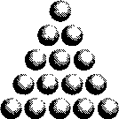

# Глава 5. Циклы в программах
Язык Objective-C позволяет повторять последовательности кода различными способами. Темой этой главы являются циклы. Они могут формироваться с помощью следующих операторов.
* Оператор for
* Оператор while
* Оператор do

Начнем с простого примера: подсчет суммы.
Составим треугольник из 15 шаров (рис. 5.1).



Рис. 5.1. Пример треугольной компоновки

Первый ряд состоит из одного шара, второй ряд — из двух, и т.д. Количество шаров в треугольнике, состоящем из п рядов, равно сумме чисел от 1 до п. Эта сумма называется треугольным числом.

Если начать с 1, то четвертое треугольное число будет равно сумме последо-вательных чисел от 1 до 4 (1 + 2 + 3 + 4), то есть 10.Напишем программу, которая вычисляет и выводит на экран значение восьмого треугольного числа. Это число легко сосчитать в уме, но можно написать программу на Objective-C, чтобы выполнить эту задачу (программа 5.1).
```
#import <Foundation/Foundation.h>

// Программа вычисления восьмого треугольного числа (triangularNumber)

int main (int argc, char *argv[])
{
    NSAutoreleasePool * pool = [[NSAutoreleasePool alloc] init];
    int triangularNumber;
    triangularNumber =1 + 2 + 3 + 4 + 5 + 6 + 7 + 8;

    NSLog (@"The eighth triangular number is %\", triangularNumber);

    [pool drain];
    return 0;
}
```
Вывод программы 5.1
```
The eighth triangular number is 36 (восьмое треугольное число = 36)
```
Способ, применяемый в программе 5.1, вполне подходит для относительно небольших треугольных чисел, но что делать, если нам нужно вычислить, на-пример, значение 200-го треугольного числа? Не складывать же в явном виде все целые числа от 1 до 200? К счастью, имеется более простой способ — воз-можность выполнения операций в цикле. Для реализации циклов в языке Objective-C имеется три оператора.

## 5.1. Оператор for
В программе 5.2 вычисляется 200-е треугольное число. На ее примере мы рассмотрим, как работает оператор for.
```
// Программа вычисления 200-го треугольного числа (triangularNumber)
// Пример использования оператора for

#import <Foundation/Foundation.h>

int main (int argc, char *argv[])
{
    NSAutoreleasePool * pool = [[NSAutoreleasePool alloc] init];
    int n, triangularNumber;

    triangularNumber = 0;

    for ( n = 1; n <= 200; n = n + 1 )
    triangularNumber += n;

    NSLog (@"The 200th triangular number is %i", triangularNumber);

    [pool drain];
    return 0;
}
```
Вывод программы 5.2
```
The 200th triangular number is 20100 (200-е треугольное число = 20100)
```
Программа 5.2 требует некоторых пояснений. Для расчета 200-го треуголь-ного числа используется тот же метод, что и для 8-го треугольного числа: вы-числяется сумма чисел от 1 до 200.

Перед оператором for переменной triangularNumber присваивается значение 0. Все переменные необходимо инициализировать (присвоить им значение) до того, как они будут использованы в программе. Определенным типам перемен-ных начальные значения присваиваются по умолчанию, но надежнее присвоить переменным нужные значения явно.

Оператор for позволяет обойтись без явного написания всех чисел от 1 до 200. В общем виде оператор for имеет формат
```
for (начальное выражение]; условие_цикла; выражение_цикла)
    программный оператор
```
Три выражения, заключенные в круглые скобки: начальное_выражение, условие_ цикла и выражение_цикла — задают среду выполнения программного цикла. Следу-ющий за ними программный оператор (который заканчивается символом «точка с запятой») может быть любым оператором Objective-C. Количество выполнений этого оператора определяется параметрами, заданными в операторе for.

Первый компонент оператора for, начальное_выражениеу задает начальные зна-чения до выполнения цикла. В программе 5.2 эта часть оператора for задает на-чальное значение п, равное 1. Второй компонент оператора for указывает усло-вия, необходимые для продолжения цикла. Цикл повторяется, пока это условие истинно. В программе 5.2 условие_цикла указывается следующим выражением отношения:
```
n <= 200
```
Это выражение означает «п меньше или равно 200». Оператор « меньше или равно» (знак «меньше» [<], после которого сразу следует знак «равно» [=]) — это оператор отношения. Операторы отношения используются для проверки условий. Результатом проверки является ответ «да» (или TRUE), если условие выполняется, или «нет» (или FALSE), если условие не выполняется.

В таблице 5.1 приводится список всех операторов отношения Objective-C.

Табл. 5.1. Операторы отношения

| Оператор | Описание         | Пример             |
|----------|------------------|--------------------|
| ==       | Равно            | count == 10        |
| !=       | Не равно         | flag != DONE       |
| <        | Меньше, чем      | а < b              |
| <=       | Меньше или равно | low <= high        |
| >        | Больше, чем      | points > POINT_MAX |
| >=       | Больше или равно | j>=0               |

Операторы отношения имеют меньший приоритет, чем все арифметические операторы. Выражение
```
а < b-с
```
выполняется так:
```
а < (b + с)
```
Оно истинно (TRUE), если значение а меньше, чем значение b + с, и ложно (FALSE) в противном случае.

Обратите внимание на оператор «равно» (==); его не следует путать с опе-ратором присваивания (=). Выражение
```
а == 2
```
проверяет, равно ли значение а значению 2* а выражение
```
а = 2
```
присваивает значение 2 переменной а.

Выбор оператора отношения зависит от типа проверки и от ваших предпочтений. Например, выражение отношения
```
n <= 200
```
эквивалентно
```
n < 201
```
В приведенном выше примере выполнение программного оператора, кото-рый образует тело цикла for (triangularNumber += п;), повторяется до тех пор, пока результат проверки выражения отношения равен TRUE (в данном случае — пока значение п меньше или равно 200). В этом операторе значение п прибавляется к значению переменной triangularNumber.

Если условие_цикла не выполнено, то программа продолжает выполняться со следующего оператора. В этой программе выполнение продолжается с оператора NSLog.

Последний компонент оператора for содержит выражение, которое вычис-ляется каждый раз после выполнения тела цикла. В программе 5.2 выражение_- цикла к значению п прибавляется 1. Значение п увеличивается на 1 каждый раз после прибавления этого значения к значению triangularNumber, и п изменяется от 1 до 201.

Последнее значение п (201) не прибавляется к значению triangularNumber, по-скольку цикл заканчивается, как только перестает выполняться условие цикла (п становится равным 201).

Итак, оператор for выполняется следующим образом.

1. Сначала вычисляется начальное выражение. В этом выражении обычно за-дается (инициализируется) переменная, используемая внутри цикла, которую называют индексной переменной. Ей присваивается некоторое начальное значение (например, 0 или 1).
2. Проверяется условие цикла. Если это условие не удовлетворяется (выражение имеет значение FALSE), то цикл немедленно прекращается, и выполнение продолжается с оператора, расположенного непосредственно после цикла.
3. Выполняется программный оператор, содержащий тело цикла.
4. Вычисляется выражение цикла. Это выражение обычно используется, чтобы изменить значение индексной переменной. Довольно часто это прибавление к переменной 1 или вычитание из нее 1.
5. Возврат к шагу 2.

Условие цикла проверяется сразу после входа в цикл, до первого выполнения тела цикла. Нельзя ставить символ «точка с запятой» после закрывающей круглой скобки, поскольку это сразу прекращает цикл.

Программа 5.2 генерирует все 200 первых треугольных чисел. Создадим таб-лицу этих чисел. Для экономии места мы выведем таблицу, содержащую только первые 10 треугольных чисел. Эта задача выполняется в программе 5.3.
```
// Программа, генерирующая таблицу треугольных чисел
#import <Foundation/Foundation.h>
int main (int argc, char *argv[])
{
    NSAutoreleasePool * pool = [[NSAutoreleasePool alloc] init]; int n, triangularNumber;
    NSLog (@"TABLE OF TRIANGULAR NUMBERS");
    NSLog (@" n Sum from 1 to n");
    NSLog (@"-- ------");

    triangularNumber = 0;

    for ( n = 1; n <= 10; ++n ) {
        triangularNumber += n;
        NSLog (@H %i    %i", n, triangularNumber);
    }

    [pool drain];
    return 0;
}
```
Вывод программы 5.3
```
TABLE OF TRIANGULAR NUMBERS (Таблица треугольных чисел)
n Сумма от 1 до n
- ------------
1 1
2 3
3 6
4 10
5 15
6 21
7 28
8 36
9 45
10 55
```
В программе 5.3 первые три оператора NSLog выводят заголовок и названий колонок вывода.

После это вычисляются первые 10 треугольных чисел. Переменная п используется, чтобы определить текущий номер, для которого вычисляется сумма от 1 до п, в переменной triangularNumber сохраняется значение n-го треугольного числа.

Выполнение оператора for начинается с присваивания переменной п значения 1. Программный оператор, следующий непосредственно после оператора for, содержит тело цикла. Чтобы выполнить в цикле не один, а несколько про-граммных оператор, нужно заключить их в фигурные скобки. Система интер-претирует этот блок (block) как один элемент. Вообще говоря, в любом месте программы на Objective-C вместо одного оператора можно использовать блок операторов, если заключить этот блок в фигурные скобки.

В программе 5.3 тело цикла состоит из выражения, в котором значение п добавляется к значению triangularNumber, и следующего за ним оператора NSLog. Обратите внимание, что эти операторы расположены с отступом, поскольку они образуют часть цикла for. Существуют разные стили программирования; неко-торые из них записывают цикл так, чтобы открывающая фигурная скобка рас-полагалась в отдельной строке после for.

```
for ( n = 1; n <= 10; ++n )
{
    triangularNumber += n;
    NSLog (@" %i %i", n, triangularNumber);
}
```
Следующее треугольное число вычисляется путем добавления значения п к предыдущему треугольному числу. При первом входе в цикл треугольное число равно 0, поэтому новое значение triangularNumber при п, равном 1, равно 1. Затем выводятся значения п и triangularNumber с соответствующим числом пробелов, вставляемых в строку формата, чтобы значения этих переменных были выров-нены под заголовками соответствующих колонок.

После выполнения тела цикла вычисляется выражение цикла. Но это выра-жение в данном операторе for выглядит странно:
```
++n
```
Однако ++n — это вполне допустимое выражение Objective-C. Оно представляет новый оператор Objective-C: оператор приращения, или увеличения (increment operator). Этот оператор добавляет 1 к своему операнду. Приращение на 1 весьма распространено, и для этой цели существует специальный оператор. Выражение ++п эквивалентно выражению n = п + 1.

Конечно, ни один язык программирования, содержащий оператор прибав-ления 1, не будет полным без соответствующего оператора вычитания 1. Этот оператор называется оператором уменьшения (decrement operator), и для него используется двойной знак «минус». Выражение
```
bean counter = bean_counter - 1
```
эквивалентно выражению
```
--bean_counter
```
Некоторые программисты любят помещать ++ или — после имени пере-менной, как в n++ или bean_counter-.

Вероятно, вы обратили внимание, что последняя строка вывода программы 5.3 не выровнена. Вы можете устранить это небольшое несоответствие, заменив соответствующий оператор программы 5.3 следующим оператором NSLog:
```
NSLog ("%2i %i", n, triangularNumber);
```
Ниже приводится вывод модифицированной программы (назовем ее про-граммой 5.ЗА).

Вывод программы 5.ЗА
```
TABLE OF TRIANGULAR NUMBERS
n   Sum from 1 to n
- ---------------
1   1
2   3
3   6
4   10
5   15
6   21
7   28
8   36
9   45
10  55
```

Основное изменение, внесенное в оператор NSLog — это включение описания ширины поля. Символы %2i указывают процедуре NSLog, что нужно вывести целое значение в определенной позиции и использовать для вывода не менее двух позиций. Любое целое число, занимающее менее двух позиций, будет выводиться с ведущим пробелом. Это называется выравниванием по правому краю (right justification).

### Ввод с клавиатуры
Программа 5.2 вычисляет только 200-е треугольное число. Как быть, если вам нужно вычислить 50-е или 100-е треугольное число? Нужно изменить програм-му, чтобы цикл for был выполнен соответствующее число раз, и изменить опе-ратор NSLog, чтобы вывести соответствующее сообщение.

Наиболее простое решение — сделать так, чтобы программа запрашивала, какое число вы хотите вычислить, а затем вычисляла его. Чтобы реализовать это решение, можно использовать процедуру с именем scant. Процедура scant действует аналогично процедуре NSLog, но процедура NSLog выводит значения на экран, а процедура scant позволяет вводить значения в программу. Конечно, если в программе на Objective-C используется графический интерфейс пользо-вателя (User Interface, UI) для такого приложения, как Cocoa или iPhone, то ни NSLog, ни scant вообще не потребуется.

Программа 5.4 спрашивает у пользователя, какое треугольное число нужно вычислить, вычисляет это число и выводит результаты.
```
#import <Foundation/Foundation.h>
int main (int argc, char *argv[])
{
    NSAutoreleasePool * pool = [[NSAutoreleasePool alloc] init];
    int n, number, triangularNumber;

    NSLog (@"What triangular number do you want?");
    scant("%i", &number);

    triangularNumber = 0;

    for ( n = 1; n <= number; ++n )
        triangularNumber += n;

    NSLog (@"Triangular number %i is %i\n", number, triangularNumber);

    [pool drain];
    return 0;
}
```
Вывод программы 5.4
```
What triangular number do you want? (Какое треугольное число вам нужно?)
100
Triangular number 100 is 5050 (100-е треугольное число равно 5050)
```
Согласно этому выводу, пользователь ввел число 100. Программа вычислила 100-е треугольное число и вывела результат 5050 на терминал. В первом опера-торе NSLog программы 5.4 у пользователя запрашивается ввод числа. Напомним пользователю, что конкретно нужно ввести. После вывода сообщения вызывается процедура scant. Первым аргументом для scant является строка формата, которая не начинается с символа У NSLog первым аргументом всегда является объект NSString, а у scant — С-строка. Перед строками в стиле С не ставится символ @.

Строка формата указывает scant, какие типы значений должны считываться с консоли (из окна терминала, если вы компилируете программу с помощью приложения Terminal). Как и в случае NSLog, для указания целого значения ис-пользуются символы %i.

Второй аргумент для процедуры scant указывает, где должно быть сохранено значение, которое вводит пользователь. В этом случае перед именем переменной необходим символ &. Этот символ, который является на самом деле оператором, рассматривается в главе 13.

При вызове scant указывается, что целое значение должно быть прочитано и сохранено в переменной number. Это значение представляет номер того треу-гольного числа, которое требуется вычислить.

После ввода этого значения пользователем (и нажатия клавиши Enter на клавиатуре, указывающей на завершение ввода) программа вычисляет запро-шенное треугольное число. Это происходит так же, как; Вместо использования в программе 5.2 предела, равного 200, в этой программе используется значение number.

Затем выводятся результаты, и выполнение программы заканчивается.

### Вложенные циклы for
Программа 5.4 позволяет вычислить любое треугольное число. Теперь предпо-ложим, что нам надо вычислить пять треугольных чисел. Пользователь мог бы запускать эту программу пять раз, вычисляя все числа по очереди.

С точки зрения изучения Objective-C:, нужно, чтобы программа сама обра-батывала эту ситуацию. Для этого достаточно вставить в программу цикл для повторения всей последовательности вычислений. Вы можете использовать опе-ратор tor, чтобы задать такой цикл. Этот способ показан на примере программы 5.5 и вывода ее результатов.
```
#import <Foundation/Foundation.h>

int main (int argc, char *argv[])
{
    NSAutoreleasePool * pool = [[NSAutoreleasePoo! alloc] init];
    int n, number, triangularNumber, counter;

    for ( counter = 1; counter <= 5; ++counter) {
        NSLog (@"What triangular number do you want?"); scant ("%i", &number);

        triangularNumber = 0;

        for ( n = 1; n <= number; ++n )
            triangularNumber += n;

        NSLog (@"Triangular number %i is %i", number, triangularNumber);
    }
    [pool drain];
    return 0;
}
```
Вывод программы 5.5
```
What triangular number do you want? (Какое треугольное число вам нужно?)
12
Triangular number 12 is 78 (12-е треугольное число равно 78)
What triangular number do you want?
25
Triangular number 25 is 325
What triangular number do you want?
50
Triangular number 50 is 1275
What triangular number do you want?
75
Triangular number 75 is 2850
What triangular number do you want?
83
Triangular number 83 is 3486
```
Эта программа содержит два уровня операторов for. Внешний оператор for:
```
for ( counter = 1; counter <= 5; ++counter)
```
Он указывает, что цикл программы должен быть выполнен пять раз. Значение счетчика (counter) задается равным 1 и затем наращивается с шагом 1 и условием, что он меньше или равен 5 (т.е. пока он не достигнет 6).

В отличие от предыдущей программы, переменная counter в других местах программы не используется. Она применяется исключительно как счетчик цикла в операторе for. Тем не менее, поскольку это переменная, вы должны объявить ее в программе.

В цикл этой программы включены все остальные программные операторы, заключенные в фигурные скобки. Эту программу можно описать следующим образом.
```
Пять раз
{
    Получение числа от пользователя.
    Вычисление запрашиваемого треугольного числа.
    Вывод результатов.
}
```
Часть «Вычисление запрашиваемого треугольного числа» фактически состо-ит из задания значения 0 для переменной triangularNumber и цикла for, в котором вычисляется треугольное число. Таким образом, оператор for оказывается внут-ри другого оператора for. Вложение циклов может продолжаться до любого уровня.

Использование отступов становится крайне важным при работе с усложнен-ными программными конструкциями, такими как вложенные операторы for. Так вы сможете быстро определить, какие операторы содержатся внутри каждого оператора for.

### Варианты цикла for
Прежде чем закончить рассмотрение цикла for, рассмотрим синтаксические ва-риации, допустимые при формировании цикла. При написании цикла for может оказаться, что вам нужно инициализировать более одной переменной, прежде чем начнется цикл, или нужно проверять несколько условий на каждом шаге цикла. Вы можете включать несколько выражений в любые поля цикла for, раз-деляя выражения запятыми. Например, в операторе, который начинается с
```
for (i = 0, j = 0; i < 10; ++i)
    ...
```
значения i и j до начала цикла задаются равными 0. Эти два выражения, i=0 и j=0, разделены запятой, и оба выражения считаются частью поля начальное_выражение этого цикла. Рассмотрим еще один пример. Он начинается с оператора
```
for (i = 0, j = 100; i < 10; ++i, j -= 10 )
    ...
```
Здесь задаются две индексные переменные, i и j, которым присваиваются до начала цикла начальные значения: 0 и 100. После каждого выполнения тела цикла значение i увеличивается на 1, значение j уменьшается на 10.

Вы можете включать несколько выражений в определенное поле оператора for или пропускать несколько полей в этом операторе. Пропустив соответствующее поле, на его месте нужно оставить точку с запятой. Наиболее распространенный случай пропуска поля в операторе for возникает, когда не нужно инициализировать начальное выражение. Вы можете просто оставить поле начальноевыражение пустым, как в следующем случае, оставив только символ «точка с запятой».
```
for (; j != 100; ++j)
    ...
```
Этот оператор можно использовать, например, если для переменной j до входа в цикл уже задано некоторое начальное значение.

Цикл for, в котором опущено поле условие_цикла, на самом деле является бесконечным циклом. Такой цикл можно использовать, если для выхода из цикла используются другие средства (например, операторы return, break или goto, которые описываются далее).

Вы можете определять переменные в составе начального выражения цикла for с помощью рассмотренных ранее типичных способов определения переменных. Например, следующий оператор задает цикл for с целой переменной counter, которая одновременно определяется и инициализируется со значением 1.
```
for ( int counter = 1; counter <= 5; ++counter)
```
Переменная counter действует только при выполнении этого цикла (она называется локальной переменной цикла) и недоступна извне данного цикла.

В следующем цикле определяются две целые переменные и задаются их начальные значения.
```
for ( int n = 1, triangularNumber = 0; n <= 200; ++n )
    triangularNumber += n;
```
Последний вариант цикла, который называется быстрым перечислением (fast enumerations) коллекции объектов, подробно описывается в главе 15.

## 5.2. Оператор while
Оператор while еще больше расширяет возможности циклов в языке Objective-С. Эта часто применяемая конструкция имеет следующий синтаксис:
```
while (выражение)
    программный оператор
```
Выполняется оценка выражения, указанного в круглых скобках. Если результатом оценки выражения является значение TRUE, то выполняется программный оператор. После выполнения этого оператора (или операторов, заключенных в фигурные скобки) снова выполняется оценка выражения. Если результатом оценки выражения является значение TRUE, то снова выполняется программный оператор. Этот процесс продолжается, пока результатом оценки выражения не станет значение FALSE, после чего цикл прекращается. Выполнение программы затем продолжается, начиная с оператора, который следует за программным оператором.

В качестве примера в следующей программе задается цикл while, используемый просто для счета от 1 до 5.
```
// В этой программе вводится оператор while

#import <Foundation/Foundation.h>

#import <stdio.h>

int main (int argc, char *argv[])
{
    NSAutoreleasePool * pool = [[NSAutoreleasePool alloc] init];
    int count = 1;

    while ( count <= 5 ) {
        NSLog (@"%i,,l count);
        ++count;
    }

    [pool drain];
    return 0;
}
```
Вывод программы 5.6
```
1
2
3
4
5
```
В этой программе сначала задается значение переменной count, равное 1; затем начинается выполнение цикла while. Поскольку значение count меньше 5, выполняется следующий оператор. В фигурных скобках содержится тело цикла с оператором NSLog и оператором, который наращивает значение переменной count. Из результатов вывода этой программы видно, что цикл выполняется пять раз, то есть до тех пор, пока значение count не достигнет 5.

Эту же задачу можно выполнить с помощью оператора for. Оператор for всегда можно преобразовать в эквивалентный оператор while, и наоборот. Общую форму оператора for
```
for (начальное_выражение; условие_цикла; выражение_цикла )
    программный оператор
```
можно выразить в эквивалентной форме оператора while:
```
начальное_выражение;
while (условие_цикла)
{
    программный оператор
    выражение_цикла;
}
```
Со временем вы поймете, когда удобнее использовать оператор while, а когда - оператор for. Обычно для цикла, который должен быть выполнен определенное количество раз, подходит оператор for. Если начальное выражение, выражение цикла и условие цикла включают одну и ту же переменную, то обычно правильным выбором будет оператор for.

В следующей программе содержится еще один пример использования оператора while. Эта программа вычисляет наибольший общий делитель двух целых значений. Наибольший общий делитель (далее мы будем применять для него сокращение gcd — greatest common divisor) - это наибольшее целое число, на которое делятся без остатка два целых числа. Например, gcd чисел Ю и 15 равен 5, так как 5 — наибольшее целое число, на которое делятся без остатка Ю и 15.

Алгоритм получения gcd двух произвольных целых чисел основывается на процедуре, впервые разработанной Евклидом примерно в 300 г. до нашей эры. Ее можно сформулировать следующим образом.

**Задача.** Найти наибольший общий делитель двух неотрицательных целых чисел и и V.

Шаг 1. Если v равно 0, то процедура завершена и gcd равен и.

Шаг 2. Вычислить `temp = u % v, u = v, v = temp` и вернуться к шагу 1.

Анализ шагов этого алгоритма показывает, что шаг 2 повторяется, пока значение v не станет равным 0. Из этого следует, что на Objective-C этот алгоритм следует реализовать опсредством оператора while.

Программа 5.7 выполняет поиск gcd двух неотрицательных целых значений, вводимых пользователем.
```
// Эта программа ищет наибольший общий делитель
// двух неотрицательных целых значений
#import <Foundation/Foundation.h>
int main (int argc, char *argv[])
{
    NSAutoreleasePool * pool = [[NSAutoreleasePool alloc] init];
    unsigned int u, v, temp;

    NSLog (@"Please type in two nonnegative integers.");
    scant ("%u%u", &u, &v);

    while ( v != 0 ) {
        temp = u % v;
        u = v;
        v = temp;
    }
    NSLog (@"Their greatest common divisor is %u", u);

    [pool drain];

    return 0;
}
```
Вывод программы 5.7
```
Please type in two nonnegative integers. (Введите два неотрицательных целых числа)
150 35
Their greatest common divisor is 5 (Их наибольший общий делитель равен 5)
```
Вывод программы 5.7 (Повторный запуск)
```
Please type in two nonnegative integers. (Введите два неотрицательных числа.)
1026 540
Their greatest common divisor is 54 (Их наибольший общий делитель равен 54.)
```
После ввода двух целых значений и сохранения в переменных и и v (с использованием символов формата %и для чтения целого значения без знака) начинается цикл while, где вычисляется наибольший общий делитель. После выхода из цикла while выводится значение и, представляющее gcd значения переменной v и исходного значения переменной и с соответствующим сообщением.

Тот же алгоритм будет использоваться для поиска наибольшего общего делителя в главе 7. В следующей программе с оператором while решается задача обращения порядка цифр целого числа, которое вводится с терминала. Например, если пользователь вводит число 1234, программа должна вывести результат 4321.

**Примечание.** При использовании вызовов NSLog каждая цифра будет выводиться в отдельной строке вывода. Программисты на С, которые знакомы с функцией printf, могут использовать эту процедуру вместо последовательного вывода цифр.

Чтобы написать такую программу, нужно сначала составить алгоритм, который выполняет поставленную задачу. Часто анализ метода решения задачи приводит к определенному алгоритму. Для задачи обращения цифр числа решение можно сформулировать как «успешное чтение цифр числа справа налево». Вы можете написать компьютерную программу, читающую числа, разработав процедуру извлечения каждой цифры числа, начиная с правой. Полученную цифру можно затем вывести на терминал как следующую цифру обращенного числа.

Чтобы извлечь правую цифру целого числа, можно взять остаток от деления этого числа на 10. Например, 1234 % 10 дает значение 4. Это правая цифра числа 1234 и первая цифра обращенного числа. Следующую цифру можно получить так же, если сначала выполнить целочисленное деление этого числа на 10. Деление 1234 / 10 дает в результате 123, а операция 123 % 10 дает 3, что является следующей цифрой обращенного числа.

Вы можете продолжать эту процедуру, пока не будет извлечена последняя цифра. Если результат последнего деления на 10 равен 0, значит, все цифры извлечены.

Программа 5.8 запрашивает у пользователя ввод числа и затем выводит цифры этого числа, начиная с крайней правой и заканчивая крайней левой.
```
// Программа обращения цифр числа
#import <Foundation/Foundation.h>
int main (int argc, char *argv[])
{
    NSAutoreleasePool * pool = [[NSAutoreleasePool alloc] init];
    int number, right_digit;

    NSLog (@"Enter your number.");
    scant ("%i", &number);

    while ( number != 0 ) {
        right_digit = number % 10;
        NSLog (@"%Г, right_digit);
        number /= 10;
    }

    [pool drain];
    return 0;
}
```
Вывод программы 5.8
```
Enter your number. (Введите свое число)
13579
9
7
5
3
1
```

## 5.3. Оператор do
В двух конструкциях циклов, которые рассматривались выше, перед выполнением цикла выполняется проверка условий. Тело цикла не будет выполнено ни разу, если не удовлетворяются эти условия. При разработке программ иногда требуется, чтобы проверка условий выполнялась в конце цикла, а не в начале. В языке Objective-C для такой ситуации имеется отдельная конструкция, которая называется оператором do. Этот оператор имеет следующий синтаксис.
```
do
    программный оператор
while ( выражение);
```

Оператор do выполняется следующим образом. Первым выполняется программный оператор. Затем оценивается выражение в круглых скобках. Если результатом оценки выражения является значение TRUE, то цикл продолжается и снова выполняется программный оператор. Выполнение программного оператора повторяется до тех пор, пока результатом оценки выражения является значение TRUE. Если результатом оценки выражения оказывается значение FALSE, цикл заканчивается и выполняется следующий по порядку оператор программы.

В операторе do, в отличие от оператора while, условия цикла помещаются в конец цикла, а не в начало.

В программе 5.8 оператор while использовался для вывода цифр числа в обратном порядке. Вернемся к этой программе и определим, что произойдет, если пользователь введет число 0 вместо 13579. Цикл оператора while не будет выполнен ни разу, и ничего не будет выведено на экран. Если использовать оператор do вместо оператора while, цикл программы будет выполнен хотя бы один раз, что гарантирует вывод хотя бы одной цифры. Использование оператора do показано в программе 5.9.
```
// Программа обращения цифр числа
#import <Foundation/Foundation.h>
int main (int argc, char *argv[])
{
    NSAutoreleasePool * pool = [[NSAutoreleasePool alloc] init];
    int number, right_digit;

    NSLog(@"Enter your number.");
    scanf("%i", &number);

    do {
        right_digit = number % 10;
        NSLog (@"%\", right_digit);
        number /= 10;
    }
    while ( number != 0 );

    [pool drain];
    return 0;
}
```
Вывод программы 5.9
```
Enter your number. (Введите свое число)
135
5
3
1
```
Вывод программы 5.9 (Повторный запуск)
```
Enter your number.
О
о
```
При вводе 0 программа выводит цифру 0.

## 5.4. Оператор break
Иногда при выполнении цикла требуется выйти из цикла, как только возникает определенное условие, например, если определено состояние ошибки или преждевременно достигнут конец данных. Для этой цели можно использовать оператор break. При выполнении оператора break программа сразу выходит из цикла любого типа (for, while или do). Все остальные операторы цикла пропускаются, и выполнение цикла прекращается. Выполнение продолжается с первого оператора, следующего после цикла.

Если оператор break выполняется из набора вложенных циклов, то прекращается выполнение только вложенного цикла, в котором выполнен этот оператор break.

Оператор break — это просто ключевое слово break, после которого следует
символ «точка с запятой»:
```
break;
```

## 5.5. Оператор continue
Оператор continue не прекращает выполнение цикла. Если выполнен оператор continue, то пропускаются все следующие операторы до конца цикла, в противном случае выполнение цикла продолжается обычным образом.

Оператор continue чаще всего используется для обхода группы операторов внутри цикла в зависимости от некоторого условия. Его формат:
```
continue;
```
Не используйте операторы break или continue, пока не освоитесь с написанием программных циклов и выхода из них. Эти операторы нужно применять с осторожностью, поскольку они затрудняют чтение и отслеживание работы программ.

## Упражнения
1. Напишите программу создания и вывода таблицы значений пип2 для целых значений п от 1 до 10. Обязательно выведите заголовки колонок.
2. Треугольное число (triangularNumber) можно вычислить для любого целого числа по формуле `triangularNumber = п (п + 1) / 2`
    Например, 10-е треугольное число (55) можно вычислить путем подстановки в эту формулу значения 10 вместо п. Напишите программу, которая создает таблицу треугольных чисел с помощью этой формулы. Эта программа должна вычислять каждое пятое треугольное число для значений п от 5 до 50 (то есть 5, 10, 15,..., 50).
3. Факториал целого числа п (записывается как п!) — это произведение последовательных чисел от 1 до п. Например, 5 факториал рассчитывается следующим образом: 51 = 5x4x3x2x1 = 120
    Напишите программу расчета и вывода первых десяти факториалов.
4. Если перед описателем ширины поля поставлен знак «минус», это поле выводится с выравниванием по левому краю. Замените следующим оператором NSLog соответствующий оператор программы 5.2, выполните программу и сравните вывод обеих программ:
    ```
    NSLog (@"%-2i %i", n, triangularNumber);
    ```
5. Программа 5.5 позволяет пользователю ввести только пять чисел. Модифицируйте эту программу, чтобы пользователь мог ввести количество треугольных чисел для расчета.
6. Перепишите программы 5.2-5.5, заменив все случаи использования оператора for на эквивалентные операторы while. Выполните каждую из этих программ, чтобы проверить идентичность результатов обеих версий.
7. Что произойдет, если ввести отрицательное число в программу 5.8? Попробуйте выполнить это и посмотрите, что получится.
8. Напишите программу, которая вычисляет сумму цифр целого числа. Например, сумма цифр числа 2155 равна 2 + 1 + 5 + 5, то есть 13. Программа должна допускать любое число, введенное пользователем.