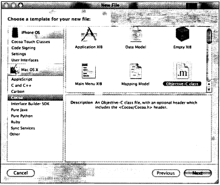
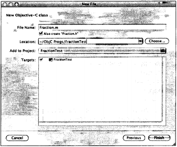
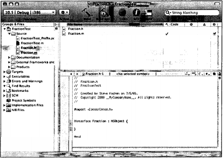

# Глава 7. Более подробно о классах
В этой главе мы продолжим изучение классов и методов и научимся работать с
программными циклами, выражениями и операторами выбора, которые изучили в предыдущей главе. Начнем с разбиения программы на несколько файлов, которое упрощает работу с большими программами.

## 7.1. Разделение файлов объявлений и определений (секции interface и implementation)
Объявления классов и определения классов для сложных программ принято
размещать в отдельных файлах.

Если вы используете Xcode, начните с нового проекта с именем FractionTest.
Введите следующую программу в файл FractionTest.m.
```
#import Traction.h"
int main (int argc, char *argv[])
{
NSAutoreleasePool * pool = [[NSAutoreleasePool alloc] init];
Fraction *myFraction = [[Fraction alloc] init];
// задание дроби (fraction) 1/3
[myFraction setNumerator: 1];
[myFraction setDenominator: 3];
// вывод дроби
NSLog (@"The value of myFraction is:");
[myFraction print];
[myFraction release];
[pool drain];
return 0;
}
```
В этот файл не включено определение класса Fraction, имеется импорт файла
Fraction.h.

Обычно объявление класса (то есть секцию @interface) помещают в отдельный файл с именем классМ. Определение класса (то есть секцию @implementation)
помещают обычно в файл с тем же именем, но с расширением .т. Мы помещаем объявление класса Fraction в файл Fraction.fi, а определение этого класса — в
файл Fraction.m.

В Xcode выберите New File (Новый файл) в меню File (Файл). В левой панели выберите Cocoa. В верхней правой панели выберите Objective-C class (рис.
7.1).



Рис. 7.1. Меню New File в Xcode

Щелкните на кнопке Next (Далее). Введите Fraction.m в поле имени файла
(File name). Оставьте установленным флажок Also Create Fraction.h (Создать
также Fraction.h). Местоположением (Location) этого файла должна быть папка с файлом FractionTest.m (рис. 7.2).

Теперь щелкните на кнопке Finish (Готово). Xcode добавит в ваш проект два
файла: Fraction.h и Fraction.m (рис. 7.3).

Мы не работаем здесь с Cocoa, поэтому заменим в файле Fraction.h строку
```
#import <Cocoa/Cocoa.h>
```
на строку
```
#import <Foundation/Foundation.h>
```



Рис. 7.2. Добавление нового класса к проекту



Рис. 7.3. Xcode создает файлы для нового класса

В этом файле (Fraction.h) введем секцию interface для класса Fraction.

```
//
// Fraction.h
// FractionTest
//
// Created by Steve Kochan on 7/5/08.
// Copyright 2008 _MyCompanyName_. All rights reserved.
//
#import <Foundation/Foundation.h>
// Класс Fraction
@interface Fraction : NSObject
{
int numerator;
int denominator;
}
-(void) print;
-(void) setNumerator: (int) n;
-(void) setDenominator: (int) d;
-(int) numerator;
-(int) denominator;
-(double) convertToNum;
@end
```
Этот файл указывает компилятору (и программистам, см. ниже), как должен выглядеть объект класса Fraction: он содержит две целых переменных экземпляра с именами numerator (числитель) и denominator (знаменатель). Он также
содержит шесть методов экземпляра: print, setNumerator:, setDenominator:, numerator,
denominator и convertToNum. Первые три метода не возвращают никакого значения,
следующие два возвращают значение типа int, а последний метод возвращает
значение типа double. Методам setNumerator: и setDenominator: передается аргумент
целого типа.

Детали определения (implementation) класса Fraction содержатся в файле
Fraction.m.
```
//
// Fraction.m
// FractionTest
//
// Created by Steve Kochan on 7/5/08.
// Copyright 2008 _MyCompanyName_. All rights reserved.

//
#import Traction.h"
@implementation Fraction
-(void) print
{
NSLog (@"%i/%in, numerator, denominator);
}
-(void) setNumerator: (int) n
{
numerator = n;
}
-(void) setDenominator: (int) d
{
denominator = d;
}
-(int) numerator
{
return numerator;
}
-(int) denominator
{
return denominator;
}
-(double) convertToNum
{
if (denominator != 0)
return (double) numerator / denominator;
else
return 1.0;
}
@end
```
Обратите внимание, что файл секции interface импортируется в файл секции implementation с помощью следующего оператора:
```
#import Traction.h"
```
Это позволяет компилятору получать информацию о классах и методах,
объявленных для класса Fraction, и обеспечивать согласованность между этими
файлами. Переменные экземпляра внутри класса обычно не переобъявляют
внутри секции implementation (хотя это можно делать), чтобы компилятор брал
эту информацию из секции interface, содержащейся в Fraction.h.

Импортируемый файл заключается в кавычки, а не в угловые скобки (`<` и `>`), как `<Foundation/Foundation.h>`. Кавычки используются для локальных файлов (создаваемых вами вместо системных файлов), и они показывают компилятору, где искать указанный файл. Когда используются кавычки, компилятор обычно ищет сначала указанный файл в текущей папке, а затем — в списке других мест. Вы можете указывать для компилятора конкретные места поиска.

Пример тестовой программы в файле FractionTest.m:
```
#import "Fraction.h"
int main (int argc, char *argv[])
{
NSAutoreleasePool * pool = [[NSAutoreleasePool alloc] init];
Fraction *myFraction = [[Fraction alloc] init];
// задание дроби (fraction) 1/3
[myFraction setNumerator: 1];
[myFraction setDenominator: 3];
// вывод дроби
NSLog (@"The value of myFraction is:");
[myFraction print];
[myFraction release];
[pool drain];
return 0;
}
```
Программа FractionTest.m включает файл секции interface Fraction.h, а не файл
секции implementation Fraction.m. Таким образом, она разделена на три отдельных файла. Вы можете компилировать и запускать программу точно так же, как
раньше. Выберите Build and Go в меню Build или щелкните на значке Build and
Go в основном окне Xcode.

Если вы компилируете программы из командной строки, укажите компилятору Objective-C оба файла с расширением «.т». При использовании дсс командная строка будет выглядеть следующим образом:
```
gcc -framework Foundation Fraction.m FractionTest.m -о FractionTest
```
В результате будет создан исполняемый файл с именем FractionTest. Ниже приводятся результаты вывода при выполнении этой программы.

Вывод программы 7.1 FractionTest
```
The value of myFraction is: (Значение myFraction)
1/3
```

## 7.2. Синтезируемые методы доступа
В Objective-C 2.0 методы-установщики (setter) и методы-получатели (getter) (которые называют методами доступа — accessor methods) можно генерироваться
автоматически. Мы не описывали этого до настоящего момента, поскольку было
важно, чтобы вы поняли, как писать эти методы самостоятельно. Однако это
настолько удобно, что пора объяснить вам, как использовать эту возможность.

Первый шаг — задание свойств в директиве (@property в секции interface. К
этим свойствам относятся переменные экземпляра. Для класса Fraction в эту категорию попадают две переменные экземпляра: numerator и denominator. Ниже приводится новая секция interface с добавлением директивы (@property.
```
@interface Fraction : NSObject
{
int numerator;
int denominator;
}
@property int numerator, denominator;
-(void) print;
-(double) convertToNum;
@end
```
Мы больше не включаем определения методов-получателей и методов-установщиков: numerator, denominator, setNumerator: и setDenominator:. Нам нужно, чтобы
компилятор Objective-C автоматически генерировал, или синтезировал
(synthesize) их для нас. Для этого служит директива (@synthesize в секции
implementation, как показано ниже.
```
#import «Fraction.h»
@implementation Fraction
@synthesize numerator, denominator;
-(void) print
{NSLog (@"%i/%i", numerator, denominator);
}
-(double) convertToNum
{
if (denominator != 0)
return (double) numerator / denominator;
else
return 1.0;
@end
```
Следующая строка указывает компилятору Objective-C, что нужно создать
по паре методов (установщик и получатель) для каждой из указанных переменных экземпляра (numerator и denominator).
```
@synthesize numerator, denominator;
```
В общем случае, если у вас есть переменная экземпляра с именем х, то включение следующей строки в секцию implementation указывает компилятору, что
нужно синтезировать метод-получатель с именем х и метод-установщик с именем setX:.
```
@synthesize х;
```
Автоматическое создание методов компилятором имеет смысл, поскольку
генерируемые методы доступа эффективны и надежны при работе с несколькими потоками, на нескольких машинах, с несколькими процессорами.

А теперь вернемся к программе 7.1 и внесем указанные изменения в секции
interface и implementation, чтобы методы доступа синтезировалисьы автоматически. Убедитесь, что программа выводит те же результаты.

## 7.3. Доступ к свойствам с помощью оператора «точка»
Для доступа к свойствам имеется более удобный синтаксис. Чтобы получить значение числителя (numerator), хранящееся в myFraction, можно использовать строку
```
[myFraction numerator]
```
Сообщение numerator передается объекту myFraction, он возвращает требуемое
значение. С помощью оператора «точка» можно написать эквивалентное выражение:
```
my Fraction, numerator
```
Его общий формат
```
instance.property (экземпляр.свойство)
```
Этот синтаксис присваивает значения:
```
instance, property = значение
```
Это эквивалентно выражению `[instance setProperty: значение]`

В программе 7.1 мы задали numerator (числитель) и denominator (знаменатель) дроби 1/3 с помощью двух строк кода:
```
[myFraction setNumerator: 1];
[myFraction setDenominator: 3];
```
Ниже приводится эквивалентный способ записи этих строк:
```
myFraction.numerator = 1;
myFraction.denominator = 3;
```
Далее мы будем использовать эти средства для синтеза методов и доступа к
свойствам.

## 7.4. Передача методам нескольких аргументов
Продолжим работу с классом Fraction и внесем некоторые дополнения. Мы определили шесть методов. Было бы хорошо иметь такой метод, чтобы можно было
задавать числитель и знаменатель с помощью одного сообщения. Если метод
принимает несколько аргументов, после каждого аргумента ставится двоеточие. Аргументы становятся частью имени метода. Например, метод с именем
addEntryWithName:andEmail: принимает два аргумента : имя (name) и адрес электронной почты (email). Метод addEntryWithName:andEmail:andPhone: принимает три
аргумента: имя, адрес электронной почты и номер телефона (phone).

Метод, с помощью которого задаются numerator (числитель) и denominator
(знаменатель), можно было бы назвать setNumerator:andDenominator: и использовать
следующим образом:
```
[myFraction setNumerator: 1 andDenominator: 3];
```
Это вполне подходящий выбор для имени метода, но можно подобрать и
более удобное для чтения имя метода, например, setTo:over:. Присвоим myFraction
значение 1/3 и сравним это сообщение с предыдущим вариантом:
```
[myFraction setTo: 1 over: 3]; (присвоить 1, деленное на 3)
```
Я считаю, что оно читается лучше, но окончательный выбор за вами. Выбор
имен методов важен для удобочитаемости программы.

А теперь опробуем работу с новым методом. Сначала добавим объявление
setTo:over: в файл секции interface, см. программу 7.2.
```
#import <Foundation/Foundation.h>
// Определение класса Fraction
@interface Fraction : NSObject
{
int numerator;
int denominator;
}
@property int numerator, denominator;
-(void) print;
-(void) setTo: (int) n over: (int) d;
-(double) convertToNum;
@end
```
Теперь добавим определение этого метода в файл implementation.
```
#import «Fraction.h»
@implementation Fraction
@synthesize numerator, denominator;
-(void) print
{
NSLog (@"%i/%i", numerator, denominator);
-(double) convertToNum
{
if (denominator != 0)
return (double) numerator / denominator;
else
return 1.0;
-(void) setTo: (int) n over: (int) d
f
numerator = n;
denominator = d;
}
@end
```
Новый метод просто присваивает два передаваемых ему целых аргумента (п
и d) переменным экземпляра для дроби (numerator и denominator).
Ниже приводится тестовая программа для этого метода.
```
#import "Fraction.h"
int main (int argc, char *argv[])
{
Fraction *aFraction = [[Fraction alloc] init];
NSAutoreleasePool * pool = [[NSAutoreleasePool alloc] init];
[aFraction setTo: 100 over: 200];
[aFraction print];
[aFraction setTo: 1 over: 3];
[aFraction print];
[aFraction release];
[pool drain];
return 0;
}
```
Вывод программы 7.2
```
100/200
1/3
```

### Методы без имен аргументов
При создании имени метода имена аргументов не являются обязательными.

Метод можно объявить следующим образом.
```
-(int) set: (int) n: (int) d;
```
В отличие от предыдущих примеров, для второго аргумента не задано никакого имени. Этот метод имеет имя set::, и два двоеточия означают, что методу
передаются два аргумента, хотя имя одного из них не задано.

При работе с методом set:: в качестве разделителей используется двоеточие:
```
[aFraction set: 1:3];
```
Практика надежного программирования рекомендует указывать имена всех
аргументов при написании новых методов, так как их отсутствие затрудняет
слежение за ходом программы и делает присваивания фактических параметров
менее интуитивным.

### Операции над дробями
Продолжим работу с классом Fraction. Сначала напишем метод с именем add:,
который позволит складывать одну дробь с другой. Ему будет передаваться дробь
как аргумент. Ниже приводится объявление этого метода.
```
-(void) add: (Fraction *) f;
```
Объявление аргумента f:
```
(Fraction *) f
```
Аргумент для метода add: имеет тип класса Fraction. Звездочка обязательна.
Следующее объявление является неверным:
```
(Fraction) f
```
В качестве аргумента методу add: будет передаваться одна дробь, и метод будет выполнять сложение этой дроби с получателем сообщения; в следующем
выражении для дроби bFraction типа Fraction будет выполнено сложение с дробью
aFraction типа Fraction.
```
[aFraction add: bFraction];
```
Напомним, что для сложения дробей а/b и c/d нужно выполнить следующие
вычисления.
```
а_ с_= ad + be
b d bd
```
Поместим код для этого метода в секцию @implementation.
```
// сложение дроби (Fraction) с дробью-получателем
-(void) add: (Fraction *) f
{
// Для сложения двух дробей:
// a/b + c/d = ((a*d) + (b*c)) / (b * d)
numerator = numerator * f.denominator
+ denominator * f.numerator;
denominator = denominator * f.denominator;
}
```
Вы можете ссылаться на объект Fraction, который является получателем сообщения, по его полям numerator и denominator, но не можете непосредственно ссылаться таким же способом на переменные экземпляра аргумента f. Вместо этого вы должны получать их, применяя к f оператор «точка» (или передавая
соответствующее сообщение f).

Предположим, что вы добавили эти объявления и определения для нового
метода add: в файлы секций interface и implementation. Ниже приводится пример тестовой программы 7.3 и ее вывода.
```
#import «Fraction.h»
int main (int argc, char *argv[])
{
NSAutoreleasePool * pool = [[NSAutoreleasePool alloc] init];
Fraction *aFraction = [[Fraction alloc] init];
Fraction *bFraction = [[Fraction alloc] init];
// Задание дробей 1/4 и ? и их сложение
[aFraction setTo: 1 over: 4];
[bFraction setTo: 1 over: 2];
// Вывод результатов
[aFraction print];
NSLog (@"+");
[bFraction print];
NSLog (@"=n);
[aFraction add: bFraction];
[aFraction print];
[aFraction release];
[bFraction release];
[pool drain];
return 0;
}
```
Вывод программы 7.3
```
1/4
+
1/2
=
6/8
```
Тестовая программа выглядит достаточно просто. Выделяется память и инициализируются два объекта класса Fraction: aFraction и bFraction. Им присваиваются
значения 1/4 и 1/2 соответственно, затем дробь bFraction прибавляется к дроби
aFraction и результата сложения выводится. Метод add: прибавляет аргумент к
объекту сообщения, изменяя этот объект. Это проверяется, когда происходит
вывод значения aFraction в конце процедуры main. Можно было бы вывести значение aFraction до вызова метода add:, чтобы увидеть значение до того, как оно
было изменено с помощью метода. Ниже в этой главе мы переопределим метод
add:, чтобы он не влиял на значение своего аргумента.

## 7.5. Локальные переменные
Вы, вероятно, заметили, что результат сложения 1/4 и 1/2 выведен как 6/8, а не
3/4. Наша процедура сложения выполняет только заданные действия, в ней не
предусмотрено сокращение дроби. Добавим новый метод, с помощью которого выполняется сокращение дробей.

Сокращение дроби означает, что нужно найти наибольшее число, на которое делятся без остатка числитель и знаменатель этой дроби, и выполнить деление на это число. Это действие называется поиском наибольшего общего делителя (greatest common divisor, gcd) числителя и знаменателя. Вы уже знаете,
как это делать, из программы 5.7. Используя этот алгоритм, напишем метод
сокращения дроби (reduce).
```
-(void) reduce
{
int u = numerator;
int v = denominator;
int temp;
while (v != 0) {
temp = u % v;
u = v;
v = temp;
}
numerator /= u;
denominator /= u;
}
```
В этом методе объявляются три целые переменные u, v и temp, которые являются локальными. Это означает, что они существуют только во время выполнения метода reduce и доступ к ним может выполняться только внутри метода, в
котором они определены. В этом смысле они аналогичны переменным, объявленным в процедуре main; эти переменные тоже были локальными по отношению к main, и доступ к ним мог выполняться только внутри процедуры main. Ни
один из написанных вами методов не мог иметь непосредственного доступа к
этим переменным, определенным в main.

Локальные переменные не имеют начального значения по умолчанию, поэтому вы должны присвоить им некоторое значение, прежде чем использовать
их. Трем локальным переменным в методе reduce присваиваются значения до
того, как они используются, поэтому здесь не возникает никакой проблемы. В
отличие от переменных экземпляра (которые сохраняют свои значения при
вызовах методов), эти локальные переменные не имеют памяти, и после возврата из метода значения этих переменных исчезают. Каждый раз, когда происходит вызов метода, выполняется инициализация каждой локальной переменной, определенной в этом методе: ей присваивается значение, указанное
при объявлении переменной.

### Аргументы для метода
Имена, которые вы используете для обозначения аргументов метода, тоже являются локальными переменными. При выполнении метода любые аргументы, передаваемые методу, копируются в эти переменные. Поскольку метод работает с копией аргументов, он не может изменить исходные значения,
переданные методу. Предположим, у нас есть метод с именем calculate:, определенный следующим образом:
```
-(void) calculate: (double) х
{
х *= 2;
}
```
Предположим также, что для его вызова использовано выражение:
```
[myData calculate: ptVal];
```
При вызове метода calculate значение, содержащееся в переменной ptVal, копируется в локальную переменную х. Поэтому изменение х внутри calculate: не
оказывает никакого влияния на значение переменной ptVal — только копия ее
значения сохраняется внутри х.

Для аргументов, которые являются объектами, вы можете изменять переменные экземпляра, хранящиеся в этом объекте. Об этом рассказывается в следующей главе.

### Ключевое слово static
Чтобы локальная переменная сохраняла свое значение при нескольких вызовах метода, поместите ключевое слово static перед объявлением переменной. В
следующей строке целая переменная hitCount объявляется как статическая переменная.
```
static int hitCount = 0;
```
В отличие от других локальных переменных, статическая переменная имеет
начальное значение 0, поэтому приведенная выше инициализация является
излишней. Кроме того, статические переменные инициализируются только
один раз, в начале выполнения программы, и сохраняют свои значения при
нескольких вызовах метода.

Приведенная ниже последовательность строк может содержаться внутри
метода showPage, который должен следить за числом своих вызовов (в данном
случае — число выведенных страниц).
```
-(void) showPage
{
static int pageCount = 0;
++pageCount;
```
Локальной статической переменной присваивается значение 0 только один
раз (при запуске программы), а затем это значение сохраняется при всех последующих вызовах метода showPage.

Если pageCount задана как локальная статическая переменная, то в ней подсчитывается число страниц, выведенных всеми объектами, которые вызвали
метод showPage.

Если pageCount задана как переменная экземпляра, то в ней подсчитывается
число страниц, выведенных каждым объектом, поскольку каждый объект будет содержать свою собственную копию pageCount.

Доступ к статическим или локальным переменным может выполняться только из метода, где они определены, поэтому даже статическая переменная
pageCount доступна только внутри showPage. Чтобы сделать эту переменную доступной другим методам, нужно объявить ее вне объявления любого метода
(обычно это делают в начале файла implementation), например:
```
#import "Printer.h"
static int pageCount;
@implementation Printer
@end
```
После этого любой метод экземпляра или класса сможет выполнять доступ
к переменной pageCount. Области действия переменных подробно рассматриваются в гл. 10.

Итак, мы можем вставить код метода reduce в файл секции implementation
Fraction.m. Не забудьте объявить метод reduce в файле секции interface Fraction.h.

После этого вы можете проверить метод в программе 7.4.
```
#import «Fraction.h»
int main (int argc, char *argv[])
{
NSAutoreleasePool * pool = [[NSAutoreleasePool alloc] init];
Fraction *aFraction = [[Fraction alloc] init];
Fraction *bFraction = [[Fraction alloc] init];
[aFraction setTo: 1 over: 4]; // set 1st fraction to 1/4
[bFraction setTo: 1 over: 2]; // set 2nd fraction to 1/2
[aFraction print];
NSLog (@"+");
[bFraction print];
NSLog (@"=");
[aFraction add: bFraction];
// сокращение дроби после сложения и вывод результата
[aFraction reduce];
[aFraction print];
[aFraction release];
[bFraction release];
[pool drain];
return 0;
}
```
Вывод программы 7.4
```
1/4
+
1/2
3/4
```
Этот результат, несомненно, лучше!

## 7.6. Ключевое слово self
В программе 7.4 мы решили сокращать дробь вне метода add:. Мы могли бы
делать это и внутри метода add:. Но как мы сможем указать методу reduce дробь,
для которой нужно выполнить сокращение? Мы знаем, как непосредственно
идентифицировать по имени переменные экземпляра внутри метода, но не знаем, как непосредственно идентифицировать получателя сообщения.

Вы можете использовать ключевое слово self для ссылки на объект, который
является получателем текущего метода. Если внутри метода add: добавить
```
[self reduce];
````
то метод reduce будет применен к объекту Fraction, который был получателем метода add:, а это нам как раз и нужно. Далее вы увидите, насколько полезным
может оказаться ключевое слово self. В методе add: оно применяется следующим образом.
```
-(void) add: (Fraction *) f
{
// Для сложения двух дробей:
// a/b + c/d = ((a*d) + (b*c)) / (b * d)
numerator = (numerator * [f denominator]) +
(denominator * [f numerator]);
denominator = denominator * [f denominator];
[self reduce];
}
```
После сложения будет выполнено сокращение дроби.

## 7.7. Выделение памяти и возврат объектов из методов
Мы уже говорили, что метод add: изменяет значение объекта, который получает
сообщение. Мы создадим новую версию метода add:, который будет вместо этого создавать новый объект типа fraction для сохранения результата сложения. В
этом случае мы должны возвращать новый объект типа Fraction отправителю
сообщения. Ниже приводится определение этого нового метода add:.
```
-(Fraction *) add: (Fraction *) f
{
// Для сложения двух дробей:
// a/b + c/d = ((a*d) + (b*c)) / (b * d)
// В result будет сохраняться результат сложения
Fraction *result = [[Fraction alloc] init];
iint resultNum, resultDenom;
resultNum = numerator * f.denominator +
denominator * f.numerator;
resultDenom = denominator * f.denominator;
[result setTo: resultNum over: resultDenom];
[result reduce];
return result;
}
```
Первая строка определения этого метода:
```
-(Fraction *) add: (Fraction *) f;
```
Она указывает, что метод add: будет возвращать объект класса Fraction и принимать такой объект в качестве аргумента. Этот аргумент будет складываться с
получателем сообщения, которым тоже является объект класса Fraction.

Метод add: выделяет память и инициализирует новый объект типа Fraction с
именем result и затем определяет две локальные переменные с именами resultNum
и resultDenom. Они будут использоваться для сохранения числителей и знаменателей, получаемых в результате сложения.

После выполнения сложения (как и раньше) и присваивания значений числителей и знаменателей локальным переменным можно задать значение result с
помощью следующего выражения.
```
[result setTo: resultNum over: resultDenom];
```
После сокращения result (на наибольший общий делитель) его значение возвращается отправителю сообщения с помощью оператора return.

Отметим, что занимаемая объектом result память, которая выделена внутри
метода add:, возвращается этим методом и не освобождается. Вы не можете освободить ее из метода add:, поскольку она требуется отправителю сообщения.

Поэтому пользователь этого метода обязан знать, что возвращаемый объект
является новым экземпляром и должен быть в дальнейшем освобожден. Это
можно указать в соответствующей документации, которая предоставляется
пользователям данного класса.

В программе 7.5 выполняется проверка нового метода add:.
```
#import «Fraction.h»
int main (int argc, char *argv[])
{
NSAutoreleasePool * pool = [[NSAutoreleasePool alloc] init];
Fraction *aFraction = [[Fraction alloc] init];
Fraction *bFraction = [[Fraction alloc] init];
Fraction ResultFraction;
[aFraction setTo: 1 over: 4]; // присваивание значения 1/4 первой дроби
[bFraction setTo: 1 over: 2]; // присваивание значения 1/2 второй дроби
[aFraction print];
NSLog (@"+");
[bFraction print];
NSLog
resultFraction = [aFraction add: bFraction];
[resultFraction print];
// Непосредственный вывод результата, см. ниже,
// вызовет "утечку" памяти!
[[aFraction add: bFraction] print];
[aFraction release];
[bFraction release];
[resultFraction release];
[pool drain];
return 0;
}
```
Вывод программы 7.5
```
1/4
+
1/2
3/4
3/4
```
Сначала определяются два объекта типа Fraction: aFraction и bFraction, которым
присваиваются значения 1/4 и 1/2 соответственно. Здесь также определяется
объект Fraction с именем resultFraction (для которого не нужно выполнять выделение памяти и инициализацию). В этой переменной будет сохраняться результат последующих операций сложения.

В следующих строках кода сначала выполняется отправка сообщения add:
получателю aFraction с передачей bFraction в качестве аргумента метода.
```
resultFraction = [aFraction add: bFraction];
[resultFraction print];
```
Результирующий объект типа Fraction, возвращаемый методом, сохраняется
в resultFraction и затем выводится путем передачи сообщения print. Отметим, что
вы должны аккуратно завершить эту программу, освободив (release) resultFraction,
хотя вы не выделяли для нее память (allocate) в main. Код выполнил метод add:,
но освободить память должны вы сами. Следующее сообщение кажется очень
удобным, но на самом деле здесь возникает проблема.
```
[[aFraction add: bFraction] print];
```
Поскольку здесь берется объект типа Fraction, возвращаемый методом add:, и
ему передается сообщение print, у вас нет никакого способа освободить этот. Мы
видим здесь пример утечки памяти (memory leakage). При многократном повторении вложенной передачи сообщения такого рода у вас будет понемногу
накапливаться память, которую вы не сможете непосредственным образом освободить.

Чтобы решить эту проблему, можно сделать так, чтобы метод print возвращал
своего получателя, и вы могли бы его освободить. Но это обходной способ.
Проще разбить эти вложенные сообщения на два отдельных сообщения, как
сделано выше.

Мы могли бы избежать использования временных переменных resultNum и
resultDenom в методе add: с помощью следующего сообщения.
```
[result setTo: numerator * f.denominator + denominator * f.numerator
over: denominator * f.denominator;
```
Мы не предлагаем писать такой сокращенный код, но вы можете встретить
его у других программистов, поэтому нужно уметь читать и понимать подобные сложные выражения.

Рассмотрим еще один (последний в этой главе) пример, связанный с дробями. Это суммирование последовательности.
```
± 1/2
i= I
```
Оно означает, что нужно сложить значения 1/2i, где i изменяется от 1 до п,
то есть сложить 1/2 + 1/4 + 1/8 .... Если сделать значение п достаточно большим,
сумма будет приближаться к 1. Мы опробуем несколько значений п, чтобы посмотреть, насколько мы приблизимся к 1.

Программа 7.6 запрашивает ввод значения п и выполняет указанные вычисления.
```
#import Traction.h"
int main (int argc, char *argv[])
{
NSAutoreleasePool * pool = [[NSAutoreleasePool alloc] init];
Fraction *aFraction = [[Fraction alloc] init];
Fraction *sum = [[Fraction alloc] init], *sum2;
int i, n, pow2;
[sum setTo: 0 over: 1]; // присваивание значения 0 первой дроби
NSLog (@"Enter your value for n:");
scant ("%i", &n);
pow2 = 2;
for (i = 1; i <= n; ++i) {
[aFraction setTo: 1 over: pow2];
sum2 = [sum add: aFraction];
[sum release]; // освобождение памяти предыдущей суммы
sum = sum2;
pow2 *= 2;
NSLog (@"After %i iterations, the sum is %g", n, [sum convertToNum]);
[aFraction release];
[sum release];
[pool drain];
return 0;
}
```
Вывод программы 7.6
```
Enter your value for n: (Введите значение n)
5
After 5 iterations, the sum is 0.96875 (По 5 итерациям сумма равна ...)
Вывод программы 7.6 (Повторный запуск)
Enter your value for n:
10
After 10 iterations, the sum is 0.999023
Вывод программы 7.6 (Повторный запуск)
Enter your value for n:
15
After 15 iterations, the sum is 0.999969
```
Переменной sum типа Fraction присваивается значение 0: числитель (numerator),
равный 0, и знаменатель (denominator), равный 1. (А что произойдет, если задать
числитель и знаменатель, равные 0?). Затем программа запрашивает у пользователя ввод значения п и считывает его с помощью scant. Затем начинается цикл for
для вычисления суммы последовательности. Перед циклом переменной pow2
присваивается значение 2. Эта переменная используется для сохранения значения 2i. На каждом шаге цикла это значение умножается на 2.

Цикл for начинается с 1 и продолжается до значения п. На каждом шаге цикла aFraction присваивается значение 1/pow2, то есть 1/2i. Это значение затем добавляется к сумме (sum) с помощью определенного ранее метода add:. Значение
result, возвращаемое из add:, присваивается sum2, а не sum, чтобы избежать проблем утечки памяти. (А что произойдет, если присвоить result непосредственно
sum?) Старое значение sum затем освобождается, и для следующего шага цикла
sum присваивается новое значение суммы — sum2. Изучите, каким образом здесь
происходит освобождение памяти для дробей. Для цикла for, который выполняется сотни или тысячи раз, при неверном освобождении памяти для дробей у
вас быстро накопится большой объем неиспользуемой памяти.

По окончании цикла for конечный результат выводится в виде десятичного
значения с помощью метода convertToNum. Остается только освободить два объекта: aFraction и конечный объект типа Fraction, сохраненный в sum. После этого
завершается выполнение программы.

Результаты вывода показывают, что происходит при запуске программы. При
значении 5 сумма последовательности равна 0.96875. При 15 результат очень
близок к 1.

### Расширение определений класса и файл секции interface
К настоящему моменту мы разработали небольшую библиотеку методов для
работы с дробями. Ниже приводится файл секции interface, в котором применяется все, что мы умеем делать с использованием этого класса.
```
#import <Foundation/Foundation.h>
// Определение класса Fraction
@interface Fraction : NSObject
{
int numerator;
int denominator;
}
@property int numerator, denominator;
-(void) print;
-(double) convertToNum;
-(Fraction *) add: (Fraction *) f;
-(void) reduce;
@end
```
Мы постепенно уточняли и расширяли класс путем добавления новых методов. Этот файл секции interface можно передать другому человеку, чтобы он
мог писать программы, в которых операции с дробями. Если ему потребуется
добавить новый метод, он сможет сделать это непосредственно, расширив определение класса, или косвенно, определив собственный подкласс и добавив
свои собственные новые методы. Этому посвящена следующая глава.

## Упражнения
1. Добавьте следующие методы к классу Fraction для завершения списка арифметических операций над дробями. Выполните сокращение (reduce) результата в каждом случае.
    ```
    // Вычитание аргумента из получателя
    -(Fraction *) subtract: (Fraction *) f;
    // Умножение получателя на аргумент
    -(Fraction *) multiply: (Fraction *) f;
    // Деление получателя на аргумент
    -(Fraction *) divide: (Fraction *) f;
    ```
2. Модифицируйте метод print из класса Fraction, чтобы он мог принимать необязательный аргумент типа B00L, который указывает, нужно ли выполнить сокращение дроби для ее вывода. Если дробь должна быть сокращена, сделайте так, чтобы сама дробь не изменялась необратимо.
3. Внесите изменения в программу 7.6, чтобы выводить результирующую сумму (sum) как дробь, а не только как вещественное число.
4. Будет ли ваш класс Fraction работать с отрицательными дробями? Например, можно ли сложить -1/4 и -1/2 и получить правильный результат? Напишите тестовую программу, чтобы проверить свой ответ.
5. Внесите изменения в метод print класса Fraction, чтобы выводить дроби, превышающие 1, как смешанные числа (с целой и дробной частями), например, дробь 5/3 выводить как 1 2/3.
6. В упражнении 6 главы 4 определяется новый класс с именем Complex для работы с комплексными мнимыми числами. Добавьте новый метод с именем add:, который можно использовать для сложения двух комплексных чисел. Чтобы сложить два комплексных числа, нужно по отдельности сложить вещественные и мнимые части:
    ```
    (5.3 + 7i) + (2.7 + 4i) = 8 + 11i
    ```
    Этот метод add: должен сохранять и возвращать результат в виде нового числа типа Complex в соответствии с объявлением метода:
    ```
    -(Complex *) add: (Complex *) complexNum;
    ```
    Учтите в тестовой программе все потенциальные проблемы утечки памяти.
7. Для класса Complex, разработанного в упражнении 6 главы 4, с учетом расширения, сделанного в упражнении 6 этой главы, создайте отдельные файлы секций interface и implementation —Complex.h и Complex.m. Создайте отдельный файл тестовой программы.