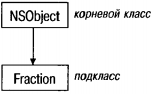
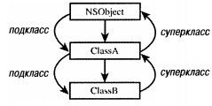
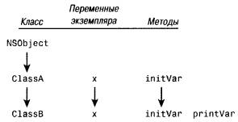
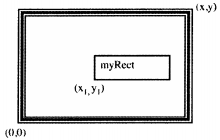
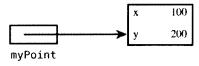
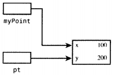
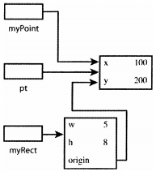
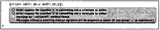
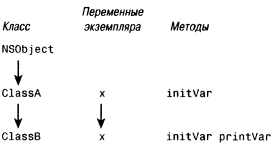
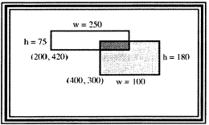

# Глава 8. Наследование
В этой главе рассматривается один из ключевых принципов, который делает
объектно-ориентированное программирование столь мощным. Принцип на­
следования позволяет расширять существующие определения классов и настра­
ивать их для приложений.

## 8.1. Все начинается с корня
Мы уже рассматривали идею родительского класса в главе 3. Родительский класс
может быть дочерним классом другого родительского класса. Класс, не имею­
щий никакого родительского класса, находится вверху иерархии и называется
корневым классом (root class). В Objective-C вы можете определять собственный
родительский класс, но обычно используют возможности существующих клас­
сов. Все классы, которые мы определяли до настоящего момента, являются до­
черними классами (потомками) корневого класса с именем NSObject, который
указывался в файле секции interface следующим образом:
```
@interface Fraction: NSObject
@end
```
Класс Fraction образуется из класса NSObject. Поскольку NSObject находится ввер­
ху иерархической структуры (то есть над ним уже нет никаких классов), он на­
зывается корневым классом (рис. 8.1). Класс Fraction является дочерним (child)
классом или подклассом (subclass).



Рис. 8 .1. Корневой класс и подкласс

С точки зрения терминологии, можно говорить о классах, родительских клас­
сах и дочерних классах или о классах, подклассах и суперклассах. Если опреде­
ляется какой-либо новый класс (не корневой), он наследует определенные свой­
ства. Например, все переменные экземпляра и методы из родительского класса
неявным образом становятся частью определения нового класса. Это означает,
что соответствующий подкласс имеет непосредственный доступ к методам и
переменным экземпляра, как будто они были определены непосредственно в
определении этого подкласса.

Проиллюстрируем концепцию наследования с помощью простого (хотя и
несколько надуманного) примера. Рассмотрим объявление объекта ClassA, со­
держащего один метод с именем initVar.
```
@interface ClassA: NSObject
{
int x;
}
-(void) initVar;
(@end
```
Метод initVar просто присваивает значение 100 переменной экземпляра клас­
са ClassA.
```
@implementation ClassA
-(void) initVar
{
x = 100;
}
@end
```
Теперь определим класс с именем ClassB.
```
@interface ClassB: ClassA
-(void) printVar;
@end
```
В первой строке этого объявления
```
@interface ClassB: ClassA
```
указывается, что ClassB объяслвается не как подкласс NSObject, а как подкласс
класса ClassA. И хотя родительским классом (суперклассом) для класса ClassA
является NSObject, родительским классом для ClassB является ClassA (рис. 8.2).
На этом рисунке корневой класс не имеет суперкласса, a ClassB, который
находится внизу иерархии, не имеет подкласса. Тем самым ClassA является под­
классом NSObject, ClassB является подклассом класса ClassA, а также класса NSObject
(он является его «подподклассом», или внуком). Кроме того, NSObject является
суперклассом для ClassA, который является суперклассом для ClassB. NSObject яв­
ляется также суперклассом для ClassB.

Ниже приводится полное определение для ClassB, где определяется один
метод с именем printVar.
```
@interface ClassB: ClassA
-(void) printVar;
@end
(^implementation ClassB
-(void) printVar
{
NSLog (@"x = %i", x);
}
@end
```
Метод printVar выводит значение переменной экземпляра х, и при этом мы не
определяем никаких переменных экземпляра в ClassB. Поскольку ClassB являет­
ся подклассом для ClassA, он наследует все переменные экземпляра из ClassA (в
данном случае — только одну переменную). Это показано на рис. 8.3.



Рис. 8.2. Подклассы и суперклассы



Рис. 8.3. Наследование переменных экземпляра и методов

(Конечно, на рис. 8.3 не показаны другие методы или переменные экземп­
ляра, наследуемые из класса NSObject.)

Теперь рассмотрим, как это все сочетается в программе. Для краткости по­
местим все объявления и определения в один файл.

```
// Простой пример наследования
#import <Foundation/Foundation.h>
// Объявление и определение ClassA
@interface ClassA: NSObject
{
int x;
}
-(void) initVar;
@end
@implementation ClassA
-(void) initVar
{
x = 100;
}
@end
// Объявление и определение ClassB
@interface ClassB : ClassA
-(void) printVar;
@end
@implementation ClassB
-(void) printVar
{
NSLog (@"x = %i", x);
}
@end
int main (int argc, char *argv[])
{
NSAutoreleasePool * pool = [[NSAutoreleasePool alloc] init];
ClassB *b = [[ClassB alloc] init];
[b initVar]; // будет использовать унаследованный метод
[b printVar]; // раскрывает значение х;
[b release];
[pool drain];
return 0;
}
```
Вывод программы 8.1
```
х = 100
```
Мы начинаем с определения b как объекта класса ClassB. После выделения
памяти и инициализации b следует передача сообщения для применения к b
метода initVar. Н о в определении класса ClassB мы не видим, что определен ка­
кой-либо метод. Метод initVar был определен в классе ClassA, а поскольку ClassA
является родительским классом для ClassB, он может использовать все методы
ClassA. Метод initVar является унаследованным методом по отношению к ClassB.
Примечание. Методы alloc и init, которые мы все время используем, никогда не
определялись, поскольку мы применяем их как унаследованные методы.

После отправки объекту b сообщения initVar вызывается метод printVar для вы­
вода значения переменной экземпляра х. Результат вывода х = 100 подтвержда­
ет, что printVar смог получить доступ к этой переменной экземпляра, поскольку
он тоже был унаследован.

Концепция наследования действует вниз по всей цепочке. Так, если опре­
делить новый класс с именем ClassC, родительским классом для которого явля­
ется ClassB:
```
@interface ClassC: ClassB;
@end
```
то ClassC унаследует все методы и переменные экземпляра класса ClassB, кото­
рый, в свою очередь, наследует методы и переменные экземпляра класса ClassA,
который, в свою очередь, наследует методы и переменные экземпляра NSObject.

Каждый экземпляр класса получает свои собственные переменные экземп­
ляра, даже если они наследуются. Это означает, что объект класса ClassC и объект
класса ClassB будут иметь свои собственные отдельные переменные экземпляра.


### Поиск подходящего метода
Прежде чем передавать сообщение объекту, надо выбрать подходящий метод
для применения к этому объекту. Здесь действуют совершенно простые прави­
ла. Сначала нужно проверить класс, которому принадлежит данный объект. Если
метод с нужным именем определен в этом классе, применяется этот метод. Если
это не так, проверяется родительский класс, и если в нем определен данный
метод, то применяется этот метод. В противном случае поиск продолжается.

Проверка родительских классов выполняется до тех пор, пока не найдется
класс, который содержит указанный метод, или метод не будет найден даже в
корневом классе. В первом случае вы можете действовать дальше; во втором слу­
чае возникает проблема и генерируется сообщение, аналогичное следующему:
```
warning: 'ClassB' may not respond to '-inity*
(предупреждение: 'ClassB', возможно, не отвечает ’-inity’)
```
Это означает, что вы ошибочно пытаетесь передать сообщение с именем unity
переменной типа ClassB. Компилятор указывает, что переменные этого типа
«не знают», как реагировать на такой метод. Это было определено после про­
верки методов класса ClassB и методов его родительских классов вплоть до кор­
невого класса (которым в данном случае является NSObject).

В некоторых случаях, когда метод не найден, никакое сообщение не гене­
рируется. Это означает, что используется пересылка (forwarding), описание ко­
торой приводится в главе 9.

## 8.2. Расширение посредством наследования: добавление новых методов
Наследование часто используется для расширения класса. Предположим, тре­
буется разработать несколько классов для работы с двумерными графическими
объектами, такими как прямоугольник, окружность и треугольник. В данном
случае нас интересуют только прямоугольники (rectangle). Вернемся к упраж­
нению 7 главы 4 и начнем с секции @interface.
```
@interface Rectangle: NSObject
{
int width;
int height;
}
@property int width, height;
-(int) area;
-(int) perimeter;
@end
```
У вас будут синтезируемые методы для задания ширины (width, w) и высоты
(height, h) прямоугольника, а также возврата этих значений, и ваши собствен­
ные методы для вычисления его площади (area) и периметра (perimeter). Доба­
вим метод, который позволит задавать ширину и высоту прямоугольника в од­
ном сообщении:
```
-(void) setWidth: (int) w andHeight: (int) h;
```
Предположим, что это объявление нового класса введено в файл с именем
Rectangle.h. Файл секции implementation с именем Rectangle.m может выглядеть сле­
дующим образом.
```
#import "Rectangle.h"
@implementation Rectangle
@synthesize width, height;
-(void) setWidth: (int) w andHeight: (int) h
width = w;
height = h;
-(int) area
{
return width * height;
-(int) perimeter
{
return (width + height) * 2;
}
@end
```
Каждое определение метода достаточно очевидно. В программе 8.2 показа­
на процедура main для тестирования.
```
#import "Rectangle.h"
#import <stdio.h>
int main (int argc, char *argv[])
{
NSAutoreleasePool * pool = [[NSAutoreleasePool alloc] init];
Rectangle *myRect = [[Rectangle alloc] init];
[myRect setWidth: 5 andHeight: 8];
NSLog (@"Rectangle: w = %i, h = %i",
myRect.width, myRect.height);
NSLog (@"Area = %i, Perimeter = %i",
[myRect area], [myRect perimeter]);
[myRect release];
[pool drain];
return 0;
}
```
Вывод программы 8.2
```
Rectangle (прямоугольник): w = 5, h = 8
Area (площадь) = 40, Perimeter (периметр) = 26
```
Сначала выполняются выделение памяти и инициализация объекта myRect;
затем задается его ширина (5) и высота (8). Это проверяется в первой строке
вывода. Затем вычисляются площадь и периметр прямоугольника путем вызо­
ва с помощью сообщения, и возвращаемые значения передаются для вывода
процедуре NSLog.

Для работы с квадратами (square) можно было бы определить новый класс с
именем Square и определить в нем методы, аналогичные методам класса Rectangle.
Можно также учесть, что квадрат является частным случаем прямоугольника, у
которого равны ширина и высота.

Поэтому проще создать новый класс с именем Square и сделать его подклас­
сом класса Rectangle. Это позволит использовать все методы и переменные клас­
са Rectangle помимо ваших собственных. После этого достаточно добавить толь­
ко методы задания определенного значения для стороны квадрата и считывания
этого значения. В программе 8.3 показаны файлы секций interface и
implementation для нового класса Square.
```
#import "Rectangle.h"
@interface Square: Rectangle
-(void) setSide: (int) s;
-(int) side;
@end
```
```
#import "Square.h"
@implementation Square: Rectangle
-(void) setSide: (int) s
{
[self setWidth: s andHeight: s];
}
(int) side
{
return width;
}
@end
```
Мы определили класс Square как подкласс класса Rectangle, который объяв­
лен в заголовке файла Rectangle.h. Здесь не требуется добавлять какие-либо пе­
ременные экземпляра, но добавлены новые методы setSide: и side.

Для квадрата достаточно задать только одну сторону, которая представляет­
ся как два числа. Все это скрыто от пользователя класса Square. Пользователю
не нужно думать об этих деталях, поскольку здесь действует инкапсуляция, о
которой мы говорили раньше.

В методе setSide: используется метод, наследуемый из класса Rectangle, задаю­
щий ширину и высоту прямоугольника. Таким образом, setSide: вызывает метод
setWidth:andHeight: из класса Rectangle, передавая параметр s как значение для ши­
рины (width) и высоты (height).Больше ничего не требуется. Тот, кто будет ра­
ботать с объектом класса Square, может задавать размеры квадрата с помощью
метода setSide: и использовать методы из класса Rectangle для вычисления пло­
щади и периметра квадрата. Ниже показана тестовая программа 8.3 и ее вывод
для нашего нового класса Square.
```
#import "Square.h"
#import <Foundation/Foundation.h>
int main (int argc, char *argv[])
{
NSAutoreleasePool * pool = [[NSAutoreleasePool alloc] init];
Square *mySquare = [[Square alloc] init];
[mySquare setSide: 5];
NSLog (@"Square s = %i", [mySquare side]);
NSLog (@"Area = %i, Perimeter = %i",
[mySquare area], [mySquare perimeter]);
[mySquare release];
[pool drain];
return 0;
}
```
Вывод программы 8.3
```
Square (квадрат) s = 5
Area (площадь) = 25, Perimeter (периметр) = 20
```
Способ, с помощью которого был определен класс Square, является базовым
методом работы с классами в Objective-C: расширение того, что уже кем-то сде­
лано, чтобы реализовать то, что вам нужно. Помимо этого, существует меха­
низм категорий (category), который позволяет добавлять новые методы к суще­
ствующему определению класса по модульному принципу, то есть без
необходимости постоянно добавлять новые определения в файлы секций
interface и implementation. Это особенно удобно в тех случаях, когда вы не име­
ете доступа к исходному коду. Описание категорий см. в главе 11.

### Класс для точки и выделение памяти
Класс Rectangle используется только для хранения размеров прямоугольника.
В реальных графических приложениях требуется следить за всевозможной до­
полнительной информацией, например, цветом заполнения прямоугольника,
цветом линий, точкой начала координат прямоугольника (origin) внутри окна
и т.д. Для этого можно легко расширить существующий класс. Сейчас мы реа­
лизуем идею начала координат прямоугольника. Примем за начало координат
декартовы координаты (х, у) левого нижнего угла прямоугольника. Если вы
разрабатываете чертежное приложение, эта точка может представлять место­
положение прямоугольника внутри окна (рис. 8.4).



Рис. 8.4. Прямоугольник, нарисованный в окне
На рис. 8.4 точка начала координат прямоугольника представлена как (xl,y 1).
Вы можете расширить класс Rectangle, чтобы сохранять координаты х,у точ­
ки начала прямоугольника в виде двух отдельных значений или определить
класс с именем XYPoint (возможно, вы помните об этой задаче из упражнения 7
главы 3).
```
#import <Foundation/Foundation.h>
@interface XYPoint: NSObject
{
int x;
int y;
}
@property int x, y;

(void) setX: (int) xVal andY: (int) yVal;
@end
```
Теперь вернемся к классу Rectangle. Нам нужно сохранять координаты нача­
ла прямоугольника, поэтому требуется добавить к определению этого класса
еще одну переменную экземпляра с именем origin.
```
@interface Rectangle: NSObject
{
int width;
int height;
XYPoint *origin;
}
```
Вполне разумно добавить метод, с помощью которого задаются и считыва­
ются координаты начала прямоугольника. Мы не будем здесь синтезировать
методы доступа (accessor methods) для координат начала, а напишем их сами.

### Директива @class
На данный момент вы можете работать с прямоугольниками (и квадратами),
задавая их ширину, высоту и координаты начала. Рассмотрим в полном виде
файл Rectangle.h секции interface.
```
#import <Foundation/Foundation.h>
@class XYPoint;
@interface Rectangle: NSObject
{
int width;
int height;
XYPoint *origin;
@property int width, height;
-(XYPoint *) origin;
-(void) setOrigin: (XYPoint *) pt;
-(void) setWidth: (int) w andHeight: (int) h
-(int) area;
-(int) perimeter;
@end
```
В файле Rectangle.h использована новая директива:
```
@class XYPoint;
```
Она требуется нам, поскольку компилятору нужно знать, что представляет
собой XYPoint, когда он встречается в одной из переменных экземпляра, опреде­
ленных для Rectangle. Имя этого класса используется также в объявлениях типов
аргумента и возвращаемого значения для наших методов setOrigin: и origin соот­
ветственно. У вас есть и другой вариант выбора — импортировать файл заго­
ловка, например, в следующем виде:
```
#import "XYPoint.h"
```
Директива @class эффективнее, поскольку компилятору не нужно обраба­
тывать весь файл XYPoint.h (хотя это небольшой файл); компилятору достаточно
знать, что XYPoint является именем класса. Если нужна ссылка на один из мето­
дов класса XYPoint, то директива @class недостаточна, поскольку компилятору
потребуется дополнительная информация: аргументы, передаваемые методу, их
типы, тип возвращаемого значения метода.

Заполним формы для нового класса XYPoint и новых методов класса Rectangle,
чтобы протестировать их в программе. В программе 8.4 имеется файл секции
implementation для класса XYPoint.

Сначала в ней показаны новые методы для класса Rectangle.
```
#import "XYPoint.h"
-(void) setOrigin: (XYPoint *) pt
{
origin = pt;
-(XYPoint *) origin
{
return origin;
)
@end
```
Затем показаны полные определения классов XYPoint и Rectangle и тестовая
программа для их проверки.
```
#import <Foundation/Foundation.h>
@interface XYPoint: NSObject
{
int x;
int y;
}
@property int х, у;
-(void) setX: (int) xVal andY: (int) yVal;
@end
```
```
#import "XYPoint.h"
@implementation XYPoint
@synthesize x, y;
-(void) setX: (int) xVal andY: (int) yVal
{
x = xVal;
у = yVal;
}
@end
```
```
#import <Foundation/Foundation.h>
@class XYPoint;
@interface Rectangle: NSObject
{
int width;
int height;
XYPoint *origin;
}
@property int width, height;
-(XYPoint *) origin;
-(void) setOrigin: (XYPoint *) pt;
-(void) setWidth: (int) w andHeight: (int) h;
-(int) area;
-(int) perimeter;
@end
```
```
#import "Rectangle.h"
@implementation Rectangle
@synthesize width, height;
-(void) setWidth: (int) w andHeight: (int) h
width = w;
height = h;
-(void) setOrigin: (XYPoint *) pt
origin = pt;
-(int) area
{
return width * height;
}
-(int) perimeter
{
return (width + height) * 2;
}
-(Point *) origin
{
return origin;
}
@end
```
```
#import "Rectangle.h"
#import "XYPoint.h"
int main (int argc, char *argv[])
{
NSAutoreleasePool * pool = [[NSAutoreleasePool alloc] init];
Rectangle *myRect = [[Rectangle alloc] init];
XYPoint * myPoint = [[XYPoint alloc] init];
[myPoint setX: 100 andY: 200];
[myRect setWidth: 5 andHeight: 8];
myRect.origin = myPoint;
NSLog (@"Rectangle w = %i, h = %i",
myRect.width, myRect.height);
NSLog (@"Origin at (%i, %i)">
myRect.origin.x, myRect.origin.y);
NSLog (@»Area = %i, Perimeter = %i»,
[myRect area], [myRect perimeter]);
[myRect release];
[myPoint release];
[pool drain];
return 0;
}
```
Вывод программы 8.4
```
Rectangle (Прямоугольник) w = 5, h = 8
Origin at (Координаты начала) (100, 200)
Area (Площадь) = 40, Perimeter (Периметр) = 26
```
Внутри процедуры main выделена память и инициализирован объект класса
Rectangle с именем myRect и объект класса XYPoint с именем myPoint. С помо­
щью метода setX:andY: объекту myPoint присваивается значение (100, 200). После
задания ширины и высоты этого прямоугольника (5 и 8 соответственно) вызы­
вается метод setOrigin, чтобы задать для координат начала прямоугольника точ­
ку, указанную в myPoint. Затем с помощью трех вызовов процедуры NSLog выпол­
няется считывание и вывод этих значений. В выражении
```
myRect.origin.x
```
считывается объект класса XYPoint, возвращенный методом доступа origin, и при­
меняется оператор «точка» для получения координаты «х» начала прямоу­
гольника. В следующем выражении считывается координата «у» начала прямо­
угольника:
```
myRect.origin.y
```

### Классы, владеющие своими объектами
Можете ли вы объяснить результаты вывода программы 8.5?
```
#import "Rectangle.h"
#import "XYPoint.h"
int main (int argc, char *argv[])
{
NSAutoreleasePool * pool = [[NSAutoreleasePool alloc] init];
Rectangle *myRect = [[Rectangle alloc] init];
XYPoint *myPoint = [[XYPoint alloc] init];
[myPoint setX: 100 andY: 200];
[myRect setWidth: 5 and Height: 8];
myRect.origin = myPoint;
NSLog (@"Origin at (%i, %i)",
myRect.origin.x, myRect.origin.y);
[myPoint setX: 50 andY: 50];
NSLog (@"Origin at (%i, %i)",
myRect.origin.x, myRect.origin.y);
[myRect release];
[myPoint release];
[pool drain];
return 0;
}
```
Вывод программы 8.5
```
Origin at (Координаты начала) (100, 200)
Origin at (50, 50)
```
В этой программе значение объекта myPoint было изменено с (100, 200) на (50,
50), то есть были изменены координаты начала прямоугольника. Но почему это
произошло? Здесь не было явным образом задано новое значение начала пря­
моугольника, почему оно изменилось? Вернемся к определению метода setOrigin:,
чтобы понять причину:
```
-(void) setOrigin: (XYPoint *) pt
{
origin = pt;
}
```
При вызове метода setOrigin: с помощью выражения
```
myRect.origin = myPoint;
```
значение myPoint передается этому методу как аргумент. Это значение указывает
место в памяти, где хранится данный объект XYPoint (рис. 8.5).



Рис. 8.5. Объект myPoint класса XYPoint в памяти

Это значение, сохраненное в myPoint и являющееся указателем места в памя­
ти, копируется в локальную переменную pt, определенную внутри метода. Пос­
ле этого pt и myPoint являются ссылкой на одни и те же данные, хранящиеся в
памяти (рис. 8.6).



Рис. 8.6. Передача методу информации о начале прямоугольника

Когда переменной origin присваивается pt внутри этого метода, указатель,
хранящийся внутри pt, копируется в переменную экземпляра origin (рис. 8.7).



Рис. 8.7. Задание начала (origin) прямоугольника

Поскольку myPoint и переменная origin, хранящаяся в myRect, ссылаются на
одну и ту же область в памяти (как и локальная переменная pt), при последую­
щем изменении значения myPoint на (50,50) изменяется и значение начала пря­
моугольника.

Чтобы избежать этой проблемы, нужно модифицировать метод setOrigin: так,
чтобы он выделял (alloc) свою собственную точку и присваивал началу прямо­
угольника (origin) эту точку.
```
-(void) setOrigin: (XYPoint *) pt
{
origin = [[XYPoint alloc] init];
[origin setX: pt.x andY: pt.y];
}
```
Метод сначала выделяет память и инициализирует новый объект класса
XYPoint. В выражении для сообщения
```
[origin setX: pt.x andY: pt.y];
```
новому объекту класса XYPoint присваивается значение координат х,у аргумента,
передаваемого методу.

Это изменение в методе setOrigin: означает, что теперь каждый экземпляр
Rectangle владеет свои собственным экземпляром XYPoint. Теперь он не только
осуществляет выделение памяти для XYPoint, но и освобождает эту память. Если
класс содержит другие объекты, бывает нужно, чтобы он владел некоторыми
или всеми объектами. Для прямоугольника класс Rectangle должен владеть объек­
том начала (origin) прямоугольника, поскольку это один из основных атрибу­
тов.

Но была ли освобождена память, которая использовалась для origin? Осво­
бождение памяти, занятой для прямоугольника (myRect), не освобождает память,
которая была выделена для начала прямоугольника (origin). Чтобы освободить
эту память, нужно вставить в main строку
```
[[myRect origin] release];
```
В результате будет освобожден объект XYPoint, возвращаемый методом origin.
Вы должны сделать это до того, как освободите память для самого объекта
Rectangle, поскольку ни одна из переменных, содержащихся в этом объекте, не­
действительна после того, как освобождена память объекта. Необходима сле­
дующая последовательность строк кода.
```
[[myRect origin] release]; // Освобождение памяти для origin
[myRect release]; // Освобождение памяти для прямоугольника
```
Вы вынуждены помнить, что нужно освобождать память непосредственно
для origin, хотя не вы выделяли эту память; это сделал класс Rectangle. В следую­
щем разделе, «Замещающие методы», вы узнаете, как сделать, чтобы Rectangle
освобождал память.

После перекомпиляции и перезапуска программы 8.5 с модифицированным
методом появляются сообщения об ошибках (рис. 8.8).



Рис. 8.8. Сообщения компилятора об ошибках

Проблема возникает из-за того, что мы использовали в модифицированном
методе некоторые методы из класса XYPoint, и теперь компилятору требуется боль­
ше информации об этом классе, чем дает директива @class. Нужно вернуться
назад и заменить эту директиву импортом:
```
#import "XYPoint.h
```
Вывод программы 8.5В
```
Origin at (100, 200)
Origin at (100, 200)
```
Это уже лучше. Теперь изменение значения myPoint на (50, 50) внутри main не
окажет никакого влияния на координаты начала прямоугольника, поскольку
копия этой точки была создана внутри метода setOrigin: объекта Rectangle.
Мы не синтезировали здесь методы origin, поскольку синтезированный ме­
тод-установщик setOrigin: будет действовать точно так же, как метод, написан­
ный нами первоначально. По умолчанию синтезированный метод-установщик
просто копирует указатель объекта, а не сам объект.

Вы можете синтезировать другой тип метода-установщик, который создает
копию объекта, но для этого вам нужно научиться писать копирующий метод.
Мы вернемся к этой теме в главе 17.

## 8.3. Замещающие методы
Выше уже говорилось, что мы не можем удалить или обойти методы при наследо­
вании, но можем изменить определение наследуемого метода путем замещения.
Возвращаясь к двум классам, ClassA и ClassB, предположим, что нужно напи­
сать собственный метод initVar для ClassB. Мы уже знаем, что ClassB будет насле­
довать метод initVar, определенный в классе ClassA, но можно ли создать новый
метод с тем же именем для замены наследуемого метода? Да, можно, для этого
нужно просто определить новый метод с тем же именем. Метод, определенный
с таким же именем, как в родительском классе, заменяет, или замещает (override),
унаследованное определение. Новый метод должен иметь такой же тип возвра­
щаемого значения и принимать такое же число аргументов такого же типа, как
метод, который вы замещаете.

В программе 8.6 показан простой пример, отражающий эту концепцию.
```
// Замещающие методы
#import <Foundation/Foundation.h>
// Объявление и определение класса ClassA
@interface ClassA: NSObject
{
int x;
-(void) initVar;
@end
@implementation ClassA
-(void) initVar
{
x = 100;
}
@end
// Объявление и определение класса ClassB
@interface ClassB: ClassA
-(void) initVar;
-(void) printVar;
@end
@implementation ClassB
-(void) initVar // добавляемый метод
{
x = 200;
-(void) printVar
{
NSLog (@"x = %i", x);
@end
int main (int argc, char *argv[])
{
NSAutoreleasePool * pool = [[NSAutoreleasePool alloc] init];
ClassB *b = [[ClassB alloc] init];
[b initVar]; // использование замещающего метода в В
[b printVar]; // раскрытие значения х;
[b release];
[pool drain];
return 0;
}
```
Вывод программы 8.6
```
х = 200
Сообщение
[b initVar];
```
вызывает использование метода initVar, определенного в ClassB, а не одноимен­
ного метода из ClassA, как в предыдущем примере (рис. 8.9).



Рис. 8.9. Замещение метода initVar

### Какой из методов выбирается?
Мы уже описывали, каким образом система выполняет поиск в иерархии, что­
бы найти метод для применения к объекту. Если у вас есть методы с одинако­
вым именем в различных классах, то нужный метод выбирается в соответствии
с классом получателя сообщения. В программе 8.7 используются такие же оп­
ределения для классов ClassA и ClassB, как выше.
```
#import <Foundation/Foundation.h>
// Здесь нужно вставить определения для классов ClassA и ClassB
int main (int argc, char *argv[])
{
NSAutoreleasePool * pool = [[NSAutoreleasePool alloc] init];
ClassA *a = [[ClassA alloc] init];
ClassB *b = [[ClassB alloc] init];
[a initVar]; // использование метода из ClassA
[a printVar]; // раскрытие значения x;
[b initVar]; // использование замещающего метода из ClassB
[b printVar]; // раскрытие значения x;
[a release];
[b release];
[pool drain];
return 0;
}
```
Для этой программы вы получите следующее предупреждающее сообщение:
```
warning: 'ClassA' may not respond to ’-printVar’
(предупреждение: ’ClassA’, возможно, не отвечает '-printVar'
```
Что произошло? Рассмотрим объявление класса ClassA:
```
// Объявление и определение класса ClassA
@interface ClassA: NSObject
{
int x;
-(void) initVar;
@end
```
Обратите внимание, что не объявлен никакой метод printVar. Этот метод объяв­
лен и определен в ClassB. И хотя объекты ClassB и их потомки могут использовать
этот метод путем наследования, объекты класса ClassA не могут это сделать,
поскольку данный метод определен ниже в цепочке иерархии.

Примечание. Вы могли бы принудительно использовать этот метод, но мы не
будем описывать способы обхода, поскольку это не соответствует практике на­
дежного программирования.

Вернемся к примеру и добавим метод printVar в класс ClassA, чтобы вывести
значение его переменных экземпляра.
```
// Объявление и определение класса ClassA
@interface ClassA: NSObject
{
int x;
-(void) initVar;
-(void) printVar;
@end
@implementation ClassA
-(void) initVar
{
x = 100;
}
-(void) printVar
{
NSLog (@"x = %i", x);
}
@end
```
Объявление и определение класса ClassB остается без изменений. Запустим
компиляцию и выполнение программы.

Вывод программы 8.7
```
х= 100
х = 200
```
а и b определены как объекты классов ClassA и ClassB соответственно. После вы­
деления памяти и инициализации передается сообщение для объекта а, у кото­
рого запрашивается применение метода initVar. Этот метод определен в опреде­
лении класса ClassA, поэтому выбирается именно он. Он присваивает значение
100 переменной экземпляра х и выполняет возврат. Затем вызывается метод
printVar, только что добавленный в класс ClassA, чтобы вывести значение х.
Выделение памяти и инициализация для объекта b класса ClassB выполняет­
ся так же как и для объекта класса ClassA, его переменной экземпляра присваи­
вается значение 200 и выводится ее значение.

Постарайтесь разобраться, как для переменных а и b происходит выбор ме­
тода, исходя из класса, которому они принадлежат. Это одна из базовых кон­
цепций объектно-ориентированного программирования в Objective-C.

В качестве упражнения попробуйте удалить метод printVar из класса ClassB.
Получится ли это? Почему?

### Замещение метода dealloc и ключевое слово super
Теперь, когда вы знаете, как замещать методы, вернемся к программе 8.5В, чтобы
изучить более подходящий способ освобождения памяти, выделенной для origin.
Метод setOrigin: выделяет память для своего собственного объекта origin класса
XYPoint, и вы обязаны освободить эту память. В программе 8.6 освобождение па­
мяти выполнял оператор:
```
[[myRect origin] release];
```
Вам не нужно заботиться об освобождении всех отдельных членов класса;
вы можете заместить метод dealloc (наследуемый из NSObject) и освободить там
память origin.

**Примечание.** Мы будем замещать метод dealloc, а не метод release. Метод release
иногда освобождает память, используемую объектом, а иногда нет. Он осво­
бождает память, используемую объектом, только если никто другой не обраща­
ется к этому объекту, и делает это, вызывая метод объекта dealloc, который фак­
тически освобождает память.

При замещении метода dealloc вы должны проследить, чтобы была освобож­
дена память, занимаемая не только вашими переменными экземпляра, но и
всеми унаследованными переменными.

Для этого существует специальное ключевое слово super, которое обозначает
родительский класс получателя сообщения. Для выполнения замещаемого ме­
тода нужно передать super сообщение. Выражение с сообщением
```
[super release];
```
при использовании внутри метода вызывает метод release, который определен
(или унаследован) в родительском классе. Этот метод вызывается в получателе
сообщения, то есть в себе самом (self).

Таким образом, замещение метода dealloc для класса Rectangle выполняется
следующим образом. Сначала освобождается память, занятая origin, а затем вы­
зывается метод dealloc из родительского класса. Тем самым освобождается па­
мять, занятая самим объектом Rectangle. Ниже приводится этот метод.
```
-(void) dealloc
{
if (origin)
[origin release];
[super dealloc];
}
```
Определенный здесь метод dealloc не возвращает никакого значения. Внутри
метода сначала dealloc выполняется проверка, что origin имеет ненулевое значе­
ние. Начало прямоугольника (origin), возможно, не было задано. В этом случае
он имеет по умолчанию нулевое значение. Затем вызывается метод dealloc из
родительского класса, который был бы унаследован классом Rectangle, если бы
не был замещен.

Метод dealloc можно написать проще:
```
-(void) dealloc
{
[origin release];
[super dealloc];
}
```
поскольку вы можете без проблем передать сообщение nil-объекту. Кроме того, к
origin применяется release, а не dealloc. В любом случае, если никто другой не исполь­
зует origin, release вызовет метод dealloc для origin, чтобы освободить его пространство.
Используя этот метод, вы должны освобождать только те объекты-прямоу­
гольники, для которых выделили память, не заботясь об объектах XYPoint, кото­
рые они содержат. Двух сообщений, показанных в программе 8.5, теперь доста­
точно, чтобы освободить память для всех объектов, в том числе объекта XYPoint,
создаваемого с помощью setOrigin:.
```
[myRect release];
[myPoint release];
```
Правда, остается одна проблема. Если задать для начала прямоугольника
(origin) одного объекта Rectangle другие значения во время выполнения програм­
мы, то вы должны освободить память, занятую прежним началом прямоуголь­
ника, прежде чем выделить и назначить новую. Рассмотрим следующую после­
довательность строк:
```
myRect.origin = startPoint;
myRect.origin = endPoint;
[startPoint release];
[endPoint release];
[myRect release];
```
Копия объекта startPoint класса XYPoint, сохраненная в элементе origin myRect, не
будет освобождена, поскольку она перезаписывается вторым значением для origin
(endPoint). Эта копия origin будет освобождена правильно, когда будет освобож­
даться сам объект прямоугольника, если применяется новый метод освобожде­
ния памяти.

Но вы должны сделать так, чтобы память, выделенная для предыдущего на­
чала (origin), была освобождена до того, как будет задано новое начало. Это
можно сделать в методе setOrigin:.
```
-(void) setOrigin: (XYPoint *) pt
{
if (origin)
[origin release];
origin = [[XYPoint alloc] init];
[origin setX: pt.x andY: pt.y];
}
```
Если вы синтезируете свои методы доступа, то можете сделать так, чтобы
компилятор автоматически разрешил эту проблему.

## 8.4. Расширение через наследование: добавление новых переменных экземпляра
Вы можете добавлять не только новые методы, расширяя определение класса,
но и новые переменные экземпляра. В обоих случаях получается накопитель­
ный эффект. При наследовании вы не можете удалять методы или переменные
экземпляра. Переменные вы можете только добавлять, а методы— добавлять
или замещать.

Вернемся к простым классам ClassA и ClassB и внесем некоторые изменения.
Добавим в ClassB новую переменную экземпляра у.
```
@interface ClassB: ClassA
{
int у;
}
-(void) printVar;
@end
```
Может показаться, что ClassB будет иметь только одну переменную экземп­
ляра (с именем у), но, исходя из предыдущего объявления, на самом деле он
имеет две. Он имеет его собственную переменную экземпляра у и наследует
переменную х из класса ClassA.

**Примечание.** Этот класс имеет также переменные экземпляра, которые насле­
дует из класса NSObject, но мы пока будет игнорировать этот факт.
Ниже приводится простой пример этой концепции (программа 8.8).
```
// Расширение переменных экземпляра
#import <Foundation/Foundation.h>
// Объявление и определение ClassA
@interface ClassA: NSObject
{
int x;
}
-(void) initVar;
@end
@implementation ClassA
-(void) initVar
{
x = 100;
}
@end
// Объявление и определение ClassB
@interface ClassB: ClassA
{
int у;
}
-(void) initVar;
-(void) printVar;
@end
@implementation ClassB
-(void) initVar
x = 200;
у = 300;
)
-(void) printVar
{
NSLog (@"x = %i", x);
NSLog (@"y = %i", y);
}
@end
int main (int argc, char *argv[])
{
NSAutoreleasePool * pool = [[NSAutoreleasePool alloc] init];
ClassB *b = [[ClassB alloc] init];
[b initVar]; // uses overriding method in ClassB
[b printVar]; // reveal values of x and y;
[b release];
[pool drain];
return 0;
}
```
Вывод программы 8.8
```
x = 200
у = 300
```
Объект b класса ClassB инициализируется путем вызова метода initVar, опреде­
ленного в классе ClassB. Этот метод замещает метод initVar из ClassA, присваивает
значение 200 переменной х (унаследованное из ClassA) и значение 300 — пере­
менной у (определенной в ClassB). Метод printVar выводит значения этих пере­
менных экземпляра.

Есть много других тонкостей, связанных с выбором метода в ответ на сооб­
щение, особенно в тех случаях, когда получателем является один из несколь­
ких классов. Это динамическое связывание (dynamic binding), которое рассматри­
вается в следующей главе.

## 8.5. Абстрактные классы
Мы закончим эту главу, добавив еще немного терминологии, связанной с по­
нятием наследования.

Иногда классы создаются просто для того, чтобы упростить другим созда­
ние подкласса. Такие классы называют абстрактными (abstract) или абстракт­
ными суперклассами. В этом классе определяются методы и переменные экзем­
пляра, но при этом не предполагается, что кто-либо будет создавать экземпляры
из этого класса. Например, р нет никакого смысла определить объект непос­
редственно из корневого объекта NSObject. Foundation framework (см. часть II)
содержит несколько абстрактных классов. Например, класс Foundation NSNumber
является абстрактным классом, который был создан для работы с числами как
с объектами. Для хранения целых чисел и чисел с плавающей точкой обычно
требуются разные размеры памяти. Для каждого числового типа существуют
отдельные подклассы NSNumber. Поскольку эти подклассы, в отличие от их аб­
страктных суперклассов, реально существуют, их называют конкретными
(concrete) подклассами. Каждый конкретный подкласс является дочерним клас­
сом класса NSNumber и называется кластером (cluster). Когда вы отправляете со­
общение классу NSNumber для создания нового объекта типа integer, использует­
ся соответствующий подкласс, чтобы выделить память для этого объекта и задать
его значение. Эти подклассы на самом деле являются частными. Вы не можете
выполнить непосредственный доступ к этим подклассам сами; доступ осуще­
ствляется косвенно через абстрактный суперкласс. Абстрактный суперкласс
представляет общий интерфейс для работы со всеми типами числовых объек­
тов и позволяет вам не знать, какой тип числа вы сохранили в вашем числовом
объекте и как задавать и считывать его значение.

## Упражнения
1. Добавьте в программе 8.1 новый класс с именем ClassC, который является подклассом класса ClassB. Создайте метод initVar, который присваивает значение 300 своей переменной экземпляра х. Напишите тестовую процедуру, которая объявляет объекты классов ClassA, ClassB и ClassC и вызывает их методы initVar.
2. При работе с объектами высокого разрешения вам может потребоваться координатная система, которая позволяет задавать точки как значения с плавающей точкой вместо целых значений. Внесите изменения в классы XYPoint и Rectangle, чтобы можно было работать с числами с плавающей точкой. Для ширины, высоты, площади и периметра тоже должны использоваться числа с плавающей точкой.
3. Внесите изменения в программу 8.1, чтобы добавить новый класс с именем ClassB2, который, как и ClassB, является подклассом класса ClassA.
    Что вы можете сказать о связи между ClassB и ClassB2? Укажите иерархические связи между классом NSObject, классом ClassA, ClassB и ClassB2. Что является суперклассом для ClassB? Что является суперклассом для ClassB2? Сколько подклассов может иметь класс, и сколько он может иметь суперклассов?
4. Напишите метод Rectangle с именем translate:, который принимает в качестве своего аргумента вектор с именем XYPoint (xv,yv). Сделайте так, чтобы он смещал начало прямоугольника (origin) на указанный вектор.
5. Определите новый класс с именем GraphicObject и сделайте его подклассом NSObject. Определите переменные экземпляра в этом новом классе следующим образом.
    ```
    int fillColor; // 32-битный цвет
    BOOL filled; // Заполняется ли объект?
    int lineColor; // 32-битный цвет линии
    ```
    Напишите методы, которые задают и считывают значения определенных выше переменных.

    Сделайте класс Rectangle подклассом GraphicObject. Определите новые классы Circle (Круг) и Triangle (Треугольник), которые тоже являются подклассами GraphicObject. Напишите методы, чтобы задавать и считывать параметры для этих объектов, вычислять длину окружности и площадь круга, периметр и площадь треугольника.
6. Напишите метод для Rectangle с именем intersect:, который принимает прямоугольник как аргумент и возвращает прямоугольник, представляющий площадь перекрытия этих прямоугольников. Например, для двух прямоугольников, показанных на рис. 8.Ю, метод должен возвращать прямоугольник, начало (origin) которого находится в точке (400, 420), ширина (width) равна 50 и высота (height) равна 60.

    

    Рис. 8.10. Пересечение прямоугольников

    Если прямоугольники не пересекаются, нужно возвратить прямоугольник с шириной и высотой 0 и началом (0,0).
7. Напишите метод для класса Rectangle с именем draw, который рисует прямоугольник из знаков «минус» и «вертикальная черта». Следующая последовательность кодов
    ```
    Rectangle *myRect = [[Rectangle alloc] init];
    [myRect setWidth: 10 and Height: 3];
    [myRect draw];
    [myRect release];
    ```
    ```
    _______
    |     |
    |     |
    |     |
    _______
    ```